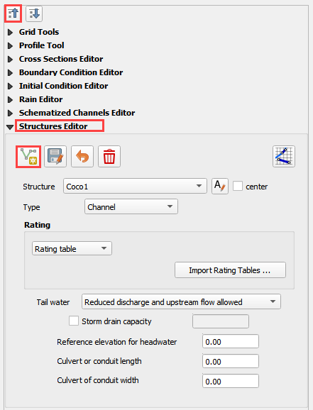
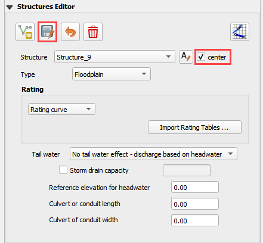
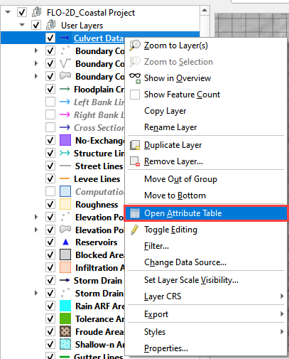
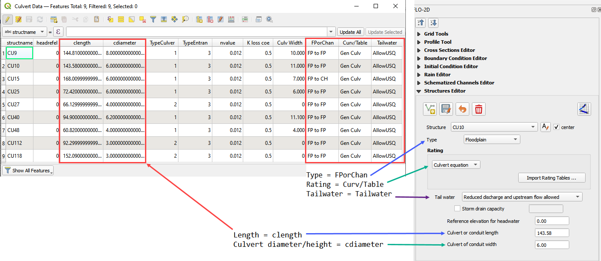
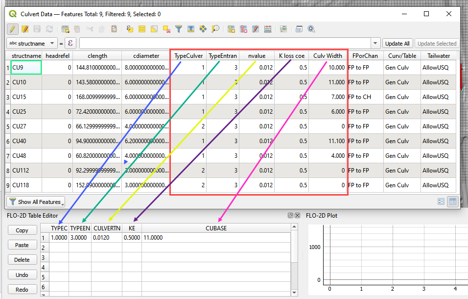
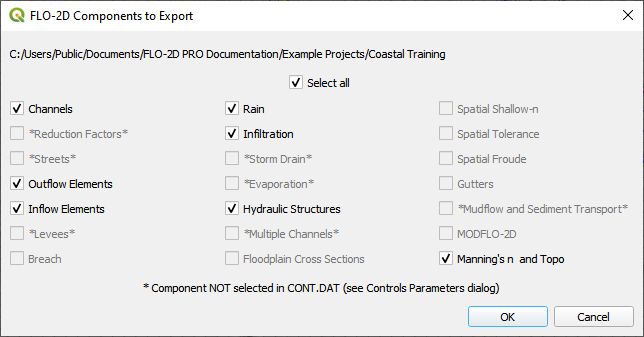
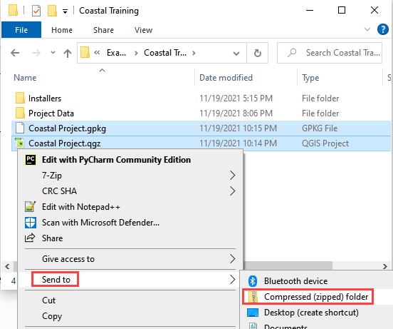
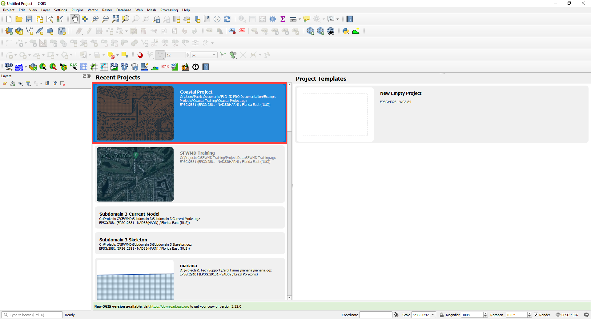
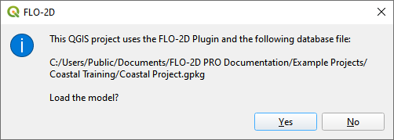

Culverts
========

**Overview**

This tutorial outlines the process of creating hydraulic structures with generalized culvert equations.

Required Data
-------------

============= =====================
**File**      **Content**
============= =====================
\*.shp         Culvert Data
============= =====================

Path: ...\\Coastal Training\\Project Data\\Culverts

.. raw:: html

    <iframe width="560" height="315" src="https://www.youtube.com/embed/zv5fN8_JQ0I" frameborder="0" allowfullscreen></iframe>

Step 1: Import data
______________________________

Start by cleaning up the map space so the next layer will be easy to see.

1. Uncheck the User Left bank, Right Bank Cross section layers.

2. Check the Elevation Layer.

3. Click the Structure Lines layer to activate it.  It is in the User Layers Group.

4. Drag the Culvert Data.shp onto the map space.

.. image:: ../img/Coastal/culv001.png

Step 2: Format the data layers
______________________________

1. Double click the Culvert Data layer

2. Change the symbology to Arrow.

3. Set the Labels to structname.

.. image:: ../img/Coastal/culv002.png

4. This helps identify the structure and show the flow direction.

.. image:: ../img/Coastal/culv003.png

Step 3: Build the structures into the User Layers.
____________________________________________________________

1. Use the Structure Editor to add all of the new structures.

2. Collapse the Widgets, open the Structures Editor, and click the Add a Structure button.

**Digitizing process:**

3. Left click the inlet node (upstream node)

4. Left click the outlet node (downstream node)

5. Right Click to finish the polyline.
   Click OK to close the attribute window.

6. Watch the gif for a cycle.  Notice how the inlet and outlet position try to take advantage of the cells with the
   lower elevations.  The positioning is not perfect.  It is aligned to the cell that most closely represents the invert.

.. image:: ../img/Coastal/addculverts.gif

Step 4: Assign the structure attributes
___________________________________________

1. Click Save in the Structures Widget and check the center box.

2. Open the Culvert Data attribute table.
   The attributes will help fill out the data for each structure.

3. Use the following Image or the attribute table to fill out the culvert variables.

4. If the following image is not clear, right click it
   and open it in a new tab.

5. For Culvert Equations, extra data is needed in the Table Editor.  If the following image is not clear, right click it
   and open it in a new tab. The new plugin also has a Mult_Barrel option.  Set Mutl_Barrel to 1.

6. Schematize the structure data and click Yes to replace the data.

.. image:: ../img/Coastal/culv009.png

.. image:: ../img/Advanced-Workshop/adv/Module045.png

Step 6: Save, and export
______________________________

1. This is a good point to save project.

.. image:: ../img/Advanced-Workshop/adv/Module046.png

2. Export the data files to the Project Folder in QGIS Lesson 6 Export.

.. image:: ../img/Advanced-Workshop/adv/Module047.png

3. All data files will be created in the selected project folder.

.. image:: ../img/Coastal/culv011.png

Step 7: Create a backup file
______________________________

1. Close QGIS.

2. Open the project folder.  Select the Coastal Project.gpkg and Coastal Project.qgz files.  Right click them and
   click Sent to/Compressed (zipped) folder.

3. Name the zipped file.
   It is good to choose a name that identifies project progress.
   For Example: **CulvertsOK.zip**

.. image:: ../img/Coastal/culv012.png

4. Open QGIS and reload the project.

5. Click yes to load the model.

