Hydrology
=========

**Overview**

In this module, learn how to retrieve data from NOAA to create rainfall and calculate infiltration from spatial data.

**Required Data**

The required data is in the Coastal 2D Training Folder.

======== ====================== =======================
**File** **Content**            Location
======== ====================== =======================
\*.shp   LandUse Training       Hydrology\\Green Ampt
\*.tif   Soil Training          Hydrology\\Green Ampt
\*.asc   NOAA rainfall data     NOAA Website
======== ====================== =======================

Path: ...\\Coastal 2D Training\\Project Data\\Hydrology

.. raw:: html

    <iframe width="560" height="315" src="https://www.youtube.com/embed/MP_pQuUtI08" frameborder="0" allowfullscreen></iframe>

Step 1. Determine the total rainfall
_____________________________________

.. Important:: If taking this training in a Live Class, skip to Step 3.  The live class will have less time to complete
               the hydrology tutorial.

1. Click here to open the precipitation website. |Hydro_Download|

.. |Hydro_Download| raw:: html

   <a href="https://hdsc.nws.noaa.gov/hdsc/pfds/" target="_blank">Precipitation Data Server</a>

2. On the NOAA website, click on Florida.

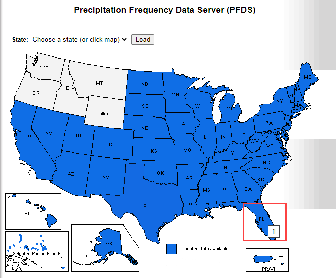

3. To navigate to the project area, search for "Immokalee and Tamiami 34110"

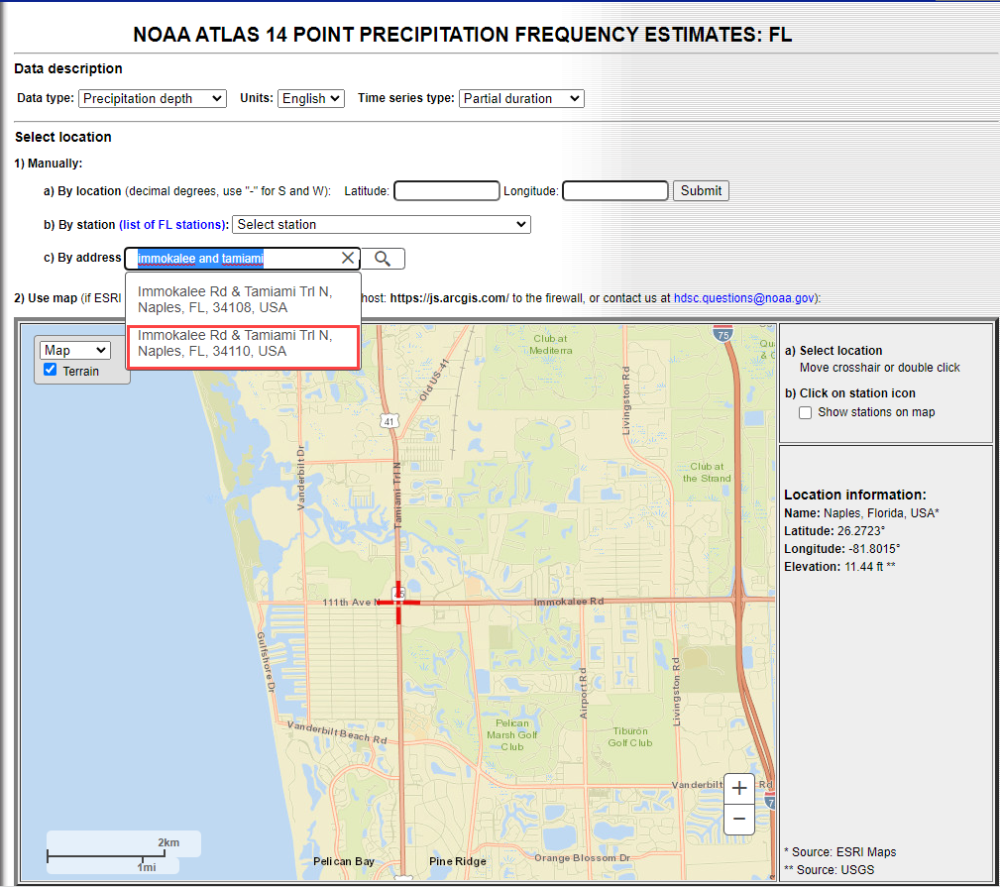

4. Scroll down to the table data and find the total rainfall for this area.  100yr 24hr rainfall is 12.2 inches.

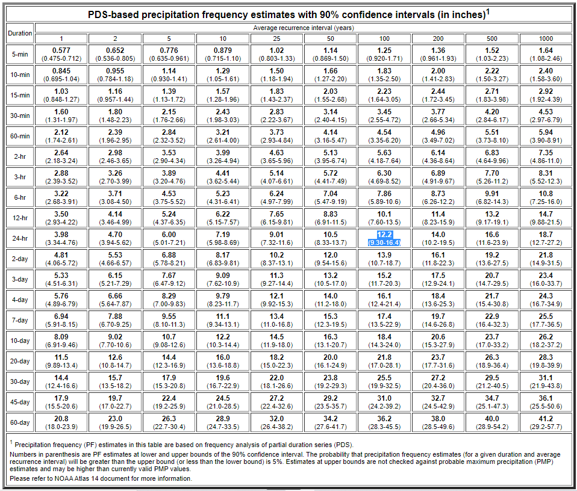

5. Change the Tab to Supplementary Info, set the variables to 100yr, 24hr and click Submit.

.. image:: ../img/Coastal/hydrology004.png

6. The file was most likely saved to the Download folder.  Copy it to the project folder and Extract it.

   \\Coastal 2D Training\\Project Data\\Hydrology

.. image:: ../img/Coastal/hydrology005.png

7. Click the manning_n layer near the bottom of the Layers List and drag the se100yr24ha.asc file onto the map space.

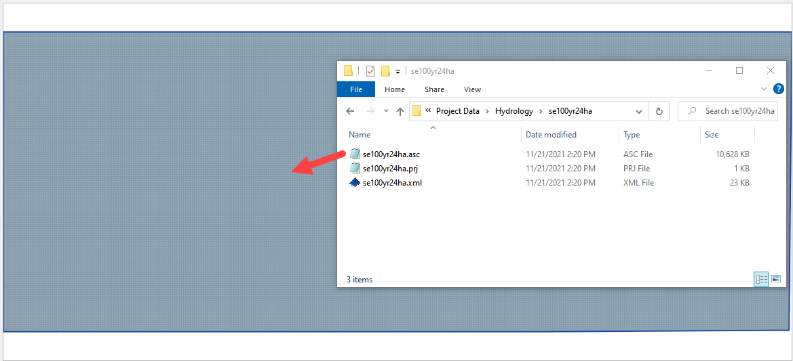

8. Right click the se100yr24ha layer and click Zoom to Layer.

.. image:: ../img/Coastal/hydrology007.png

9. These pixels are rainfall in inches \* 1000.

10. Zoom to the Computational Domain

.. image:: ../img/Coastal/hydrology008.png

11. Use the Export option to save the data in the correct coordinate system and clipped to the Map Canvas Extent.
    Right click the layer and Export the data.

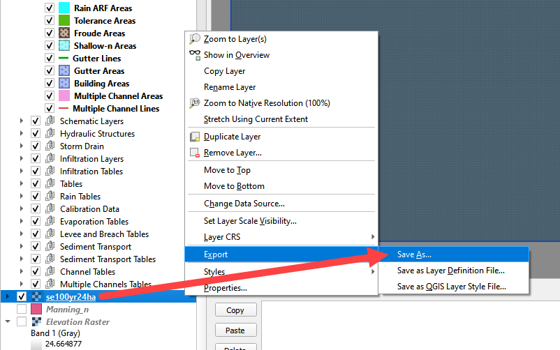

12. Select the Hydrology folder to save the data.

13. Set the coordinate system to EPSG 2881.

14. Click the Map Canvas Extent button to clip the new raster to the project area.

15. Check add the saved file to the map.

16. Click OK.

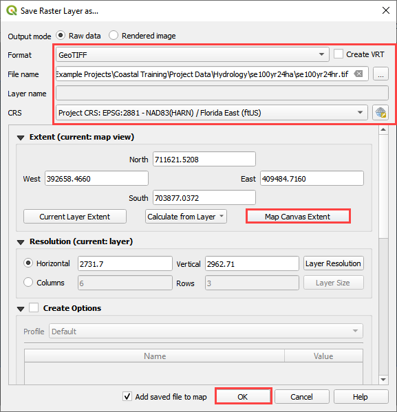

Step 2. Sample the rainfall raster
___________________________________

1. Remove the original raster from the layers list.  It has the wrong coordinate system and cannot be used to calculate
   rainfall data.

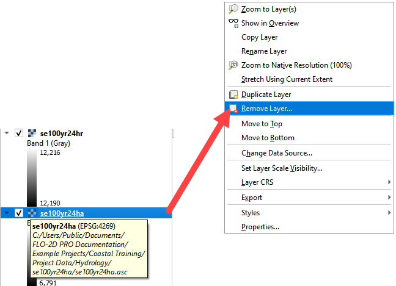

2. Use the ID tool to find the peak rainfall.

3. In this case, the lightest color is the highest rainfall.

4. 12216 is 12.2 inches of rainfall.

.. image:: ../img/Coastal/hydrology012.png

Step 3. Set up the rainfall
______________________________

1. Collapse the FLO-2D widgets and click Rain Editor.

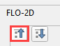

2. Enter the total rainfall.

3. Select a rainfall distribution with the Folder button.

Path: ..\\FLO-2D PRO Documentation\\Rainfall Distributions\\SCS 24-Hr Type II

4. Check the Spatial Variation (Depth Area Reduction)

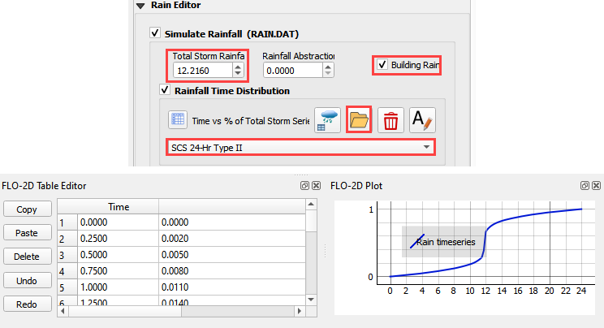

5. Skip to Step 4 if participating in Live Training.

6. To interpolate the rainfall depth reduction factor, click the AR button on the bottom of the rain editor widget.

7. Fill the form.

8. Click OK to calculate the rainARF and OK to close the message.

.. image:: ../img/Coastal/hydrology015.png

9. The rainfall is now complete.  It will be exported into the RAIN.DAT file.

Step 4. Simplify layers list
______________________________

1. Move all of the external data to the bottom of the Layers List.

2. Select the external layers using CTRL-Click or Shift-Click.

3. Right click the selected layers and click Group Selected.

4. Right click the Grouped Layers and rename them Project data or External data.  The name should be something
   that helps organize the data.

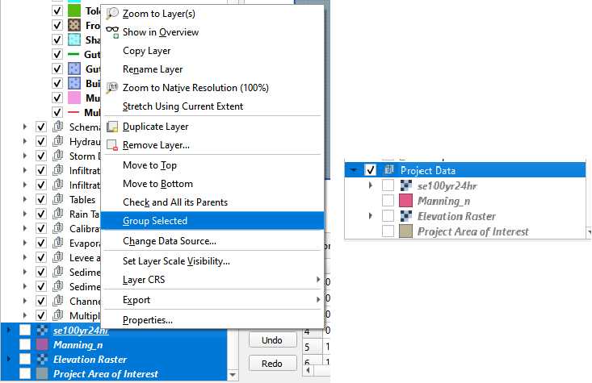

5. There are many tools to manage the layers list.  These can help organize data so that it is easy to find.

6. Use the cursor to hover over each icon and read the tool tip.  Collapse All and the Hide Selected are two tools
   that will keep the layers list manageable.

.. image:: ../img/Coastal/hydrology017.png

7. Layers can be grouped into like groups to simplify the layers list.  A tidy layers list makes finding data easier.
   Take a moment to group data into a well organized system.

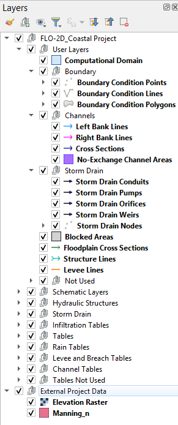

Step 5. Calculate infiltration
______________________________

.. Note:: This tutorial shows how to use Green-Ampt infiltration.  SCS, and Horton can also be applied with
          the calculator.  SCS can be calculated from a shapefile or a raster.

1. Collapse the FLO-2D widgets and click Infiltration Editor.

2. Select the Project Data group in the layers list and drag the file LandUse Training.shp onto the map space.

Path: ...\\Coastal 2D Training\\Project Data\\Hydrology\\Green Ampt\\LandUse Training.shp

3. Drag the file Soil Training.shp onto the map space.

Path: ...\\Coastal 2D Training\\Project Data\\Hydrology\\Green Ampt\\Soil Training.shp

.. image:: ../img/Coastal/hydrology018.png

4. From the Infiltration Editor click the Global Infiltration icon.

.. image:: ../img/Workshop/Worksh048.png

5. Check the Global Green Ampt switch.  For a description of how these variables are used, please see the
   INFIL.DAT section of the Data Input Manual.  Note that the soil depth solution will not be used if the
   global soil depth is 0.00.

6. Click OK to close.

.. image:: ../img/Workshop/Worksh049.png

7. On the Infiltration Editor click Calculate Green-Ampt.

.. image:: ../img/Workshop/Worksh050.png

8. Specify the attributes as shown in the following image and click OK.
   The calculation process should take less than a couple of minutes to complete because this project is small.

.. note::  The Green-Ampt calculator was modified in 2023 and extra potential Green-Ampt sources are now available.  In
           this example, the 2021 method is used so DTHETA, and PSIF, and Vegetation cover are not required.

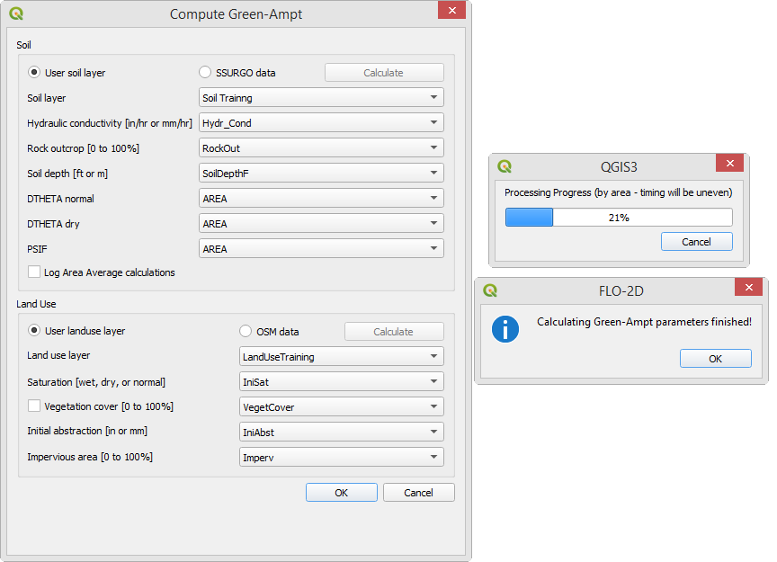

.. note::  If a calculator is taking too long, make sure the data is on the C: drive.  If the project is in a
           directory on the C: drive, and the data is in the same directory, the SQLite database manager works much
           faster.

Step 6. Save, export, and run
______________________________

1. This is a good point to save project.

.. image:: ../img/Advanced-Workshop/adv/Module046.png

2. Set up the Control Variables and click Save.

.. image:: ../img/Coastal/chan047.png

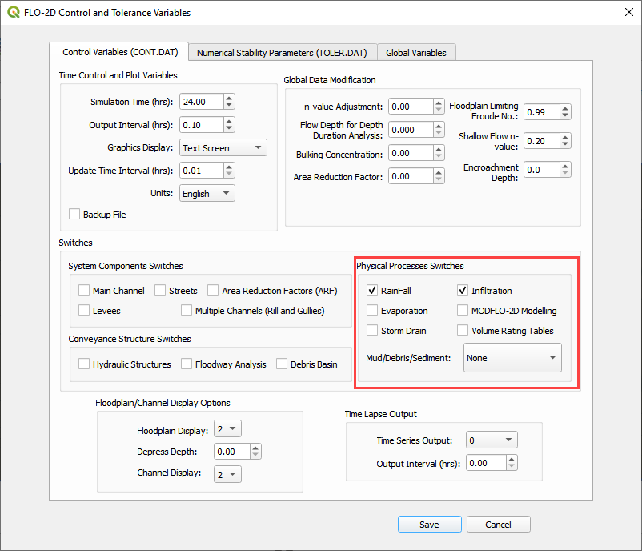

3. Export the project.

.. image:: ../img/Coastal/hydrology021.png

4. Save the data to the Project Folder and click OK to close the message.

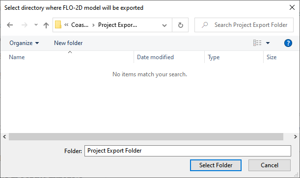

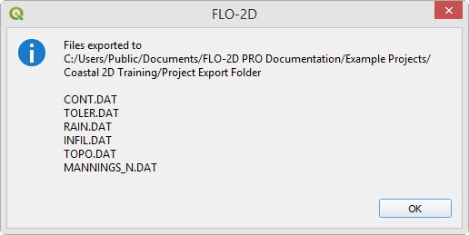

5. Use the Run Settings to set the Project path and the FLO-2D Engine Path.

.. image:: ../img/Coastal/hydrology024.png

6. Run the model.

.. image:: ../img/Coastal/runengine.png

- The blue message with the Professional License means this computer has a valid activator turned on.
- Once the time lines appear, that means the initial data tests have passes.
- The file path can be found at the bottom of the run window.

.. image:: ../img/Coastal/hydrology026.png

7. Let the project run and continue on to the next step.

.. important::  If an error message appears, use the snipping tool to get a screenshot of the error message.
                Review the error.chk file.  If help is required, ask the class instructor for help.
                If working through tutorials independently, email both the image and error message to
                FLO-2D tech support for help.  Most error messages are resolved quickly.

Step 7: Create a backup file
______________________________

1. Close QGIS.

2. Open the project folder.  Select the Coastal Project.gpkg and Coastal Project.qgz files.  Right click them and
   click Sent to/Compressed (zipped) folder.

.. image:: ../img/Coastal/creategrid019.png

3. Name the zipped file.
   It is good to choose a name that identifies project progress.
   For Example: **Hydrology OK.zip**

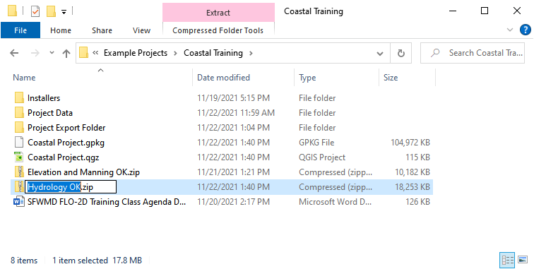

4. Open QGIS and reload the project.

.. image:: ../img/Coastal/creategrid021.png

5. Click yes to load the model.

.. image:: ../img/Coastal/creategrid022.png

