Review Results
==============

Required Data

================== ============================
**File**           **Content**
================== ============================
\*.out             FLO-2D output files
\*.chk             Debugging files
profiles.exe       Channel profile program
hydrog.exe         Channel hydrograph program
maxplot.exe        Simple mapping tool
================== ============================

Path:  ...\\Coastal Training\\Project Data\\Project Export Folder

Step 1. Error logging files
____________________________

These files are reviewed in NotePad or QGIS.  They log errors, warnings, and general data
for every simulation. The files are located in the Project Export Folder.

- ERROR.CHK

- STORM DRAIN ERROR.CHK

- DEBUG_datetime.OUT

Step 2. General review files
____________________________

The general review files give information about the overall grade of a simulation.

- SUMMARY.OUT: Data about the health of a simulation.  Volume conservation, timestep, computation
  time etc.

- VELTIMEFP.OUT: 1000 highest velocities sorted by velocity.  Use this file to look for surging.

- TIME.OUT: Finds the grid elements that control the timestep.  Sticky grid elements slow
  the simulation down.  If a grid element has more than 1000 timestep adjustments, it can be modified so that it no longer
  exceeds the stability criteria.  Slope adjustment, roughness adjustment, review total area of the grid element.  If
  grid element is an inflow node, increase spatial tol to 0.1 and roughness to 0.200.

- SUPER.OUT: List of super critical grid elements.  If a grid element is listed and it is not likely to go super critical
  check the slope and roughness.  Make an elevation adjustment or add a spatial tol = 0.1ft.  If the grid element is
  likely to go super critical, leave it alone.

- ROUGH.OUT: List of grid elements with n-value adjustments.  Review for any unusual grid element n-value adjustment.
  Review the slope and add a spatial tol = 0.1 if the adjustments are too excessive.

- EVACUATEDFP.OUT: List of grid elements that dried out over a timestep.  If a grid element dries out during flooding,
  it could indicate instability.  Check for ponding, slope, roughness.  Increase the roughness value, raised depressed
  grid elements, use a spatial tol = 0.1 ft, adjust the slope slightly.

Step 3. Channel review files
____________________________

- CHANMAX.OUT: List of maximum channel cross section hydraulics. It is easy to scan this list for
  discharge values that are out of range.  If a discharge is well out of range, it could be instability.  Channel
  instability is corrected by making better transitions between cross sections that are change rapidly.

- VELTIMEC.OUT: List of top 1000 channel elements sorted by high velocity.  Quick check for
  excessive velocity.  If velocities are excessive, review roughness values, slope, transitional areas.  Look for surging.

- CHANBANKEL.CHK: This is a list of grid elements that have a difference between the cross section
  elevation and the left or right bank floodplain elevation.  It may indicate that the channel alignment is off or the
  cross section is wrong.  FLO-2D will address bank elevation differences by setting the grid element elevation along
  the bank to the same elevation in the cross section data.  It is only necessary to correct elevations that cause
  a perched channel or a channel that is embedded deep into the grid.

- CHVOLUME.OUT: A list of channel cross section hydraulics and mass balance.  If the channel
  has a volume error, it will be listed in the last column.

Step 4. Structure review files
________________________________

- HYDROSTRUCT.OUT: Quick review of the discharge through a structure.  Look for anomalies like
  high flow rates or surging.  If flow through a structure is surging or evacuating the inlet, check the elevation around
  the inlet to make sure the water can get to the inlet.  Check the rating table or structure data.  It should not be
  allowing more flow than can move through the structure at a given depth.  Add more data to the rating table at the
  lower depths.

- HYDRAULIC STRUCTURE_RUNTIME WARNINGS.OUT: Warnings of potential error in the HYSTRUC.DAT file.  Follow the instructions
  in the file to correct the warnings if necessary.

- REVISED_RATING_TABLES.OUT: If flow accelerates through a structure, this file will recommend
  a slight change to the rating table.  It is just a suggestion and only implemented if the table is changed.

Step 5. MAXPLOT
____________________________

1. From QGIS click the drop down button next to the Run FLO-2D button and choose Maxplot.

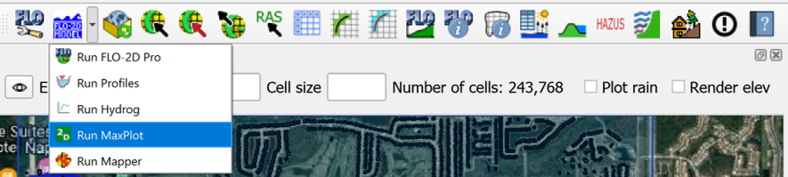

2. Set the executable folder to FLO-2D Pro.

3. Set the project folder to the last place where you have a completed run.

.. image:: ../img/Coastal/rev002.png

4. Maxplot can plot many simple maps and it can calculate the difference between two files.

.. image:: ../img/Coastal/rev003.png

5. Choose any plot to see the results.

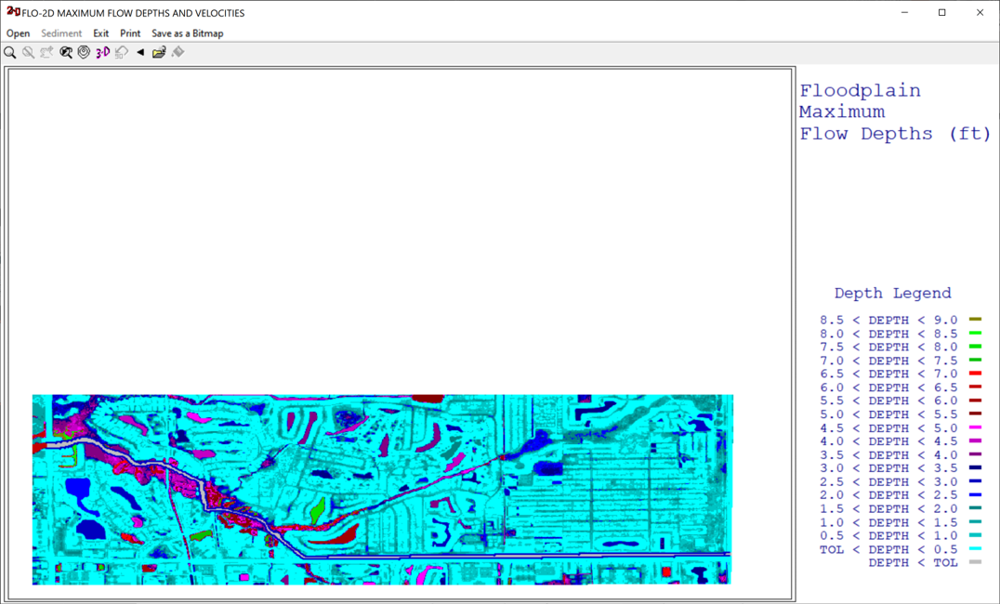

6. Try a few different plots to see how Maxplot works.

7. Maxplot will only plot data from results files like this one.  This is an example of the
   file maximum floodplain depths DEPFP.OUT.

.. image:: ../img/Coastal/rev005.png

8. Close Maxplot.

Step 6. HYDROG
____________________________

1. From QGIS click the drop down button next to the Run FLO-2D button and choose Hydrog.

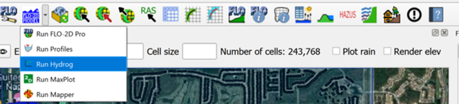

2. Set the executable folder to FLO-2D Pro.

3. Set the project folder to the last place where you have a completed run.

.. image:: ../img/Coastal/rev007.png

4. Hydrog can plot and computer hydraulics for channel cross sections and floodplain cross sections.

.. image:: ../img/Coastal/rev008.png

5. Select the Plot Channel Cross Sections option.

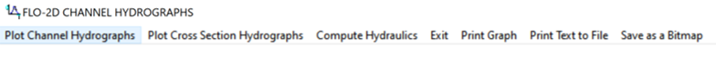

6. Choose the first cross section to plot.

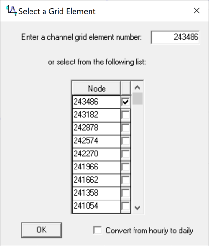

7. The hydrograph for that channel cross section is plotted and the upstream downstream buttons are used to
   go to a new cross section.

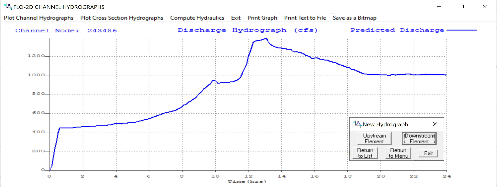

8. Close Hydrog.

Step 7. PROFILES
____________________________

1. From QGIS click the drop down button next to the Run FLO-2D button and choose Profiles.

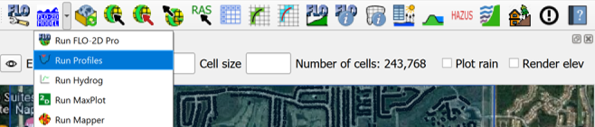

2. Set the executable folder to FLO-2D Pro.

3. Set the project folder to the last place where you have a completed run.

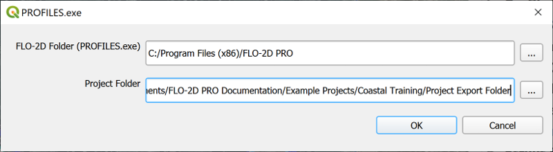

4. Profiles is used to review the bed, bank and water surface elevation.  It can also review and edit cross section
   station data, and profiles of channels.

5. Choose the View Profiles Button.

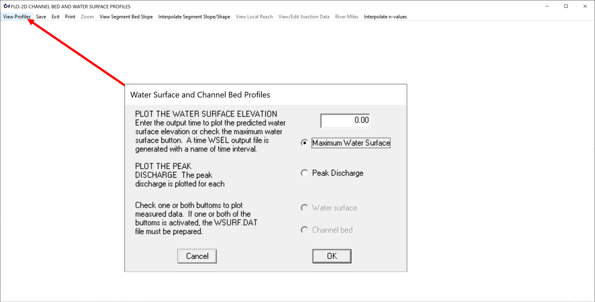

6. The plot shows the max water surface for the channel.

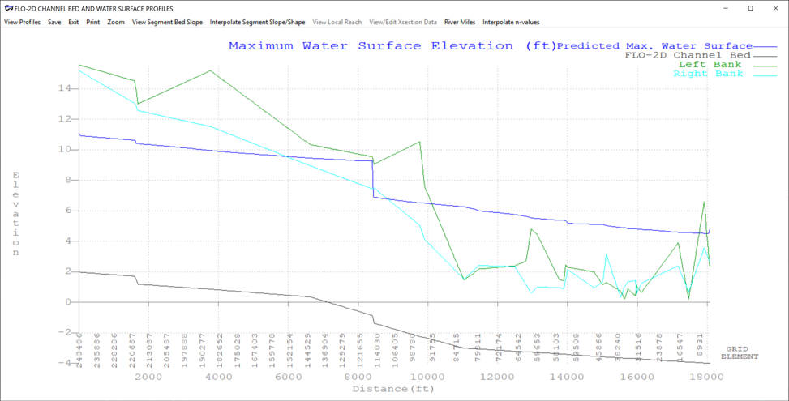

7. Profiles can also be used to view cross section data.  Click the View Segment Bed Slope and
   then click View Local Reach.  Then click the mouse somewhere near the profile.

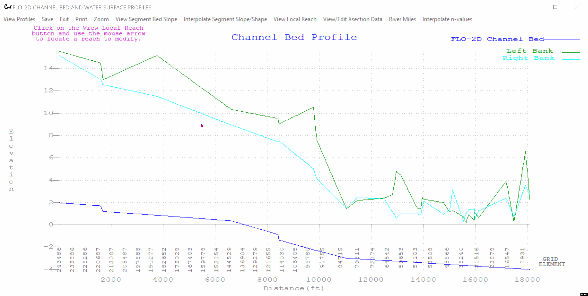

8. Click View/Edit Xsection Data button and then click the XSEC button on the new window.

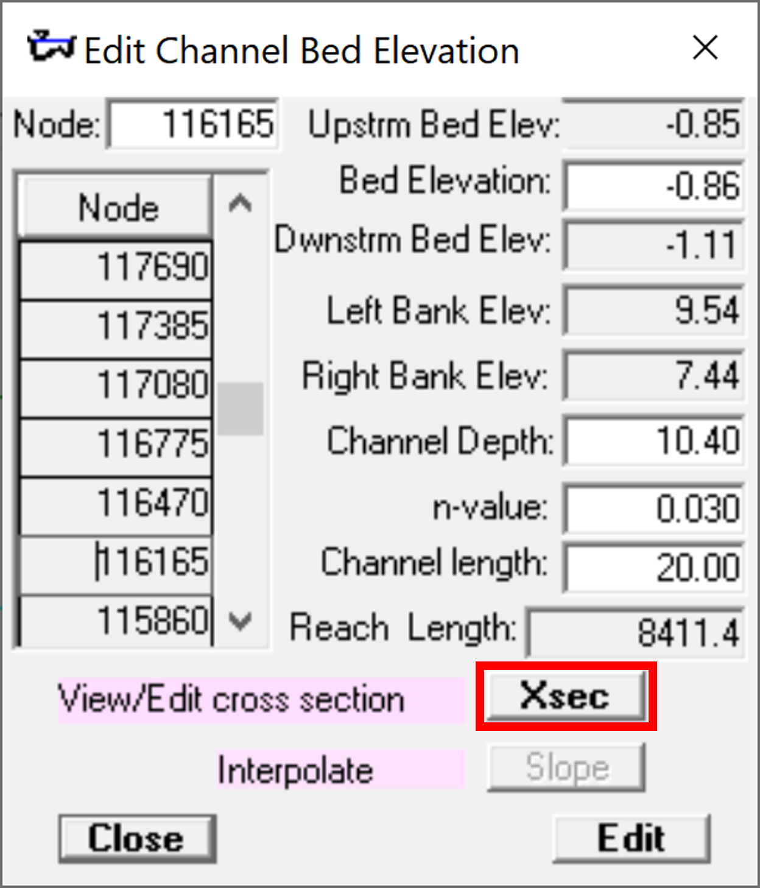

9. This opens a cross section editor program.  It is better to use the QGIS channel tools but
   these are still available.

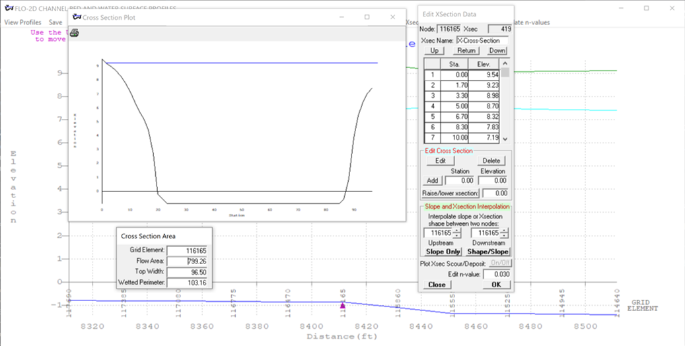

10. Close Profiles.
