Module 1 - Install The Software
====================================================

This module will prepare your computer for the FLO-2D workshop. By the end of this module, 
you will have QGIS, the FLO-2D Plugin, and the FLO-2D Pro engine installed and ready for use. 

Step 1: Get the installers
---------------------------------------------------

1. Download the required installer here:

.. raw:: html

   <a href="https://flo-2d.sharefile.com/d-s324ed541474440dd85aaad107c07063c" target="_blank" rel="noopener noreferrer">Download</a>

Step 2: Install the FLO-2D Build 25
------------------------------------

1. Run the FLO-2D Installer.

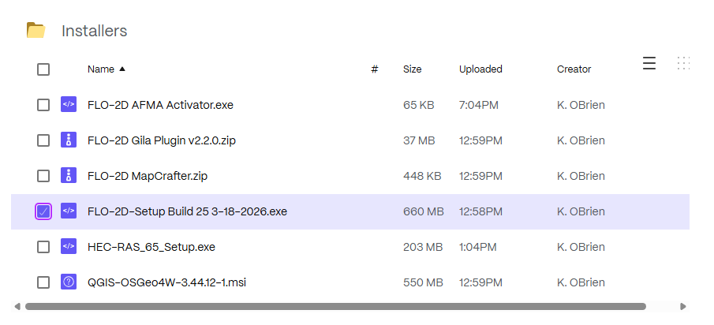

2. Check all options and click next.

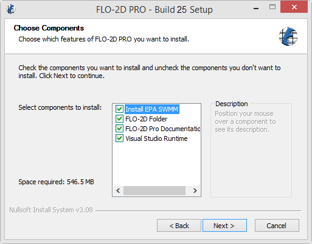

3. Click Next and Install to run the installer.

4. The Microsoft Visual C++ redistribution packages are embedded in the FLO-2D installer.  They install passively,
   but may request a restart.

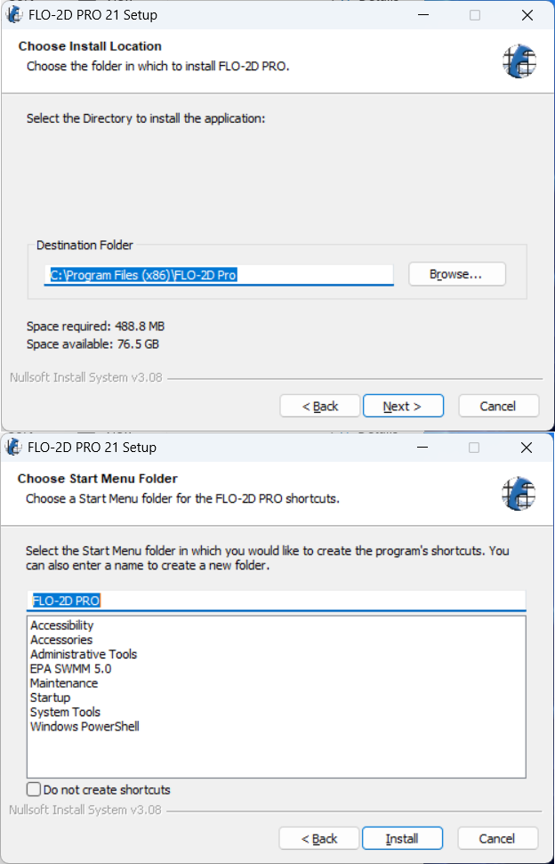

Step 3: Run the FLO-2D AFMA Activator
---------------------------------------

1. Run the activator.

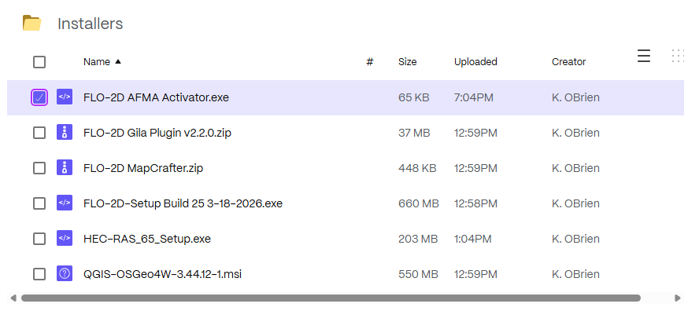

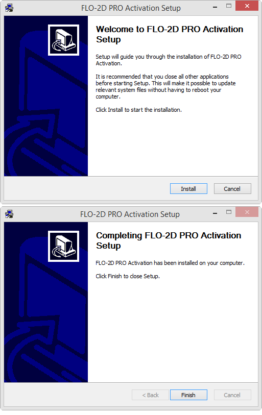

Step 4: Install QGIS 3.4x
---------------------------------------

1. Run the QGIS Installer. This one is 3.44 but any version around 3.4x should be fine.
2. If you have more than 2 versions of QGIS installed, remove the ones you don't need.

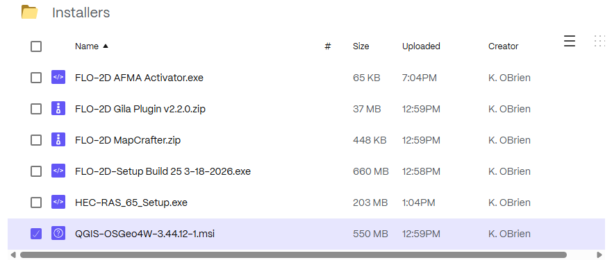

   
3. Finish installing with the default settings. The following image is a bit outdated. 

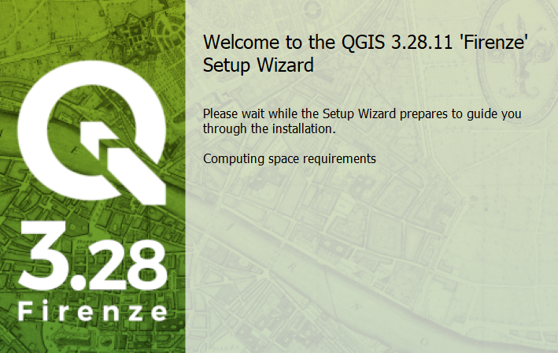

Step 5: QGIS Setup Profile
--------------------------------------------

Build a QGIS User Profile by following these steps:

.. important::

   This step should be performed by the End User.  If it is done on an Admin account, the profile will only be 
   available on the Admin account.

1. Open QGIS. Your version will be newer.

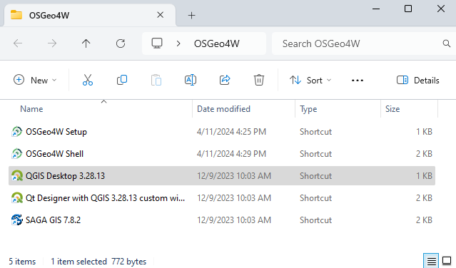

2. Click **Settings → Options**.

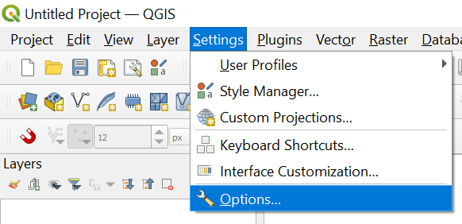

3. Click the **CRS** tab and set the options shown below.

.. important:: This step is critical for the FLO-2D Plugin to function properly.

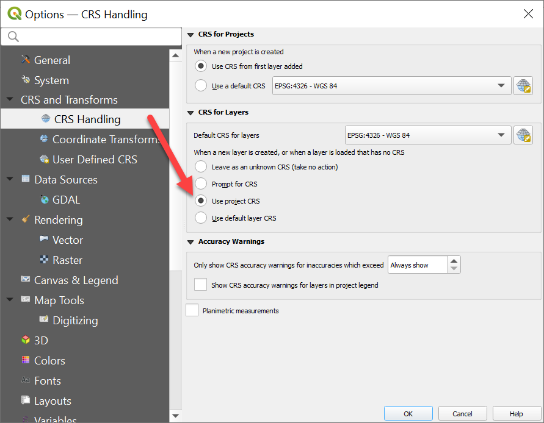

Step 6: Install FLO-2D Plugins
--------------------------------

1. Install the FLO-2D Plugins

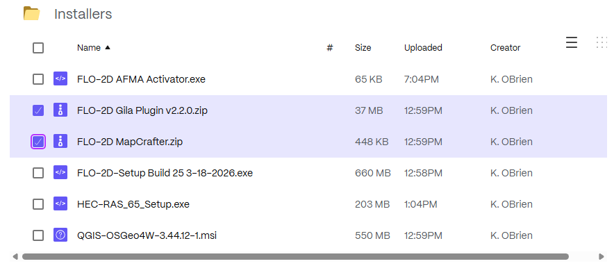

.. warning::

   The FLO-2D Plugin packages a bundled version of the ``h5py`` library for Stand Alone QGIS programs.
   In some QGIS environments, the ``h5py`` binaries lock the plugin folder.  
   This may prevent the plugin from uninstalling, updating, or overwriting files during installation.

   If the plugin cannot be removed or updated:

   1. Close QGIS completely.
   2. Open the plugin directory:

      ::

         C:\Users\YourUserName\AppData\Roaming\QGIS\QGIS3\profiles\default\python\plugins\

      or for QGIS 4:

      ::

         C:\Users\YourUserName\AppData\Roaming\QGIS\QGIS4\profiles\default\python\plugins\

   3. Delete the entire ``flo2d`` plugin folder manually.
   4. Restart QGIS.
   5. Reinstall the FLO-2D Plugin.

   

2. Open to the Plugin Manager and Find the Install from Zip tab.

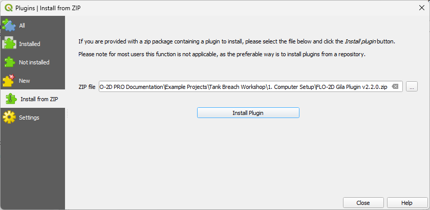

3. Load the FLO-2D Plugin and install it.
4. Load FLO-2D MapCrafter and install it the same way.

Step 7: Recommended Plugins
-----------------------------------

1. These additional plugins are helpful for FLO-2D Model Development.

2. These plugins can be installed from the **All Plugins** menu:

   - Quick Map Services  
   - Profile Tool  
   - Curve Number Generator
   - Manning's Roughness Generator
   - Street View
   - QuickOSM

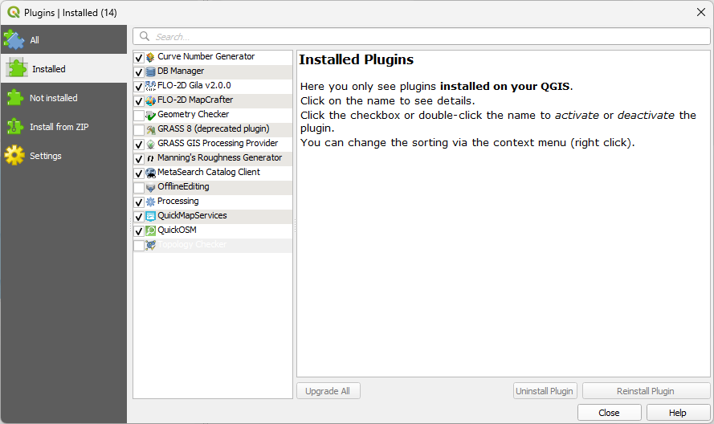

3. Quick Map Services requires an additional step.

   Click the QMS icon → Settings → More Services → **Get Contributed Pack**.

4. **Close QGIS** to save the profile.

Step 8: Install HEC-RAS 6
---------------------------------------------------

1. Run the installer.

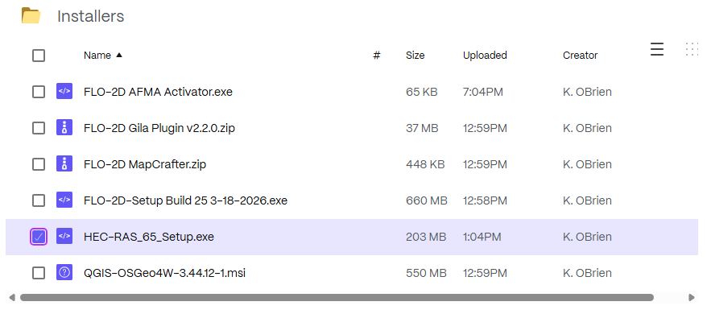

1. Locate the downloaded installation file.
2. Right-click the installer and select **Run as Administrator**.
3. If prompted by Windows User Account Control (UAC), click **Yes**.
4. Follow the installation wizard and accept the default settings unless
   your organization requires a different installation location.
5. Click **Install** and wait for the installation to complete.
6. Click **Finish** when the installation is complete.

