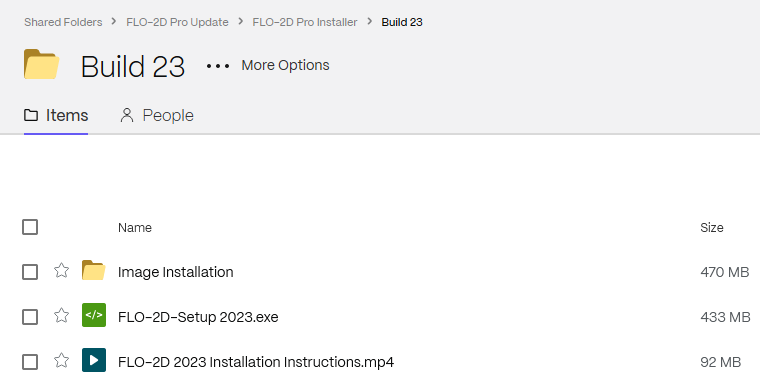

Module 1 - Import 2009 DAT files
====================================================

This module will prepare your computer for the FLO-2D workshop. By the end of this module, 
you will have QGIS, the FLO-2D Plugin, and the FLO-2D Pro engine installed and ready for use. 

Step 1: Setup GeoPackage
---------------------------------------------------

1. Link Example:

.. raw:: html

   <a href="https://flo-2d.sharefile.com/d-s324ed541474440dd85aaad107c07063c" target="_blank" rel="noopener noreferrer">Download</a>

Step 2: Import DAT files
------------------------------------

1. Run the FLO-2D Installer.

Step 3: Export DAT Files 2009
---------------------------------------

1. Run the activator.

Step 4: Export DAT files PRO
---------------------------------------

1. stuff.
2. 