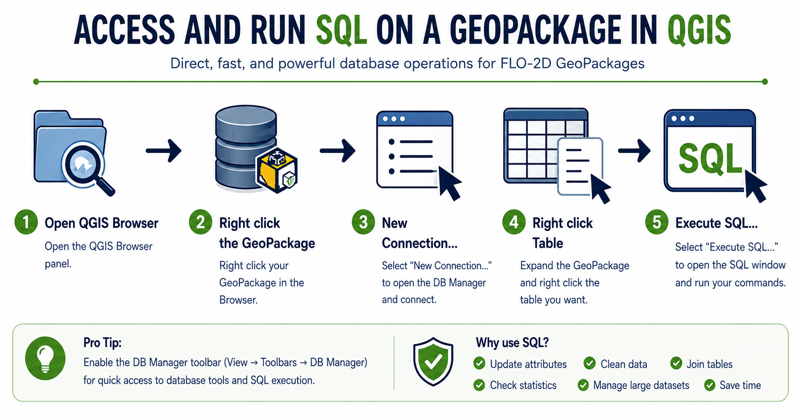
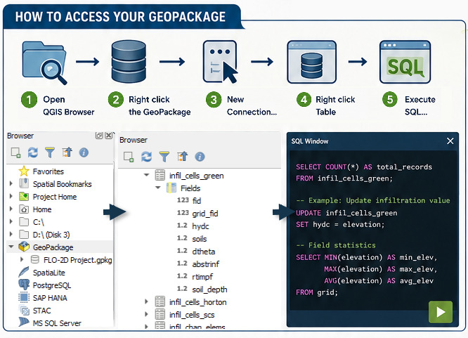
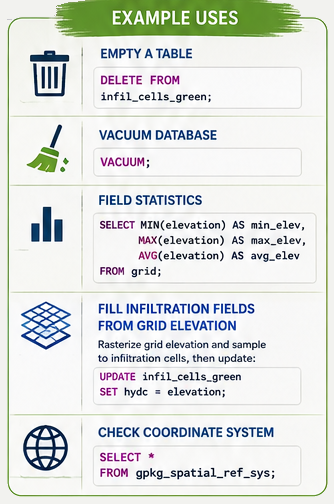
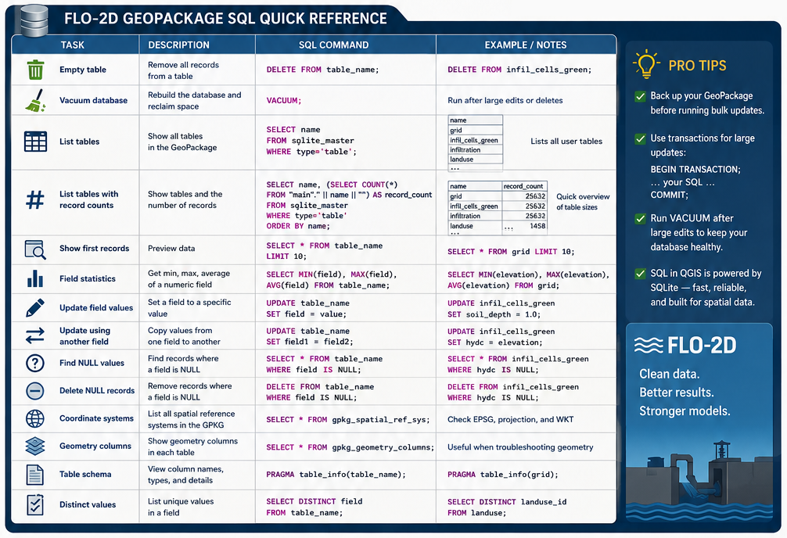

.. vim: syntax=rst
.. _gpkg:

=============================================
GeoPackage Tools & Tips
=============================================

One of the most efficient advanced workflows in QGIS is accessing a FLO-2D GeoPackage
directly through the QGIS Browser or DB Manager and running SQL commands on the database.

Direct SQL access can simplify many common GIS processing tasks and reduce the need for
multiple processing tools, joins, or repetitive field calculator operations.

Typical uses include:

- Processing large infiltration datasets
- Cleaning or repairing project data
- Troubleshooting locked GeoPackages
- Reviewing coordinate system information
- Updating attributes in bulk
- Checking field statistics
- Querying NULL values
- Managing large tables more efficiently

Quick Workflow
----------------

1. Open the QGIS Browser Panel
2. Right click the GeoPackage
3. Connect New...
4. Load GeoPackage
5. Right click the desired table
6. Select :menuselection:`Execute SQL...`

SQL Examples
--------------

A GeoPackage is a SQLite database and supports a wide range of SQL operations for
querying, updating, and managing project data.

Common tasks include:

- Listing tables and record counts
- Calculating field statistics
- Updating infiltration parameters
- Checking coordinate systems
- Finding NULL values
- Cleaning unused records
- Vacuuming the database
- Joining attribute information between tables

Using ChatGPT to Generate SQL Commands
---------------------------------------

ChatGPT can be used to quickly generate SQL commands for FLO-2D and QGIS workflows.

Example prompts:

- "Create a SQL command to calculate field statistics for elevation."
- "Generate a SQL query to find NULL hydc values."
- "Write a SQL UPDATE command to fill soil depth with 1.0."
- "Create a query to list all GeoPackage tables with record counts."
- "Write a SQL command to check the GeoPackage coordinate system."

ChatGPT can also assist with:

- SQLite syntax troubleshooting
- Building complex WHERE statements
- Creating JOIN operations
- Automating repetitive updates
- Explaining SQL commands
- Generating Quick Reference cheat sheets

.. important:: When using generated SQL commands, always verify the query and create a project backup
   before performing bulk updates or DELETE operations.

Cheat Sheet
-------------

