Create Project and Grid
========================

This tutorial guides users through setting up a project in FLO-2D and QGIS.

.. Note:: For better visibility, it is recommended to watch these videos on YouTube.

   Adjusting the video playback speed to 2x can expedite the learning process.

Create a New Project
-----------------------

Load Project Domain
++++++++++++++++++++++

Open the **Self-Help Lesson 1** folder and drag and drop the **Project Domain shapefile** onto the QGIS map.

.. Hint:: If identifying the correct `.shp` (shapefile) file is difficult, enable **file extensions** in the folder
   view options.

QGIS should display the domain as shown below. The polygon color is randomly assigned and may differ from the example
image.

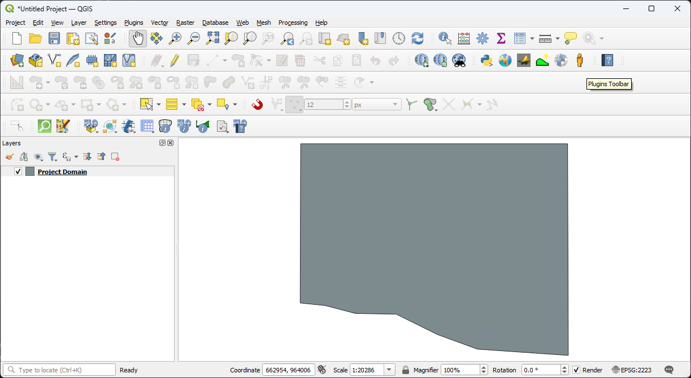

Check the CRS
+++++++++++++

Open the **CRS Selector** by clicking the button shown in the image below:

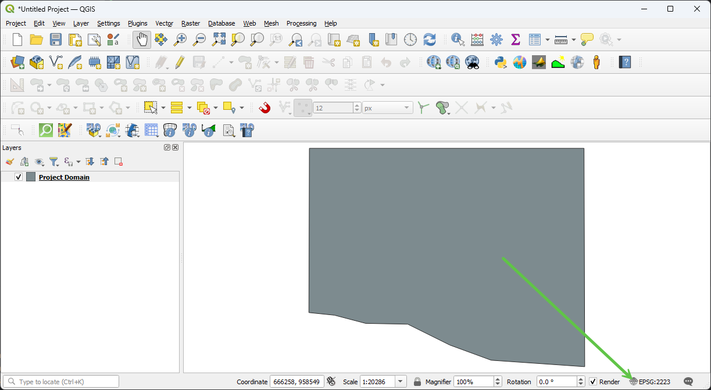

The coordinate reference system for this project is **EPSG:2223**, representing **NAD 83 Arizona Central**. While
**EPSG:2868** or **EPSG:6405** are generally preferred for Arizona, EPSG:2223 will be used throughout this tutorial
to maintain consistency with the provided data.

.. important:: For new projects, consult local city, county, or state agencies, or a surveying team to determine the
   appropriate coordinate system.

The following image displays a filtered list of Arizona coordinate systems:

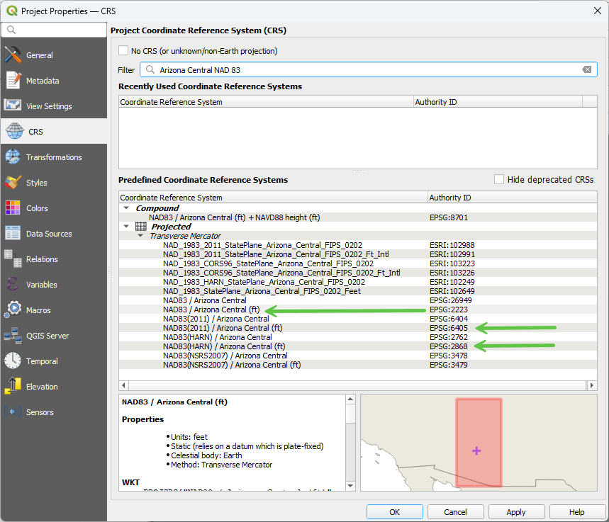

Close the window if the coordinate system is set correctly.

Create a New Project
++++++++++++++++++++++

Locate the **FLO-2D Toolbar** and click the **New Project** button.

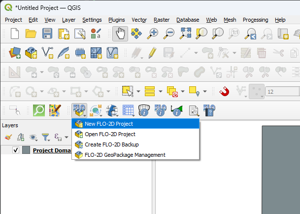

.. Hint:: The project name should be descriptive, including key details such as study location, project number, or
   start date. In this tutorial, a simplified naming convention is used for clarity.

Use the **Create** button to navigate to the **Self-Help Kit Gila** directory and name the **GeoPackage file**
appropriately, such as **Self-Help Kit** or **Project 1**.

Project Settings Overview
++++++++++++++++++++++++++

The **Project Settings** dialog box provides key details about the project:

1. Displays essential project-related information.
2. If the unit system is not recognized, update the FLO-2D plugin.
3. User data entry is optional but can assist future users in retrieving project details.
4. If the **FLO-2D Build** version is displayed as *Version not Found*, an experimental **FLOPRO.exe** may be installed
   on the system.
5. The **grid cell size** displayed in this dialog is not used. Instead, refer to the "Computational Domain" attribute
   for the correct setting. Instructions are available in the **Assign Grid Roughness** section.
6. A **default n value** is applied to all projects. This value is intentionally low to encourage modification based on
   **Assign Grid Roughness** guidelines. Updating overland roughness is essential for accurate modeling. If a project
   is submitted to technical support with unchanged default n values, it may indicate that key adjustments have been
   overlooked.

.. image:: ../img/shg/2/shg02_005.png

Set the CRS using the pop-up dialog and click **OK**.

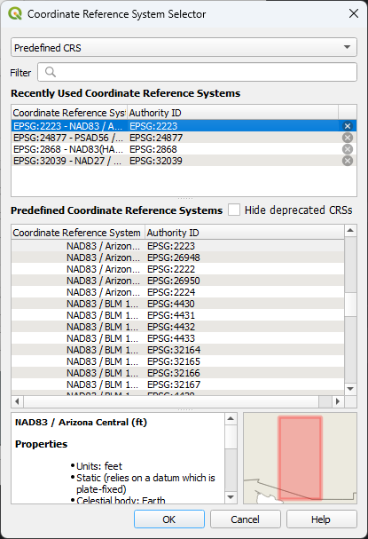

Click **OK** to close the **Project Settings** window. This action will initialize the FLO-2D plugin and save the QGIS
project.

When prompted with save options, external data can either be embedded into the **GeoPackage** or referenced using
file paths.

Click **Yes** when prompted to save.

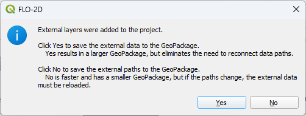

Managing External Layers
+++++++++++++++++++++++++

The **GeoPackage Management Tool** provides options for handling external layers.

- To ensure that a layer remains accessible within the project, move it to the left side of the dialog box.
- Layers that are temporary or non-essential can remain on the right side.
- Layers that are server connected like Google Maps or from FLO-2D MapCrafter will always use the **Path** option.

For this tutorial, the **Project Domain** layer is only needed once and will be copied into the **Computational Domain**
layer. It does not need to be retained within the GeoPackage.

.. image:: ../img/shg/2/shg02_008.png

After setup, the project interface should appear as follows:

- **FLO-2D Widget** positioned on the right side of QGIS.
- **Table and Plotting Windows** located at the bottom.
- **FLO-2D Grid Info Panel** displayed on the left.

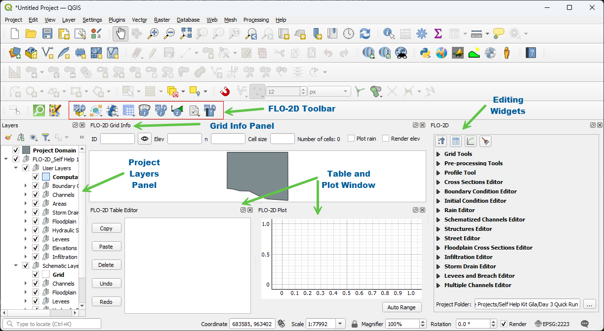

Setup the Grid
----------------

.. raw:: html

   <iframe width="560" height="315" src="https://www.youtube.com/embed/V0N064712ng?si=El8bthhN_ePQ0V2k"
   title="YouTube video player" frameborder="0" allow="accelerometer; autoplay; clipboard-write; encrypted-media;
   gyroscope; picture-in-picture; web-share" referrerpolicy="strict-origin-when-cross-origin" allowfullscreen>
   </iframe>

Expand the **Grid Tools Widget** and click the **Create Grid** button.

Select **External Layer** and choose **Project Domain** as the layer.

Set the **Cell Size** field to `cell_size` and click **OK** to generate the grid.

.. image:: ../img/shg/2/shg02_010.png

The FLO-2D plugin will generate and validate the grid.

.. Hint:: If this process takes longer than expected, verify that the **correct field** is being used. Selecting the
   **FID field** instead of `cell_size` may result in an excessively large grid. If this occurs, allow the process to
   complete and then retry with the appropriate field.

The dialog displays the **cell size**, **grid count**, and **elapsed time** for grid generation. While the elapsed
time varies based on system performance and grid size, this metric assists in evaluating plugin optimization.

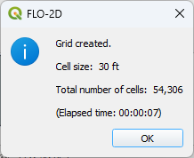

Assign Elevation
--------------------

.. raw:: html

   <iframe width="560" height="315" src="https://www.youtube.com/embed/Xcqbf42UUnI?si=_tj6UtGkD3COQvaO"
   title="YouTube video player" frameborder="0" allow="accelerometer; autoplay; clipboard-write; encrypted-media;
   gyroscope; picture-in-picture; web-share" referrerpolicy="strict-origin-when-cross-origin" allowfullscreen>
   </iframe>

**Load the Elevation File**

To begin, add the elevation raster to the project by dragging and dropping it onto the map.

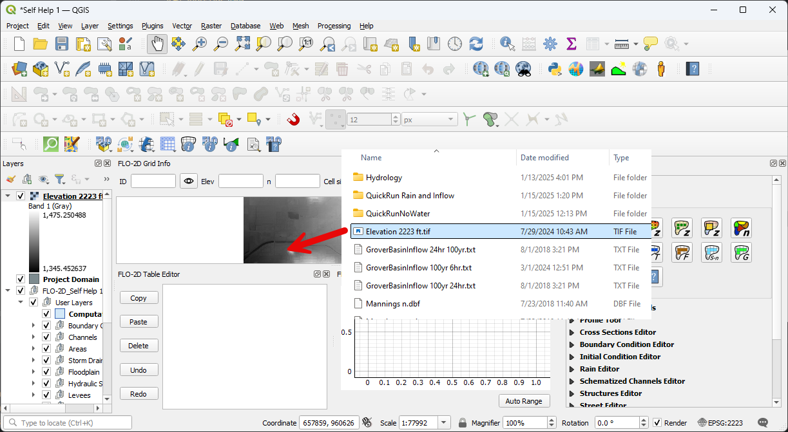

**Assign Elevation to the Grid**

From the **Grid Tools Widget**, select the **Assign Elevation Data to Grid** tool. Complete the dialog box as shown
below and click **OK** to process the elevation.

.. image:: ../img/shg/2/shg02_013.png

For additional information on this tool and its interpolation methods, click the **Help** button.

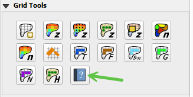

**Adjust Layer Visibility**

To improve visibility, deselect **Elevation** and **Project Domain** in the Layers panel. This will ensure the grid
is clearly displayed.

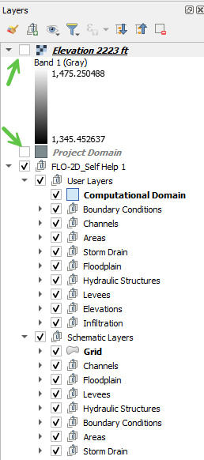

**Review Grid Elevation**

Enable the **Render Elevation** checkbox to inspect the assigned elevation values. Once the review is complete,
disable this option to optimize map rendering performance.

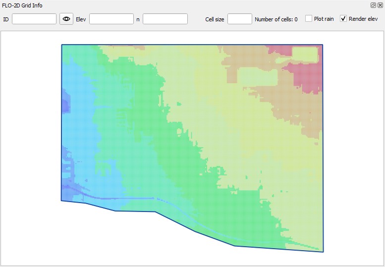

Assign Grid Roughness
------------------------

.. raw:: html

   <iframe width="560" height="315" src="https://www.youtube.com/embed/hItgohR5e8w?si=-9uzzocICxnusRAF"
   title="YouTube video player" frameborder="0" allow="accelerometer; autoplay; clipboard-write; encrypted-media;
   gyroscope; picture-in-picture; web-share" referrerpolicy="strict-origin-when-cross-origin" allowfullscreen>
   </iframe>

**Load the Manning's n Shapefile**

To assign roughness values, add the **Manning's n** shapefile to the project.

.. image:: ../img/shg/2/shg02_017.png

**Assign Roughness Values**

Use the **Assign Roughness from Polygon** tool to apply roughness values to the grid.

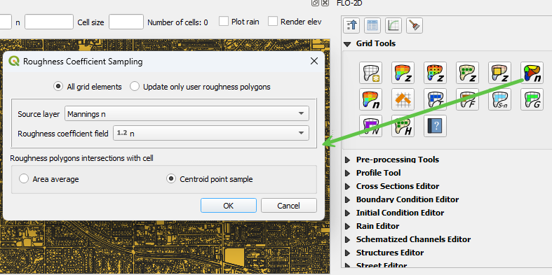

.. hint:: When using a roughness raster, select the **Assign Roughness from Raster** option.

**Review Grid Attributes**

To verify the assigned values, open the **Grid Attribute Table**:

1. Right-click the **Grid** layer.

2. Select **Open Attribute Table**.

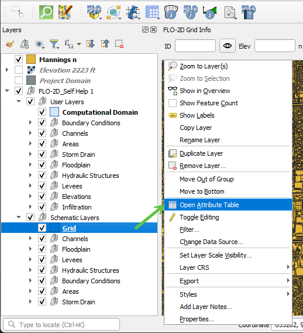

The attribute table can be sorted by clicking on the column headers. The **FID** field represents the **Grid Element
Number (GE Number)**.

.. image:: ../img/shg/2/shg02_020.png

.. hint:: Avoid opening the **Grid Attribute Table** if the grid contains more than **one million cells**, as performance
   may be significantly impacted.

Assign Control Parameters
--------------------------

.. raw:: html

   <iframe width="560" height="315" src="https://www.youtube.com/embed/mgl5VgAXP_g?si=9CO0AhES5GdnIZFe"
   title="YouTube video player" frameborder="0" allow="accelerometer; autoplay; clipboard-write; encrypted-media;
   gyroscope; picture-in-picture; web-share" referrerpolicy="strict-origin-when-cross-origin" allowfullscreen>
   </iframe>

**Configure Control and Stability Parameters**

Open the **FLO-2D Parameters Group** and select the first option to access the **Control and Stability Parameters** dialog.

.. image:: ../img/shg/2/shg02_021.png

Complete the fields as shown in the example below.

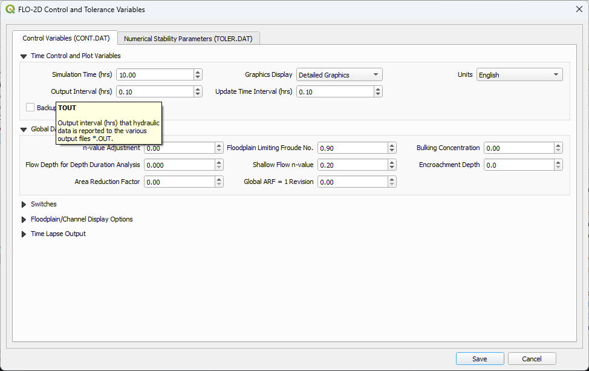

.. hint:: Tooltips are available in this dialog to provide descriptions of each variable. The variable names correspond
   to those in **Chapter 4** of the **Data Input Manual**, making it easy to locate specific tables for reference.

**Review Numerical Stability Parameters**

Navigate to the **Numerical Stability** tab and review the parameter values.

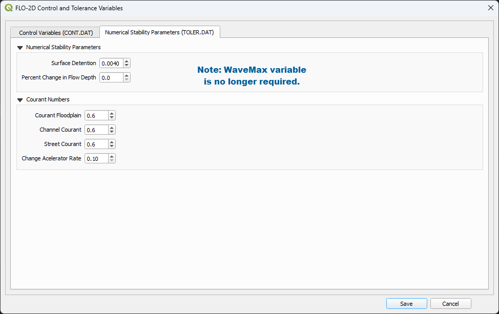

.. hint:: For a more detailed understanding, refer to the **Numerical Stability** section of the **FLO-2D Reference
   Manual** and review related webinar recordings by **Dr. Jimmy O'Brien**. These resources are available in the
   **Training Packages** section on the FLO-2D website and in the **ShareFile Webinar Series** folder.
   |trpa|

.. |trpa| raw:: html

   <a href="https://flo-2d.sharefile.com/share/view/s8eb82117ebf4d5b8/fo0f5642-4b81-43e2-9a11-e79085fc030c"
   target="_blank" rel="noopener noreferrer">Webinar Series</a>

Save, Export, and Run
----------------------

.. raw:: html

   <iframe width="560" height="315" src="https://www.youtube.com/embed/_uE-NrasaXA?si=IWpqfAKH5k7KNoih"
   title="YouTube video player" frameborder="0" allow="accelerometer; autoplay; clipboard-write; encrypted-media;
   gyroscope; picture-in-picture; web-share" referrerpolicy="strict-origin-when-cross-origin" allowfullscreen>
   </iframe>

**Save the Project**
+++++++++++++++++++++

Click the **QGIS Save** button and confirm by selecting **Yes** in the dialog box.

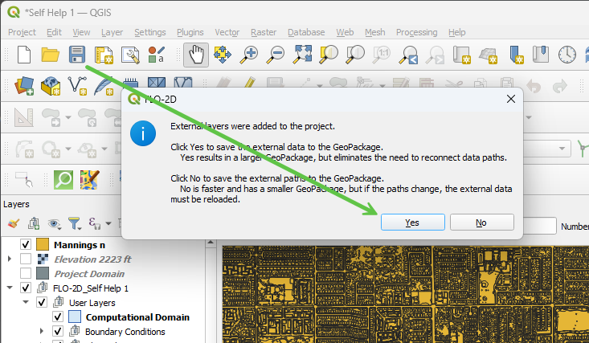

Move the **Elevation** and **Manning's n** layers to the left side of the dialog box. This action saves these layers
to the GeoPackage.

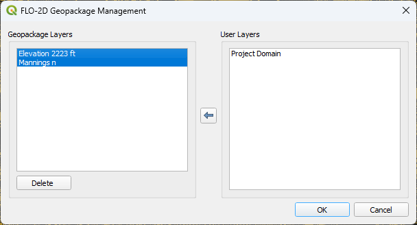

The **FLO-2D Plugin** automatically organizes external layers added to the GeoPackage into a separate group.
The **Project Domain** layer can be removed, as it has already been copied into the **Computational Domain**.

.. image:: ../img/shg/2/shg02_026.png

**Review the GeoPackage Structure**
++++++++++++++++++++++++++++++++++++

Open the **Browser Panel** and dock it next to the **Layers Panel** by dragging the panel with a left-click and
dropping it on the Layers Panel when highlighted.

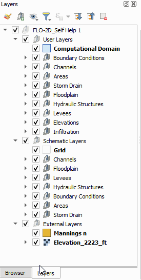

Connect to the **Project GeoPackage** by right-clicking the **GeoPackage** section and selecting **New Connection**.
Choose the **Project GeoPackage** file and click **Open**.

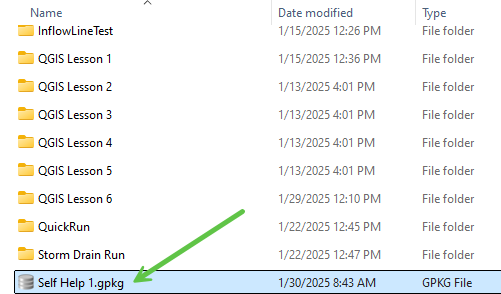

Expand the **GeoPackage** and use the **E, G, and M** keys on the keyboard to quickly navigate to tables that begin
with those letters.

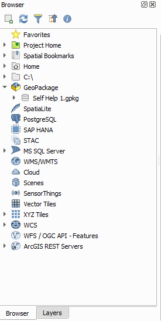

**Using SQL Tools in GeoPackage**
++++++++++++++++++++++++++++++++++++

To execute SQL queries, right-click the **Grid** layer and select **Execute SQL**.

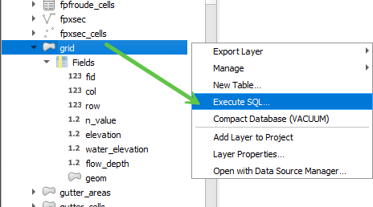

To compute basic statistics on the `n_value` field in the `grid` table within a GeoPackage database, use the
following SQL query:

.. code-block:: sql

    SELECT
        MIN(n_value) AS min_value,
        MAX(n_value) AS max_value,
        AVG(n_value) AS mean_value,
        SUM(n_value) AS sum_value,
        COUNT(n_value) AS total_entries,
        (SUM(n_value * n_value) / COUNT(n_value)) - (AVG(n_value) * AVG(n_value)) AS variance,
        SQRT((SUM(n_value * n_value) / COUNT(n_value)) - (AVG(n_value) * AVG(n_value))) AS std_dev
    FROM grid;

**Query Explanation:**

- `MIN(n_value)`: Returns the **minimum** roughness value.
- `MAX(n_value)`: Returns the **maximum** roughness value.
- `AVG(n_value)`: Computes the **mean** roughness value.
- `SUM(n_value)`: Returns the **sum** of all roughness values.
- `COUNT(n_value)`: Counts the **total number of records**.
- `variance`: Computes the **variance** of `n_value`.
- `std_dev`: Computes the **standard deviation**.

**Executing the Query in QGIS:**

1. Right-click the **grid** table and select **Execute SQL**.
2. Paste the SQL query into the query editor.
3. Click **Run** to execute the query and display the results.

.. image:: ../img/shg/2/shg02_028.png

.. hint:: Using SQL processing is a more efficient method for analyzing data in GeoPackages. Large grids (over 1 million
   cells) may experience performance issues when using QGIS table joins and table tools. SQL-based queries operate
   directly on the database without requiring additional memory allocation, making them significantly faster.

**Quick Run**
+++++++++++++++++++++

The **Quick Run** feature allows exporting data and running the model in a single step.

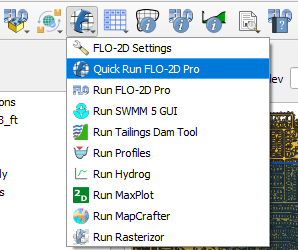

Create a new folder named **Quick Run** inside the **Lesson 1** directory and select it.

.. image:: ../img/shg/2/shg02_031.png

Uncheck **Rain** and click **OK** to initiate a **Quick Run** test.

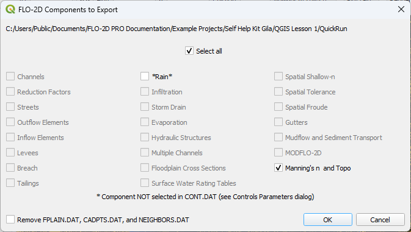

If the model starts successfully, the **License Status** will be displayed, and the simulation will begin.

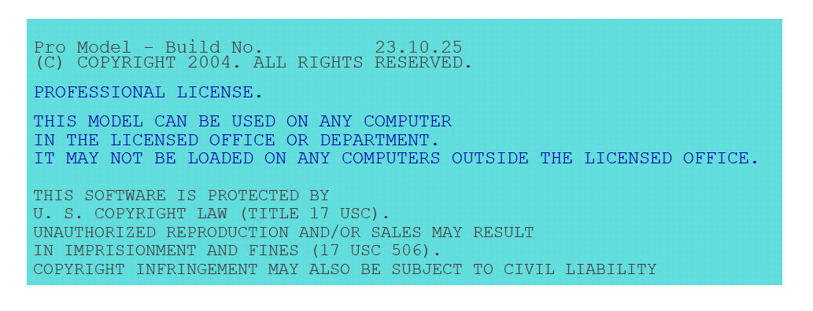

.. hint:: The **Quick Run** feature executes **FLOPRO.EXE** validation checks. If the model starts, the verification
   process has passed. For additional information on ASCII data files used by the **FLOPRO.EXE** engine, refer to
   the accompanying **YouTube tutorial**.

Run Demo Engine
---------------------

.. raw:: html

   <iframe width="560" height="315" src="https://www.youtube.com/embed/9wUJBdP6vjQ?si=gHTxsyj6ct_J3TKf"
   title="YouTube video player" frameborder="0" allow="accelerometer; autoplay; clipboard-write; encrypted-media;
   gyroscope; picture-in-picture; web-share" referrerpolicy="strict-origin-when-cross-origin" allowfullscreen></iframe>

.. Note:: The Self-Help Tutorial does not require a license.  Use the Demo-Engine as shown in the video to take this
   tutorial with a demo version of the software.

Backup and Recovery
-----------------------

.. raw:: html

   <iframe width="560" height="315" src="https://www.youtube.com/embed/wmo3Mkl7ZvU"
   title="YouTube video player" frameborder="0" allow="accelerometer; autoplay; clipboard-write; encrypted-media;
   gyroscope; picture-in-picture; web-share" referrerpolicy="strict-origin-when-cross-origin" allowfullscreen></iframe>

