Self-Help Kit Setup
========================

Set up the project to begin learning how to use FLO-2D and QGIS.

**Get the data!**

|ProSetup_Download|

.. |ProSetup_Download| raw:: html

   <a href="https://flo-2d.sharefile.com/d-s5c66fd7ec29e451facfcef7c56fac84e" target="_blank">Download Self-Help Kit</a>

.. Note:: Viewing these videos on YouTube is recommended.

   Set the video playback speed to 2x to complete the lessons more efficiently.

.. raw:: html

    <iframe width="560" height="315" src="https://www.youtube.com/embed/tTcxTWMlpkk?si=KUlDut2agYaAg-g2"
    title="YouTube video player" frameborder="0" allow="accelerometer; autoplay; clipboard-write; encrypted-media;
    gyroscope; picture-in-picture; web-share" referrerpolicy="strict-origin-when-cross-origin" allowfullscreen></iframe>

Install the Training Data
_____________________________________

Download the required data.

|ProSetup_Download|

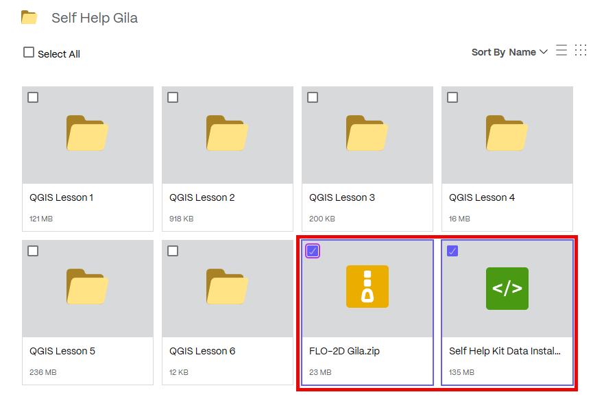

Extract the data and run the installer.

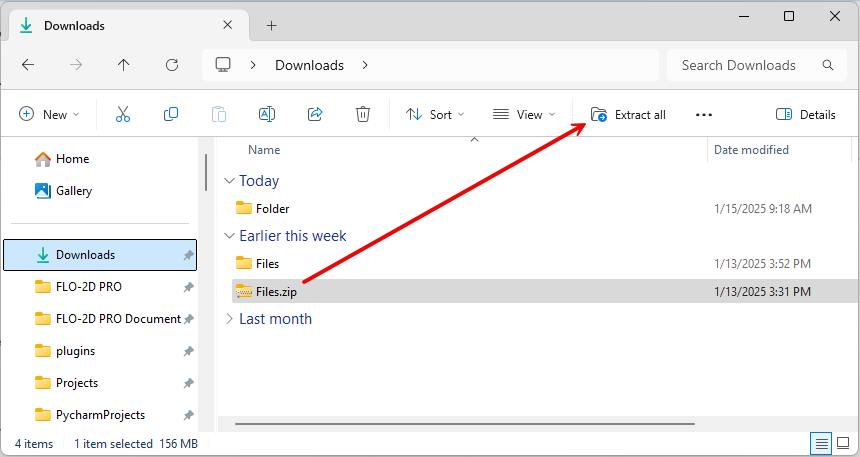

Run the Self-Help Data Installer. This will place the FLO-2D Self-Help Kit in the documentation directory.

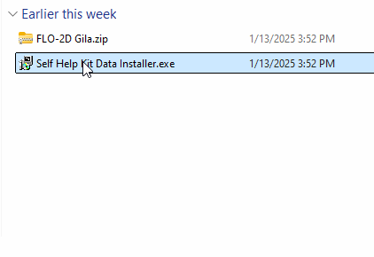

Create a shortcut to the Self-Help Kit for quick access. This allows easy navigation to FLO-2D documentation and training files.

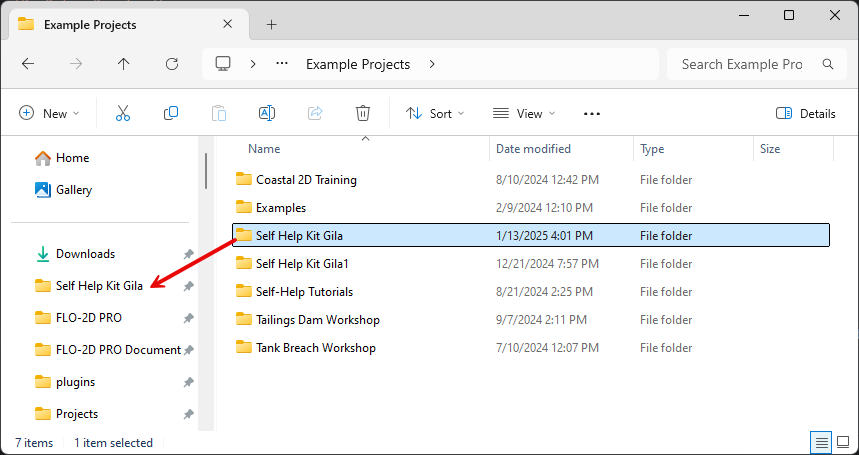

Review the Documentation folder. Take a few minutes to explore its contents, which include manuals, examples, and white papers.

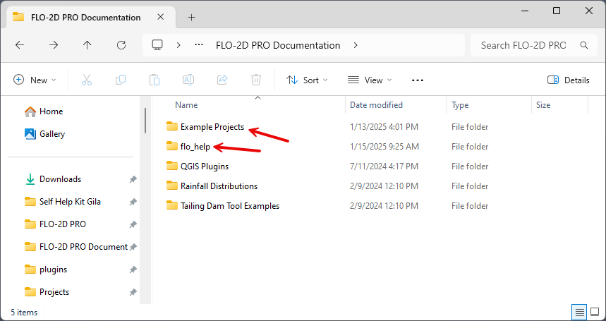

Open QGIS and Set Up
_____________________________________

Open QGIS
+++++++++++

Search for QGIS 3.34 or later in the Windows search bar.

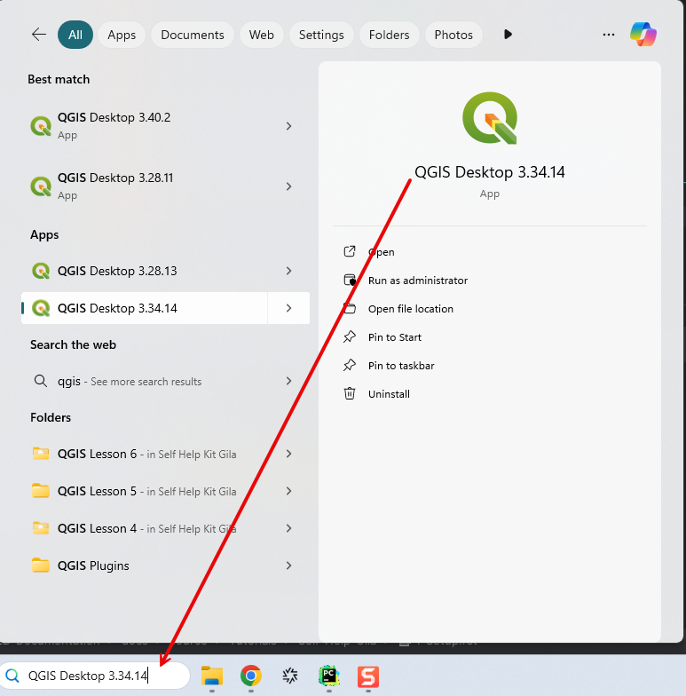

QGIS will appear as shown below. Additional plugins may need to be installed, and some settings may require modification.

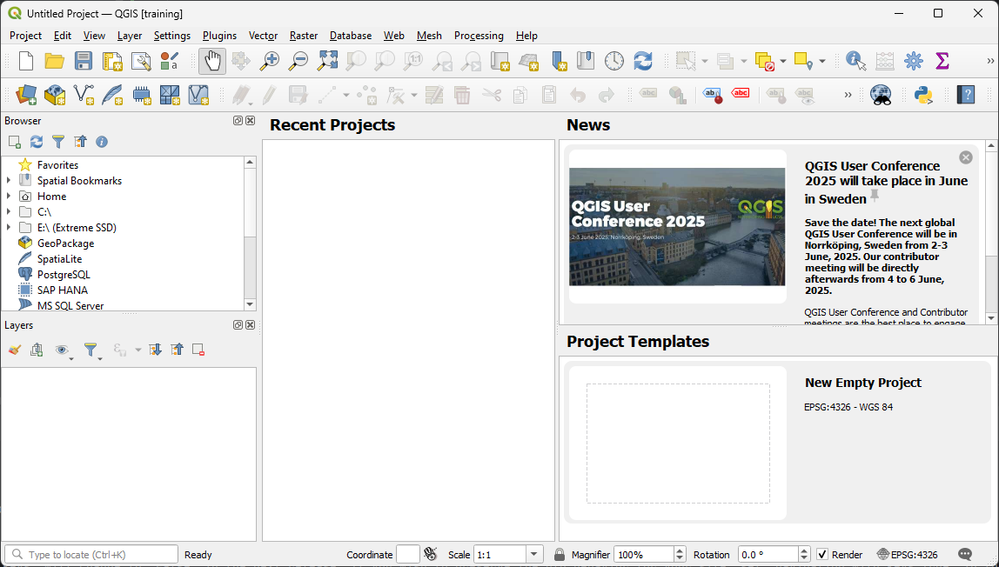

Install Plugins
+++++++++++++++++

**Get the latest plugin!**

|pluginlist|

.. |pluginlist| raw:: html

   <a href="https://flo-2d.com/qgis-plugin/" target="_blank">FLO-2D Plugin Link</a>

.. important:: Ensure that the plugin version matches the installed version of QGIS.

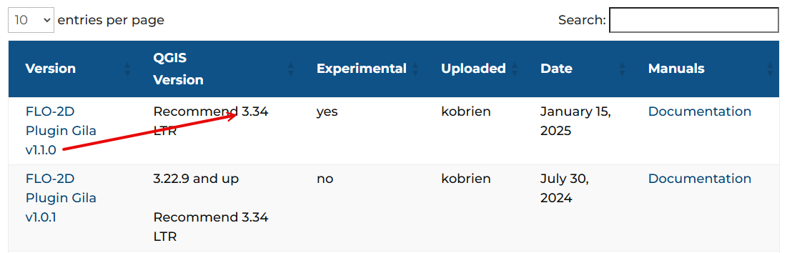

Install FLO-2D and other useful plugins. Navigate to **Plugin > Manage and Install Plugin**.

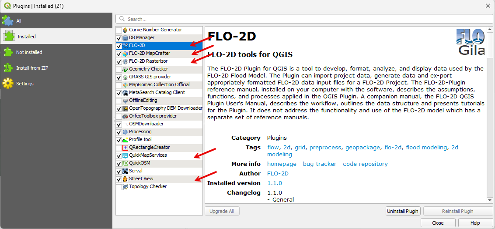

FLO-2D is installed using the **Install from Zipped File** option.

CRS Handling
++++++++++++++++++++++++++++

Navigate to **Settings > Options** and apply the correct configurations.

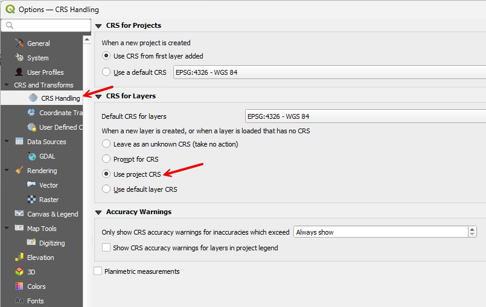

Set Up Quick Map Services
++++++++++++++++++++++++++++

Open the plugin settings and uncheck any maps that are not needed.

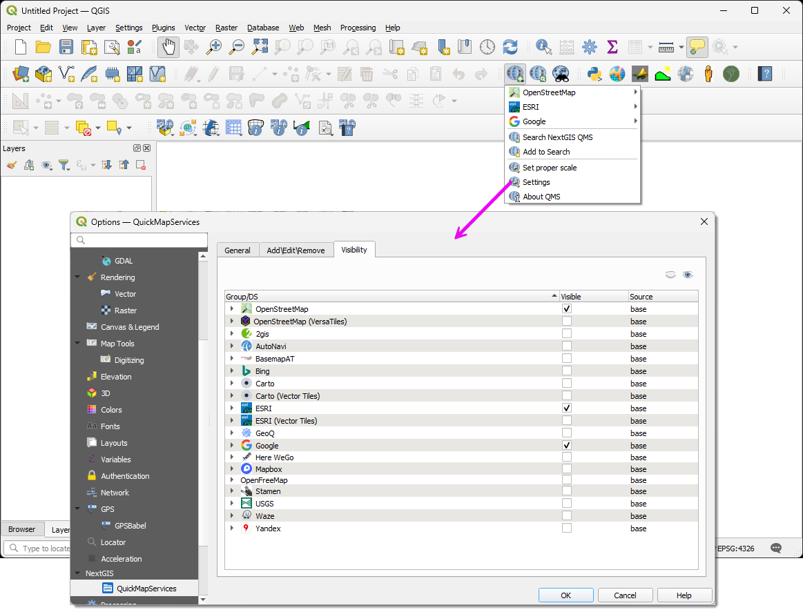

Close and Reload QGIS
_____________________________________

Closing and restarting QGIS ensures that the *User Profile* is saved. If QGIS crashes before being closed after the
initial setup, the setup process must be repeated.

Each user account has a distinct profile. If another user logs into the computer, a separate QGIS profile must be
configured. For example, a student account on a shared computer will not have the same QGIS configuration as an
administrative account.

FLO-2D Reference Materials
=============================

Technical reference manuals, user manuals, and tutorials are found on the FLO-2D website. https://documentation.flo-2d.com

The most important documents are:

-Data Input Manual
-FLO-2D Reference Manual
-Channel Guidelines
-Storm Drain Guidelines
-Hydraulic Structure Guidelines

Technical assistance is available for bug fixes, installation support, and general guidance. Please send a 
screenshot of the problem to us via email. Most tech support is managed quickly and effectively by email. 
The short course files are installed in the path:

C:\\Users\\Public\\Documents\\FLO-2D PRO Documentation\Example Projects\\Self Help Kit

FLO-2D Units
=====================

.. list-table::
   :header-rows: 1
   :widths: 40 30 30

   * - Parameter
     - Unit (Imperial)
     - Unit (Metric)

   * - Grid Size
     - feet (ft)
     - meters (m)

   * - Elevation
     - feet (ft)
     - meters (m)

   * - Area
     - square feet (ft²)
     - square meters (m²)

   * - Storage Volume (Large Scale)
     - acre-feet (ac-ft)
     - cubic meters (m³)

   * - Discharge
     - cubic feet per second (cfs)
     - cubic meters per second (m³/s)

   * - Simulation Time
     - hours (hr)
     - hours (hr)

   * - Time Step
     - hours (hr)
     - hours (hr)

   * - Flow Velocity
     - feet per second (ft/s)
     - meters per second (m/s)

   * - Hydraulic Conductivity
     - inches per hour (in/hr)
     - millimeters per hour (mm/hr)

   * - Rainfall Intensity
     - inches per hour (in/hr)
     - millimeters per hour (mm/hr)

   * - Manning's n
     - dimensionless
     - dimensionless

   * - Flow Rate
     - cubic feet per second (cfs)
     - cubic meters per second (m³/s)
		
There is no need to convert Manning's N. The conversion is part of the calculation		

