Dam and Levee Tool 
===================

**Overview**

This lesson will outline the process of setting up a dam with the Levee
Tool, filling the reservoir with clear water, defining prescribed breach
conditions, and running a simple, clear water breach model. The clear
water model establishes that the reservoir and dam are set up correctly.

**Required Files**

The step makes use of Elevation Post Disaster and the Dam Crest. The
required data is available at C:\\Users\\Public\\Documents\\FLO-2D PRO
Documentation\\Example Projects\\Tailings Dam Breach Workshop\\data\\

+-------------------------+-------------------+------------------------+
| File                    | Content           | Location               |
+=========================+===================+========================+
| Elevation Pre Disaster  | Elevation Pre     | ..\\6. Dam and         |
| - Modified.tif          | Disaster -        | Levee\\data            |
|                         | Modified          |                        |
+-------------------------+-------------------+------------------------+
| Dam Crest.shp           | Dam crest         |                        |
+-------------------------+-------------------+------------------------+
| Elevation               | Elevation         |                        |
| Correction.shp          | Correction        |                        |
+-------------------------+-------------------+------------------------+
| Cross Sections.shp      | Cross sections    |                        |
+-------------------------+-------------------+------------------------+

.. important::  This video discusses why we apply different modeling practices in an area that was a Stack Collapse.

.. raw:: html

   <iframe width="560" height="315" src="https://www.youtube.com/embed/E7y-4EXxsyQ?si=aDiKiiKm-_TE0gyl"
   title="YouTube video player" frameborder="0" allow="accelerometer; autoplay; clipboard-write; encrypted-media;
   gyroscope; picture-in-picture; web-share" referrerpolicy="strict-origin-when-cross-origin" allowfullscreen></iframe>

.. note::  This video shows how to set up a clear water dam and breach it using prescribed failure rates.  It's the
   primary modeling test before adding tailings to the model.  This is not a stack collapse.  That is another lesson.

.. raw:: html

   <iframe width="560" height="315" src="https://www.youtube.com/embed/gCxcbwSAgBs?si=LwUOdq3iLmno1FSI"
   title="YouTube video player" frameborder="0" allow="accelerometer; autoplay; clipboard-write; encrypted-media;
   gyroscope; picture-in-picture; web-share" referrerpolicy="strict-origin-when-cross-origin" allowfullscreen></iframe>

Step 1: Interpolate Elevation Pre-Disaster Modified
---------------------------------------------------

The Pre Disaster DEM was modified using the FLO-2D Dam Removal
Pre-processing tools. This is not covered in this workshop for the sake
of brevity. More information can be found on the FLO-2D Plugin user
manual.

1. Drag the Elevation Pre Disaster - Modified.tif file onto the map
   space.

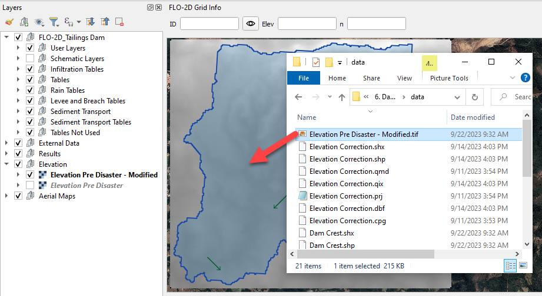

2. To interpolate the elevation to the grid layer from a raster layer,
   use the Sample Grid Elevation icon.

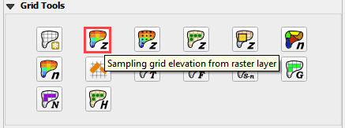

3. Click on the Sample Grid Elevation icon and enter the required data
   in the dialog fields and click OK.

.. image:: ../img/Tailings/tddamlevee/damlevee03.png

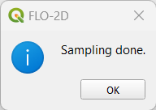

Step 2: Create dam
------------------

The extent of this dam is not realistic because this wasn’t a dam. It
was stacked tailings. This lesson shows how to define a Tailings Dam.
Another lesson will show how to set up stacks for failure.

1. Add the Dam Crest.shp onto map and zoom into the Tailings Dam.

.. image:: ../img/Tailings/tddamlevee/damlevee05.png

2. Create the levee by selecting the Levee Lines under User Layers on
   the Layers.

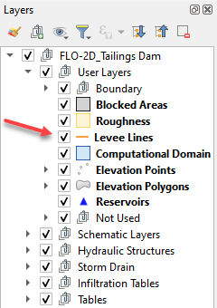

3. Click Toggle Editing to start editing and then click on Add Line
   Feature to draw the Levee.

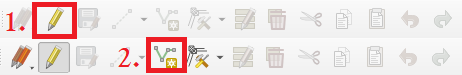

4. Draw the Levee line following the Dam Crest layer template.

5. Use the roller wheel on the mouse to zoom in and out while editing.

6. Use roller wheel click and drag function to pan while editing.

.. image:: ../img/Tailings/tddamlevee/damlevee08.png

7. Right click to finish drawing the levee line. Fill the data as the
   following picture.

.. image:: ../img/Tailings/tddamlevee/damlevee09.png

8. Click the Create Levees button.

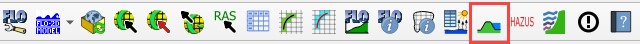

9. Check only User levee lines and click Create Schematic Layers from
   User Layers button. Click ok to close the message.

.. image:: ../img/Tailings/tddamlevee/damlevee011.png

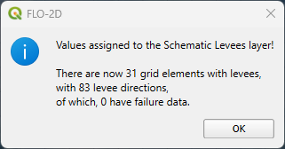

The levee should look like this . The red lines are cutoff lines that
prevent tailings deposits and water from moving downstream. They
represent an thin vertical wall with a uniform elevation.

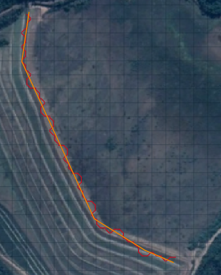

Step 3: Create reservoir
------------------------

1. An initial condition is set to fill the reservoir when FLO-2D PRO.exe
   initiates the simulation.

1. Click the collapse widgets button and open the Initial Condition
   Editor widget.

.. image:: ../img/Tailings/tddamlevee/damlevee014.png

2. Click the add reservoir button.

.. image:: ../img/Tailings/tddamlevee/damlevee015.png

3. Click anywhere within the reservoir and fill the form with the
   following data. Click OK to close the data.

Do not use the Snapping Tool on this layer. The point will snap to the
corner of a grid element and 4 reservoir nodes will be created.

.. image:: ../img/Tailings/tddamlevee/damlevee016.png

4. Click the Save button first and the Schematize button.

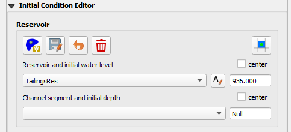

.. image:: ../img/Tailings/tddamlevee/damlevee018.png

5. Make sure only one grid element is schematized. Click OK.

6. It should look like this.

.. image:: ../img/Tailings/tddamlevee/damlevee019.png

7. This data is saved to the INFLOW.DAT file when the model is exported.

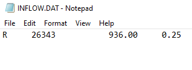

Step 4: Run the simulation 
---------------------------

Reports estimate that approximately 9.7 million cubic meters of material
were involved in the failure. Therefore, the total storage of the
reservoir should be in this range. This test shows how to see the
reservoir volume and make sure the reservoir is not leaking.

1. Open the Control Parameters. Adjust the Simulation time for a quick
   simulation, check the Levees and uncheck Rainfall and Infiltration
   processes for this and the forthcoming runs. Click save.

.. image:: ../img/Tailings/tddamlevee/damlevee021.png

8. Click the main Save icon on the QGIS toolbar.

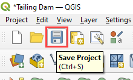

9. Click the FLO-2D Data Export icon, set the export folder to Export
   Reservoir. The Project Folder on the Run Settings is automatically
   updated to the new Export Reservoir folder and it does not need to be
   updated.

.. image:: ../img/Tailings/tddamlevee/damlevee023.png

10. Make sure to uncheck Rain and Infiltration and to check Levees.

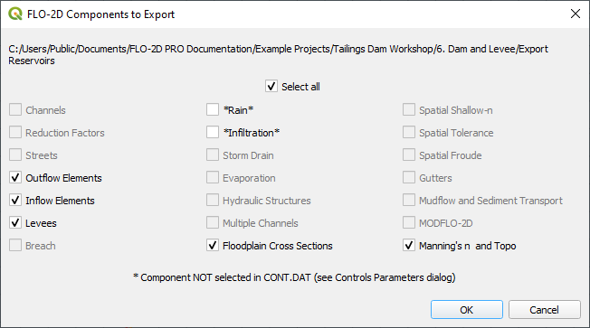

11. Click on the Run FLO-2D icon to run the simulation.

.. image:: ../img/Tailings/tddamlevee/damlevee025.png

12. Check the simulation summary.

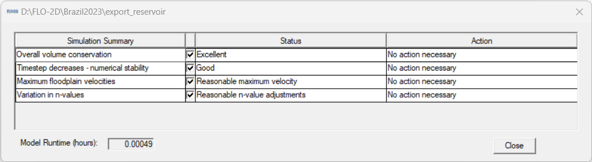

Step 5: Check the reservoir volume
----------------------------------

1. It is possible to check if the reservoir is filled or overfilled by
   using Maxplot and FLO-2D-Rasterizor.

2. **MaxPlot:** click on the drop-down arrow at the right of Run
   Simulation and click on Run MaxPlot.

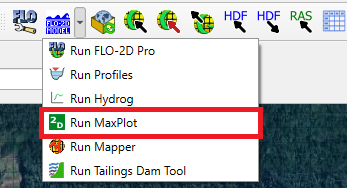

3. **MaxPlot:** Select the Floodplain Maximum Flow Depths – Fluid and
   click OK.

.. image:: ../img/Tailings/tddamlevee/damlevee028.png

4. **MaxPlot:** Check for any water flowing out the reservoir. In this
   case, there is no water flowing out the reservoir that was setup.

.. image:: ../img/Tailings/tddamlevee/damlevee029.png

5. **FLO-2D-Rasterizor:** Open the Rasterizor plugin to check the
   results as the previous lessons.

.. image:: ../img/Tailings/tddamlevee/damlevee030.png

6. **FLO-2D-Rasterizor:** Using this method, it is also possible to
   visualize that the water is not flowing out the reservoir.

7. Here is a sample of the INFLOW.DAT and the SUMMARY.OUT.

.. image:: ../img/Tailings/tddamlevee/damlevee031.png

8. The volume stored in the reservoir is close to the reported storage
   volume. Minor adjustments to the reservoir elevation will achieve the
   reported volume.

9. The reservoir test showed that the reservoir was set up correctly.

Step 6: Set up breach failure
-----------------------------

Set up the levee grid failure condition in QGIS. This location can
represent a weak point on a dam: spillways, stilling basins, sag,
deformation, or erosion, boreholes, ends points, etc.

It is important to start the breach from the correct side of the levee
feature. The breach must be asigned to a levee cutoff that can fail. The
grid elemet must contain water. The red arrows are places where a breach
will not work. The green arrows are locations where a breach will work.

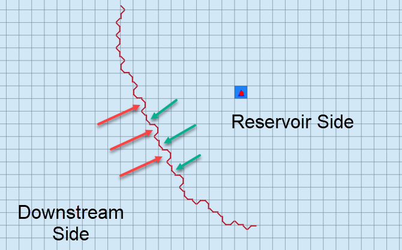

1. Using the Grid Info Tool, pick a grid element that has a levee with a
   configuration that will allow the breach.

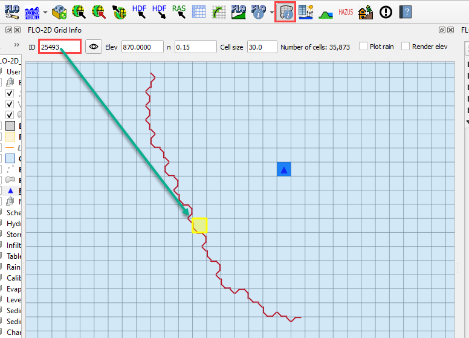

13. Click the collapse button from the FLO-2D widget.

14. Open Levees and Breach Editor.

15. Select radio button for Prescribed Failure and click Levee Grid
    elements.

.. image:: ../img/Tailings/tddamlevee/damlevee034.png

16. Enter levee grid element ID in the Individual Levee Data dialog and
    use the eye button to get to the selected levee element. Zoom in and
    zoom out can help to locate the grid.

17. Click the breach failure **direction** **elevation** **box.** When
    the box changes color, it is selected for failure editing.

18. Fill the form and Apply Change and Close.

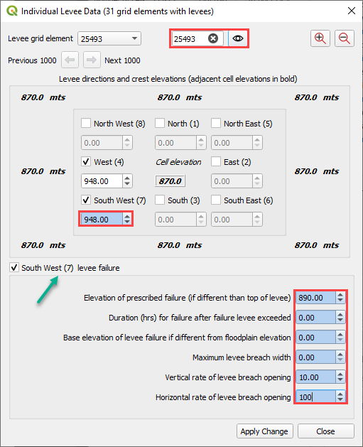

This method is a simple test case to analyze the clear water levee
failure routing mechanism. It doesn’t require very much data to initiate
a failure. Once this method is working as desired, advanced failure
methods can be applied to the dam or stacks.

Step 7: Add cross sections
--------------------------

The cross sections are used to compute hydrographs for flow crossing a
line of cells, including floodplain, channel and street flow elements.
The floodplain editor sets the FPXSEC.DAT file. The lines should be
horizontal, vertical or diagonal to the grid elements. If the line is
not very close to the grid alignment, the intersector may have trouble
finding the correct alignment.

1. Add the Cross Sections.shp layer onto map.

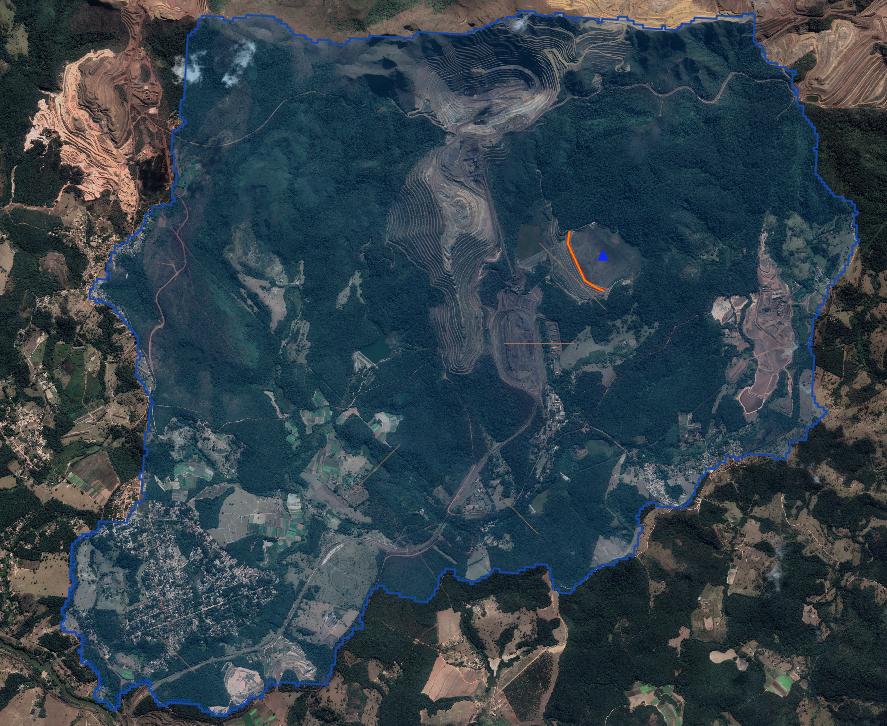

2. Expand the Floodplain Cross Sections Editor and click on Add user
   floodplain cross-section.

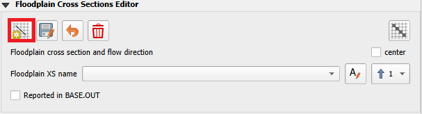

3. Starting from the most upstream cross section to downstream, zoom
   into the first cross section. Following the Cross Sections layer,
   draw the cross section. Right click to finish drawing the cross
   section and name this cross section “Cross Section 1”.

.. image:: ../img/Tailings/tddamlevee/damlevee038.png

4. Repeat this process to the other 4 cross sections. At the end, click
   on Save added floodplain cross-section.

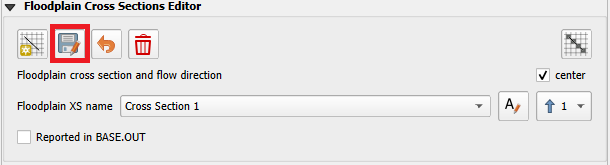

5. The flow direction most perpendicular to the polyline must be
   assigned. Select each Floodplain XS name on the dropdown and set the
   flow direction as the table below.

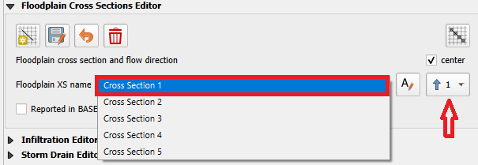

+----------------------------------------+-----------------------------+
| Cross section name                     | Flow direction              |
+========================================+=============================+
| Cross Section 1                        | 7                           |
+----------------------------------------+-----------------------------+
| Cross Section 2                        | 3                           |
+----------------------------------------+-----------------------------+
| Cross Section 3                        | 7                           |
+----------------------------------------+-----------------------------+
| Cross Section 4                        | 8                           |
+----------------------------------------+-----------------------------+
| Cross Section 5                        | 7                           |
+----------------------------------------+-----------------------------+

Make sure that each cross section is assigned to a number 1 – 8 that is
a flow direction most perpendicular to the polyline. An incorrect
direction will result in incorrect discharge calculation.

6. Once all the flow directions are set, click on Schematize floodplain
   cross sections.

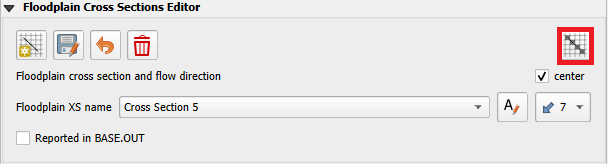

7. Click OK to close the message.

.. image:: ../img/Tailings/tddamlevee/damlevee042.png

8. Uncheck the external Cross Sections layer and check if the cross
   sections were added correctly. The project should look like this.

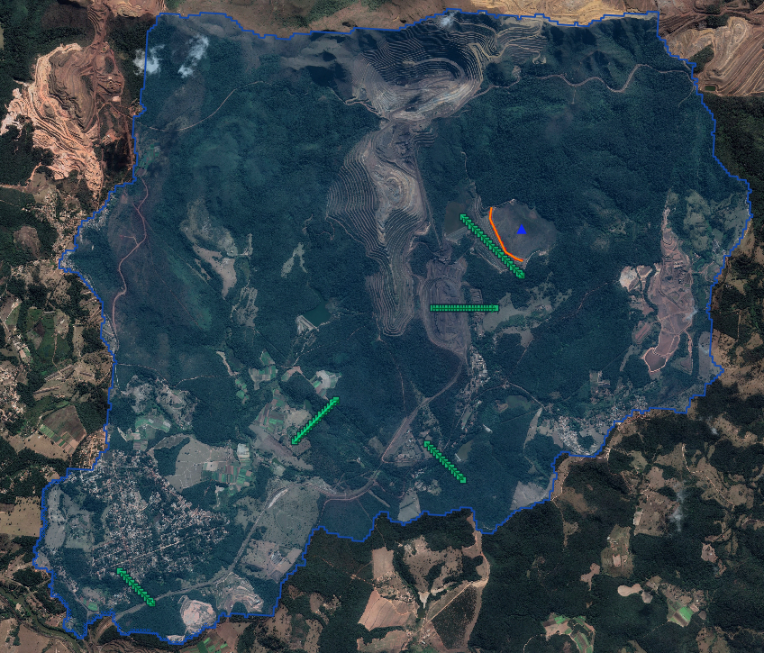

Step 8: Export and run
----------------------

1. Open the Control Variables and adjust the Time Control and Plot
   Variables.

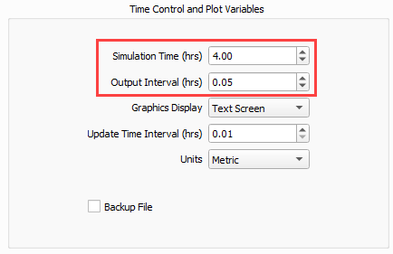

1. Click the main Save icon on the QGIS toolbar.

.. image:: ../img/Tailings/tddamlevee/damlevee045.png

2. Click the FLO-2D Data Export icon, set the export folder to Export
   Breach. The Project Folder on the Run Settings is automatically
   updated to the new Export Breach folder and it does not need to be
   updated.

.. image:: ../img/Tailings/tddamlevee/damlevee046.png

3. Uncheck rain and infiltration and click OK.

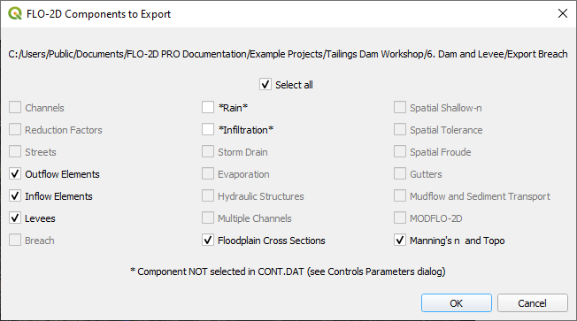

4. Click on the Run FLO-2D icon to run the simulation.

.. image:: ../img/Tailings/tddamlevee/damlevee048.png

5. Check the simulation summary. Close the window when the run is
   complete.

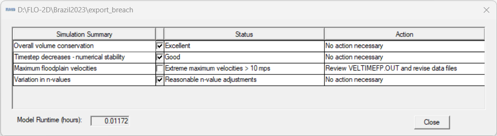

Step 9: Check the breach
------------------------

1. Use FLO-2D-Rasterizor to check depth.out results to see the max flow
   depth.

.. image:: ../img/Tailings/tddamlevee/damlevee050.png

2. To review floodplain cross sections hydrographs, use Hydrog. Open the
   dropdown menu by clicking on the arrow close to Run Simulation and
   open the Run Hydrog.

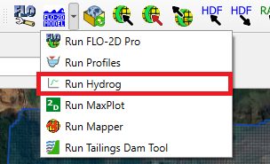

3. On the Hydrog, click on Plot Cross Section Hydrographs.

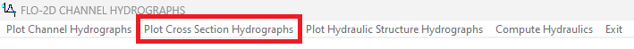

4. Select the first cross section for plotting and click OK.

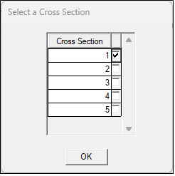

5. The graph shows the Discharge on the y-axis and the time in the
   x-axis.

.. image:: ../img/Tailings/tddamlevee/damlevee054.png

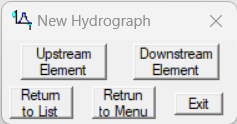

6. Using the New Hydrograph window, it is possible to navigate between
   upstream and downstream cross sections to check for any issues.

The clear water test shows that the breach and reservoir parameters are
set up correctly. It is a simpler case and once the prescribed breach is
working correctly, the tailings case is less likely to require
troubleshooting.

Note that as the class progresses the changes in the modeling results
can be compared by the maps loaded from FLO-2DRasterizor. Keep the maps
organized for easy review of changes.

.. image:: ../img/Tailings/tddamlevee/damlevee056.png

