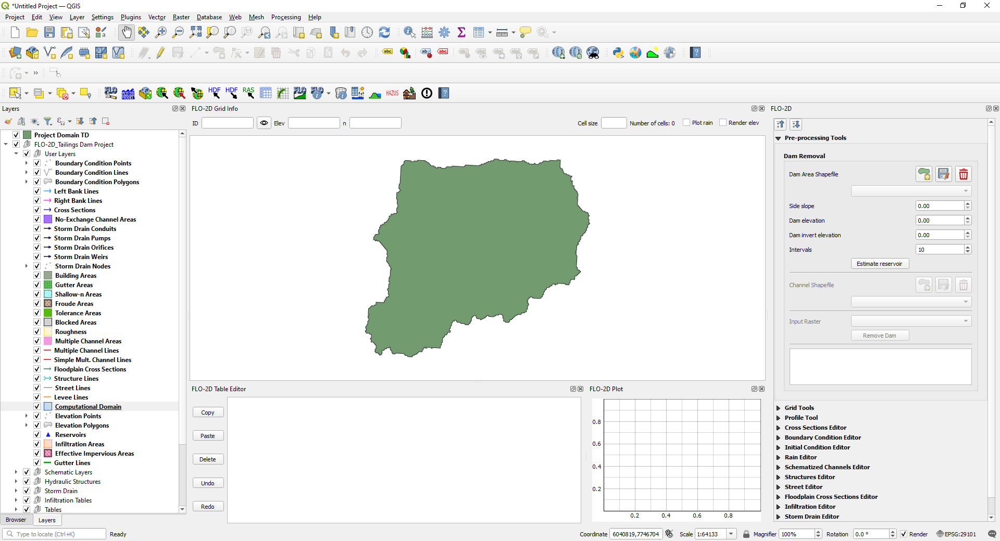
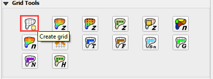
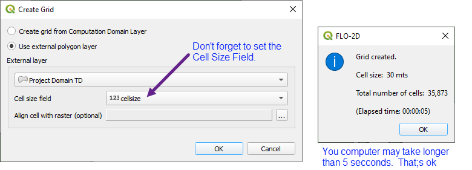
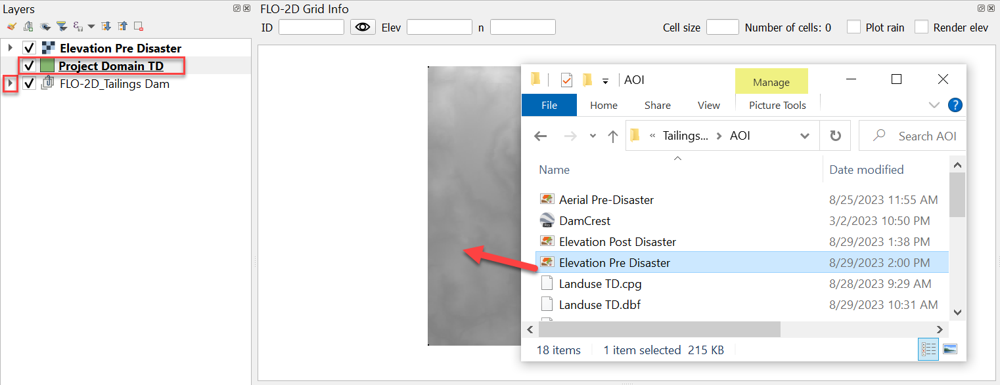
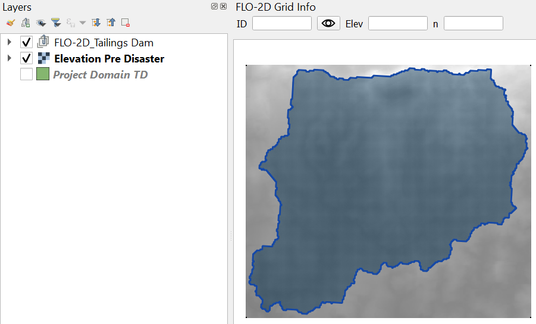
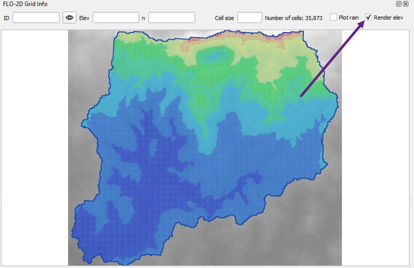
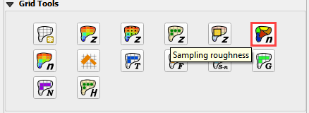
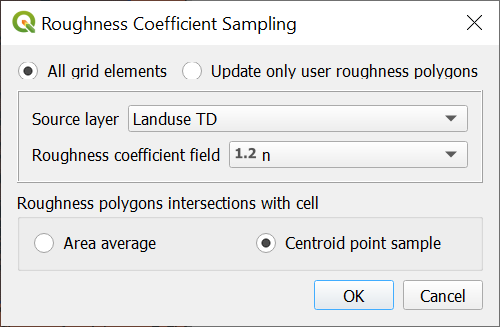
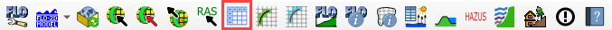
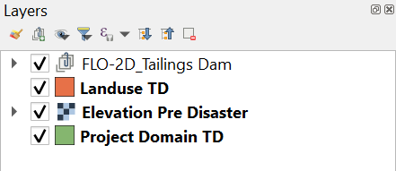

Project Set-Up
==============

**Overview**

This step will outline the process of setting up a FLO-2D project using
the Plugin for QGIS. Setting up the computational domain, creating a
grid, interpolating elevation data and spatially variable roughness.

**Required Data**

This step makes use of terrain elevation data, project domain, and
roughness data. The required data is available here:

C:\\Users\\Public\\Documents\\FLO-2D PRO Documentation\\Example
Projects\\ Tailings Dam Breach Workshop\\

+------------------+-------------------------+-------------------------+
| File             | Content                 | Location                |
+==================+=========================+=========================+
| Elevation Pre    | Digital terrain raster  | ..\\2. Project          |
| Disaster.tif     |                         | Setup\\Data             |
+------------------+-------------------------+-------------------------+
| Project Domain   | Polygon for project     | ..\\ 2. Project         |
| TD.shp           | domain                  | Setup\\Data             |
+------------------+-------------------------+-------------------------+
| Landuse TD.shp   | Shapefile for spatially | ..\\ 2. Project         |
|                  | variable roughness      | Setup\\Data             |
+------------------+-------------------------+-------------------------+

.. raw:: html

   <iframe width="560" height="315" src="https://www.youtube.com/embed/I5B6x8QH7XM?si=tbEnL30Dtl_2_eQY"
   title="YouTube video player" frameborder="0" allow="accelerometer; autoplay; clipboard-write; encrypted-media;
   gyroscope; picture-in-picture; web-share" referrerpolicy="strict-origin-when-cross-origin" allowfullscreen></iframe>

Step 1: Open QGIS and load project domain
-----------------------------------------

1. Search the start menu and run the QGIS Desktop program. Look for QGIS
   version 3.22 **or higher**.

.. image:: ../img/Tailings/tdproject/tdproject01.png

2. Click the New Project icon to load a new map.

.. image:: ../img/Tailings/tdproject/tdproject02.png

3. Open the project folder and drag the file Project Domain TD.shp onto
   the map space. This will set the CRS to the correct EPSG code. The
   code should be 29101.

.. image:: ../img/Tailings/tdproject/tdproject03.png

Step 2: Create the GeoPackage
-----------------------------

1. Click the Settings icon.

.. image:: ../img/Tailings/tdproject/tdproject04.png

2. Fill out the dialog box as shown below. Set the Grid cell size to 30
   m. Click Create.

3. Save the geopackage file to the project folder. Name the file
   Tailings Dam.gpkg.

.. image:: ../img/Tailings/tdproject/tdproject05.png

4. Set the project CRS to SAD69 / Brazil Polyconic (m). Filter the list
   with an **EPSG code: 29101**. Select EPSG: 29101 and click OK.

.. image:: ../img/Tailings/tdproject/tdproject06.png

5. Wait for the geopackage to write and check the accuracy of the
   project settings and click OK.

.. image:: ../img/Tailings/tdproject/tdproject07.png

6. The project should look like this:

7. Click the Collapse button and then expand the Grid Tools Widget.

.. image:: ../img/Tailings/tdproject/tdproject09.png

Step 3: Create the grid
-----------------------

1. From the Grid Tools widget, click Create Grid.

2. Select the Project Domain TD layer, and the Cell Size field and click
   OK. Click OK to close the Grid information window.

3. Save the project. Click the main Save icon on the QGIS toolbar.

.. image:: ../img/Tailings/tdproject/tdproject012.png

4. Navigate to the project folder, name the project Tailings Dam.qgz and
   click Save.

Step 4: Interpolate the elevation
---------------------------------

1. Collapse the FLO-2D Project Layers.

2. Select the Project Domain Layer so that it is active.

3. Drag the Elevation Pre Disaster.tif onto the map.

4. Uncheck the Project Domain Layer and drag it to the bottom of the
   Layers List.

5. Drag the Elevation layer to the bottom of the list.

6. The map should look like the following image.

7. To interpolate the elevation to the grid layer from a raster layer,
   use the Sample Grid Elevation icon.

.. image:: ../img/Tailings/tdproject/tdproject015.png

8. Click on the Sample Grid Elevation icon and enter the required data
   in the dialog fields and click OK. Click the OK box to close the
   Sampling Done dialog box.

.. image:: ../img/Tailings/tdproject/tdproject016.png

.. image:: ../img/Tailings/tdproject/tdproject017.png

9. The Render elev button will show if the process worked correctly.

Step 5: Assign roughness
------------------------

1. To assign roughness data, open the project folder and drag the
   Landuse TD.shp file onto the map space.

Important Note: New layers are placed on top of the Active layer. If a
layer is added to the map and lost, look in the FLO-2D groups to find
it. A good practice is to select the layer elevation layer before adding
new data. Then the elevation data wont’ cover the new layer.

.. image:: ../img/Tailings/tdproject/tdproject019.png

2. Click the Sample roughness icon.

3. Fill the dialog box and click OK. Click OK to close the next message
   window.

.. image:: ../img/Tailings/tdproject/tdproject022.png

4. The roughness values and elevations are assigned to the grid layer in
   the Schematized Layers group. Right click the Grid layer and click
   Open Attribute Table to see the data.

.. image:: ../img/Tailings/tdproject/tdproject023.png

5. Click the Set Control Parameters Icon to assign the control
   variables.

6. Fill the dialog box using the two figures below and save the data to
   the GeoPackage with the Save icon. The variable descriptions and
   additional instructions are presented in the Data Input Manual. The
   drag bar will expose the save button.

.. image:: ../img/Tailings/tdproject/tdproject025.png

.. image:: ../img/Tailings/tdproject/tdproject026.png

7. Save the project.

Step 6: Configure layers
------------------------

1. Move the extra data to the bottom of the layers list.

.. image:: ../img/Tailings/tdproject/tdproject028.png

2. Expand the FLO-2D User Layers and Group the Boundary Conditions and
   Channels. Select the layers to be grouped. Right click and click
   Group Selected. Name the group to finish!

.. image:: ../img/Tailings/tdproject/tdproject029.png

3. Group all the layers that will not be needed into a group called Not
   Used.

4. This procedure makes it easier to find layers that are more commonly
   used.

.. image:: ../img/Tailings/tdproject/tdproject030.png

5. Repeat the procedure with the tables that are not needed.

6. Click the QGIS save button to save this configuration.

.. image:: ../img/Tailings/tdproject/tdproject031.png

