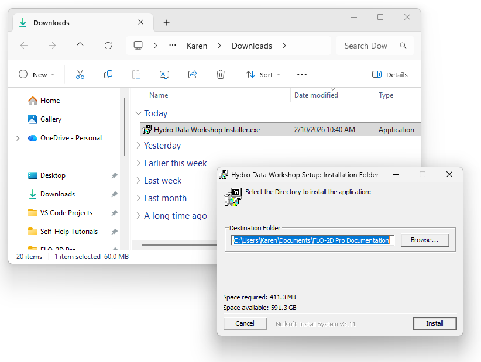
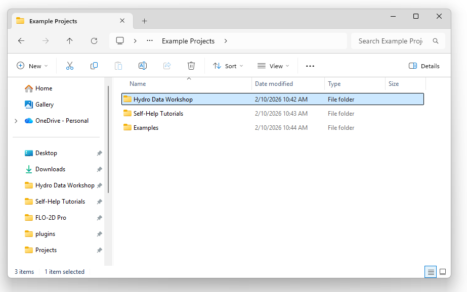
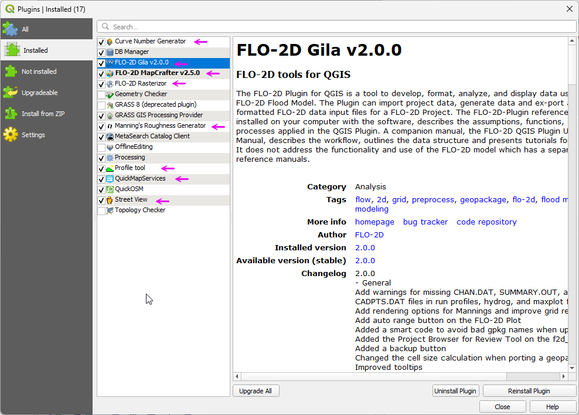
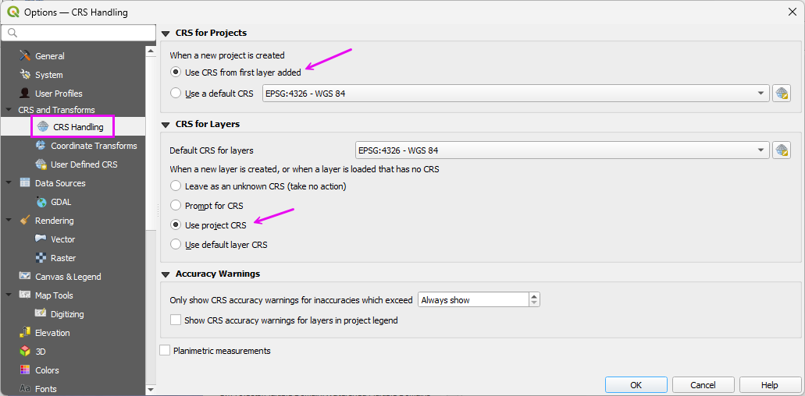
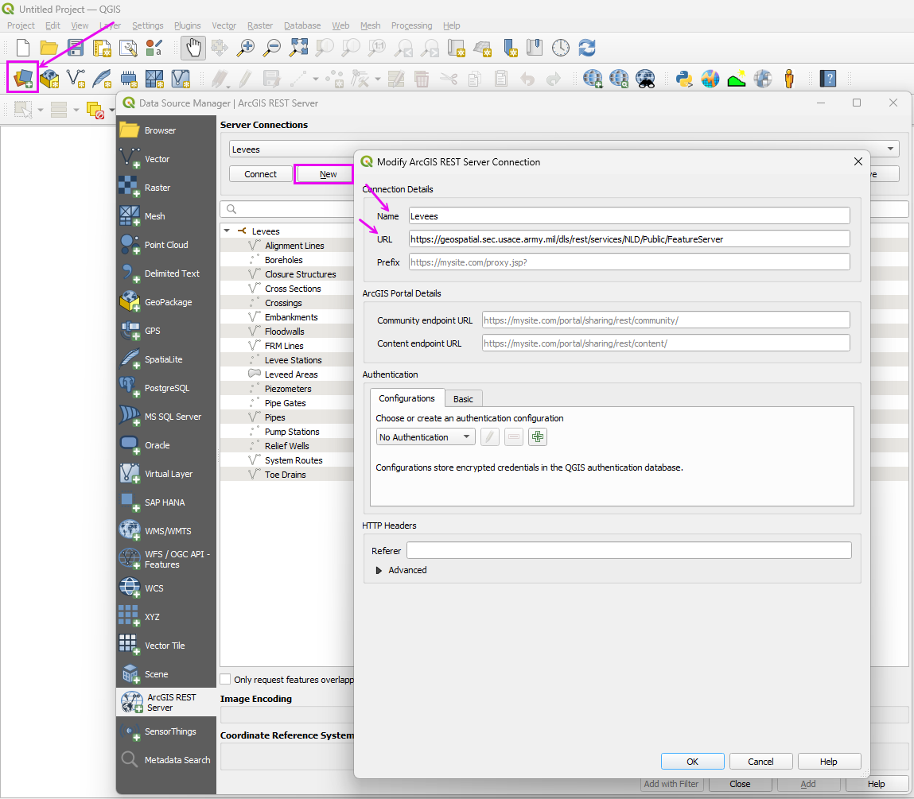
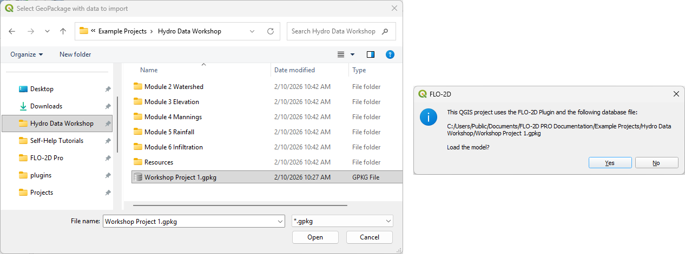
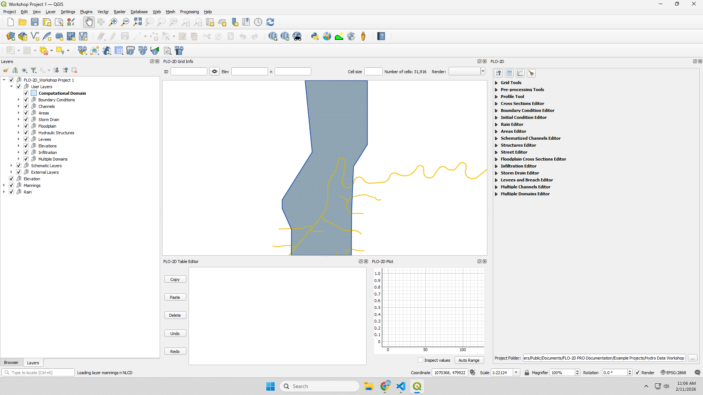
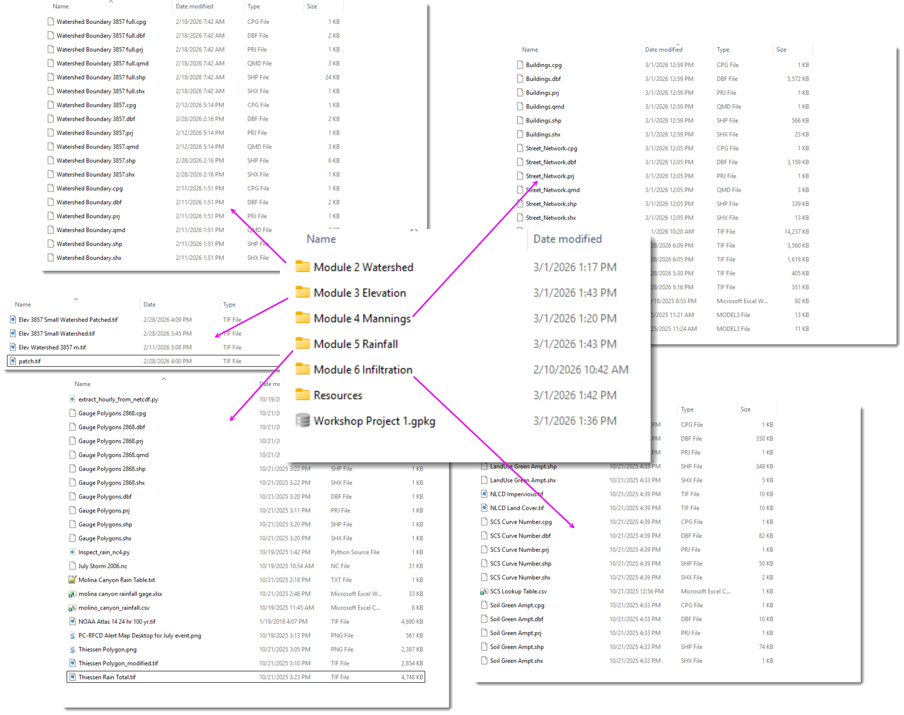

Module 1 - Install FLO-2D Pro and QGIS
====================================================

This module will prepare your computer for the FLO-2D workshop. By the end of this module, 
you will have QGIS, the FLO-2D Plugin, and the FLO-2D Pro engine installed and ready for use. :contentReference[oaicite:0]{index=0}

Step 1: Get the installers
---------------------------------------------------

1. Download the required installer here:

   <a href="https://flo-2d.sharefile.com/d-s324ed541474440dd85aaad107c07063c" target="_blank" rel="noopener noreferrer">Download</a>

Step 2: Install the FLO-2D Build 25
------------------------------------

Install FLO-2D using the following instructions.  Admin Rights Required.

.. image:: img/Instructions/image3.png

1. Right click zipped file to access properties.

2. Unblock the file if necessary.

.. image:: img/Instructions/image41.png

3. Double click the Setup file to run the installer.

.. image:: img/Instructions/image5.png

4. Check all options and click next.

.. image:: img/Instructions/image15a.png

5. Click Next and Install to run the installer.

.. image:: img/Instructions/image16.png

6. The Microsoft Visual C++ redistribution packages are embedded in the FLO-2D installer.  They install passively,
   but may request a restart.

The activator is stored in the tech support account. It requires Admin Rights to run.

.. important::

   The activator name tag is MM-YY where MM is the month and YY is the year of purchase. Don't run an activator from previous years.

|Activator|

.. |Activator| raw:: html

   <a href="https://flo-2d.sharefile.com/" target="_blank">Sharefile Login</a>

1. Download and run the activator.

.. image:: img/Instructions/inst002.png

2. Activation lasts 1 year past the purchase date.

.. image:: img/Instructions/inst003.png

3. FLO-2D uses a site license.  It can be installed and activated on any computer in the office that holds the
   license.  The license agreement is saved to the Documentation folder along with the rest of the FLO-2D Documentation.

C:\\users\\public\\documents\\FLO-2D Pro Documentation

Follow these instructions to set up an older version of QGIS. 

   Get an old stand alone installer from the QGIS download archive:

      .. raw:: html

         <a href="https://download.osgeo.org/qgis/win64/" target="_blank" rel="noopener noreferrer">QGIS Installer Archive</a>
   
   
   .. note:: The images reference QGIS version 3.34 and 3.28 but the steps are the same for any stand alone version of QGIS.
      
   .. image:: img/Instructions/archive.png
      :width: 600px
      :class: bordered-img
   
   1. Double click the QGIS installer.

   2. Finish installing with the default settings.

   .. image:: img/Instructions/image8.png
      :width: 600px
      :class: bordered-img

Step 3: QGIS Setup Profile
--------------------------------------------

.. _flo2d_plugin_step:

Build a QGIS User Profile by following these steps:

.. important::

   This step should be performed by the End User.  If it is done on an Admin account, the profile will only be 
   available on the Admin account.

1. Open QGIS. Any version newer than 3.30 should work.

.. image:: img/Instructions/Worksh002.png
   :width: 600px
   :class: bordered-img

2. Click **Settings → Options**.

.. image:: img/Instructions/image13.png
   :width: 600px
   :class: bordered-img

3. Click the **CRS** tab and set the options shown below.

.. important:: This step is critical for the FLO-2D Plugin to function properly.

.. image:: img/Instructions/image14.png
   :width: 600px
   :class: bordered-img

.. _addflo2dplugin:

Step 4: Install FLO-2D Plugin
-------------------------------

.. warning::

   The FLO-2D Plugin packages a bundled version of the ``h5py`` library for Stand Alone QGIS programs.
   In some QGIS environments, the ``h5py`` binaries can remain locked in memory after the plugin is loaded.  
   This may prevent the plugin from uninstalling, updating, or overwriting files during installation.

   If the plugin cannot be removed or updated:

   1. Close QGIS completely.
   2. Open the plugin directory:

      ::

         C:\Users\YourUserName\AppData\Roaming\QGIS\QGIS3\profiles\default\python\plugins\

      or for QGIS 4:

      ::

         C:\Users\YourUserName\AppData\Roaming\QGIS\QGIS4\profiles\default\python\plugins\

   3. Delete the entire ``flo2d`` plugin folder manually.
   4. Restart QGIS.
   5. Reinstall the FLO-2D Plugin.

   

1. Add the FLO-2D Plugin Repository. Copy this link to the clipboard. Ctrl-C.

   ``https://flo-2dsoftware.github.io/FLO-2D-Plugins/plugins.xml``

2. Open to the Plugin Manager and Find the Settings tab.

3. Click the Add button to add the FLO-2D Plugin Repository.

.. image:: img/Instructions/qgisplugin001.png
   :width: 600px
   :class: bordered-img

4. Fill the form with the repository URL and click OK.

.. image:: img/Instructions/qgisplugin002.png
   :width: 600px
   :class: bordered-img

5. Install the FLO-2D Plugins.

   Switch to the All Plugins tab and filter the list with "FLO-2D".

   Install the following plugins:

.. image:: img/Instructions/qgisplugin003.png
   :width: 600px
   :class: bordered-img

Step 5: Recommended Plugins
-----------------------------------

1. These additional plugins are helpful for FLO-2D Model Development.

2. These plugins can be installed from the **All Plugins** menu:

   - Quick Map Services  
   - Profile Tool  
   - Curve Number Generator
   - Manning's Roughness Generator
   - Street View
   - QuickOSM

.. image:: img/Instructions/qgisplugin004.png
   :width: 600px
   :class: bordered-img

3. Quick Map Services requires an additional step.

   Click the QMS icon → Settings → More Services → **Get Contributed Pack**.

.. image:: img/Instructions/image15.gif
   :width: 600px
   :class: bordered-img

This concludes the installation and setup.  Please restart QGIS to save the profile.
Tutorial data is located here:

``C:\Users\Public\Documents\FLO-2D PRO Documentation\Example Projects\QGIS Tutorials``

Step 6: Set up the quick access folder
-----------------------------------------

- Find the training folder.

C:\\Users\\Public\\Documents\\FLO-2D PRO Documentation\\Example Projects

- Drag the Workshop Folder into the Quick Access Area.
- It can be removed after the class is over.

|hydrow003|

Step 3: Load QGIS
-----------------------------------------

- Open QGIS

|hydrow004|

- Open the plugin manager and load the Installed Tab.

|hydrow005|

- If you are missing any of these plugins please follow the :ref:`Install Instructions <setup_qgis_flo2d_plugin>`.

|hydrow006|

- Open the Settings>>Options menu.

|hydrow007|

- Find the CRS tab and select the **Use Project CRS** button.

|hydrow008|

- QGIS Layout Overview

|hydrow009|

- QGIS Toolbar Layout Overview

|hydrow010|

Module 1 - Connect Data 
=============================

Use the following steps to connect to U.S. government or international data servers. If a local agency provides a server connection URL, 
QGIS can connect to it using the same workflow. Servers that require authentication can be configured through the QGIS connection settings.

Step 1: 3DEP elevation server connection
---------------------------------------------------

- Load the Data Manager by clicking the colorful icon below.
- Set the tab to WCS.
- Click New and enter a name and paste the URL.

URL: https://elevation.nationalmap.gov/arcgis/services/3DEPElevation/ImageServer/WCSServer

|hydrow011|

Step 2: Land cover NLCD server connection
---------------------------------------------------

- Load the Data Manager by clicking the colorful icon below.
- Set the tab to WCS.
- Click New and enter a name and paste the URL.

URL: https://dmsdata.cr.usgs.gov/geoserver/mrlc_Land-Cover-Native_conus_year_data/wcs

|hydrow012|

Step 3: Hydrography NHD server connection
---------------------------------------------------

- Load the Data Manager by clicking the colorful icon below.
- Set the tab to ArcGIS REST Server.
- Click New and enter a name and paste the URL.

URL: https://hydro.nationalmap.gov/arcgis/rest/services/NHDPlus_HR/MapServer

|hydrow013|

Step 4: FEMA Effective Server
---------------------------------------------------

- Load the Data Manager by clicking the colorful icon below.
- Set the tab to ArcGIS REST Server.
- Click New and enter a name and paste the URL.

URL: https://hazards.fema.gov/arcgis/rest/services/public/NFHL/MapServer

|hydrow014|

Step 5: Levee Database
---------------------------------------------------

- Load the Data Manager by clicking the colorful icon below.
- Set the tab to ArcGIS REST Server.
- Click New and enter a name and paste the URL.

URL: https://geospatial.sec.usace.army.mil/dls/rest/services/NLD/Public/FeatureServer

|hydrow013a|

.. Important:: Close and Reload QGIS to **save the User Profile**. If QGIS crashes before the profile is saved, the **setup** step will need to be repeated.

Module 1 - Load FLO-2D Project 
=================================

Step 1: Load the project
------------------------------

- Click the Open FLO-2D Project button.

|hydrow015|

- Navigate to the Workshop folder and open the Workshop Project 1.gpkg file.

|hydrow015a|

- The project should look like this:

|hydrow015b|

Step 2: Review Available Data
---------------------------------

.. note:: Since the data processing steps in this workshop depend on a good 
   internet connection and the ability to download large datasets, some files are 
   available in the **Workshop** Folders.

- Open the Workshop directory and review the data files.
- If a download process fails, find the data in each respective folder.

|hydrow015c|

.. |hydrow004| image:: ../img/hydrowkshp/hydrow004.jpg

.. |hydrow005| image:: ../img/hydrowkshp/hydrow005.jpg

.. |hydrow007| image:: ../img/hydrowkshp/hydrow007.jpg

.. |hydrow009| image:: ../img/hydrowkshp/hydrow009.jpg

.. |hydrow010| image:: ../img/hydrowkshp/hydrow010.jpg

.. |hydrow011| image:: ../img/hydrowkshp/hydrow011.jpg

.. |hydrow012| image:: ../img/hydrowkshp/hydrow012.jpg

.. |hydrow013| image:: ../img/hydrowkshp/hydrow013.jpg

.. |hydrow014| image:: ../img/hydrowkshp/hydrow014.jpg

.. |hydrow015| image:: ../img/hydrowkshp/hydrow015.jpg

