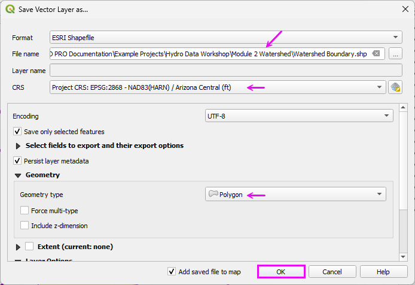
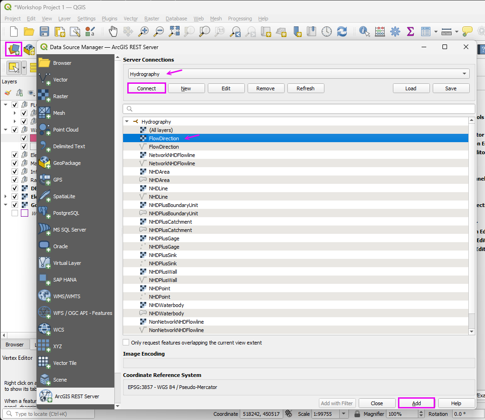
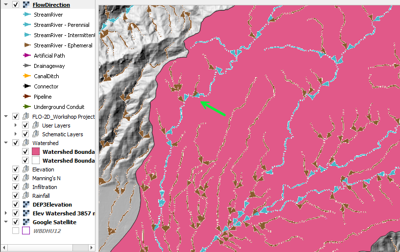
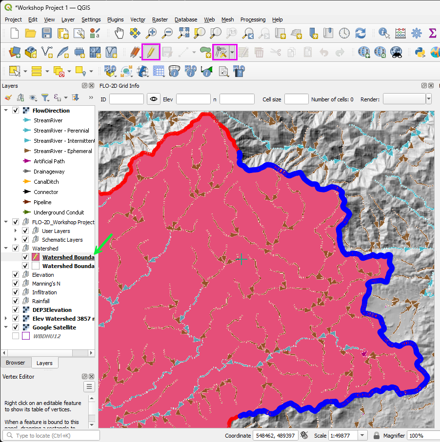
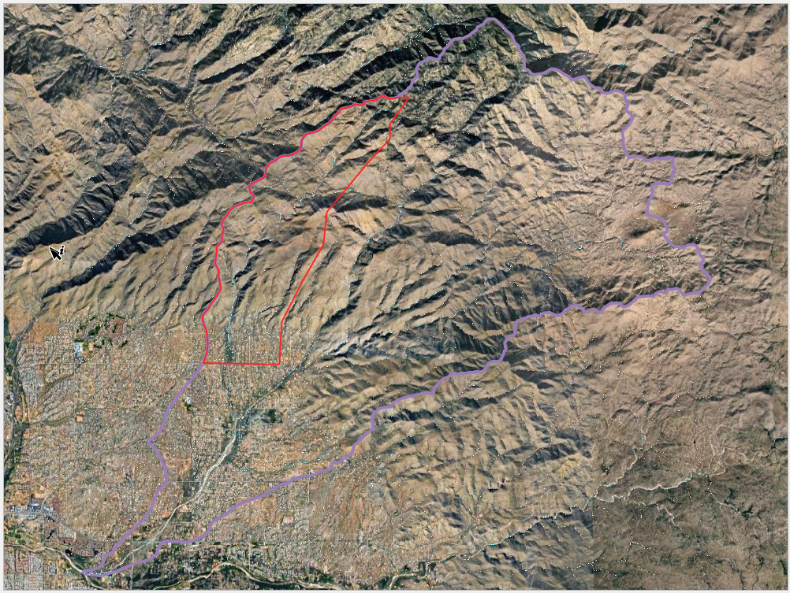
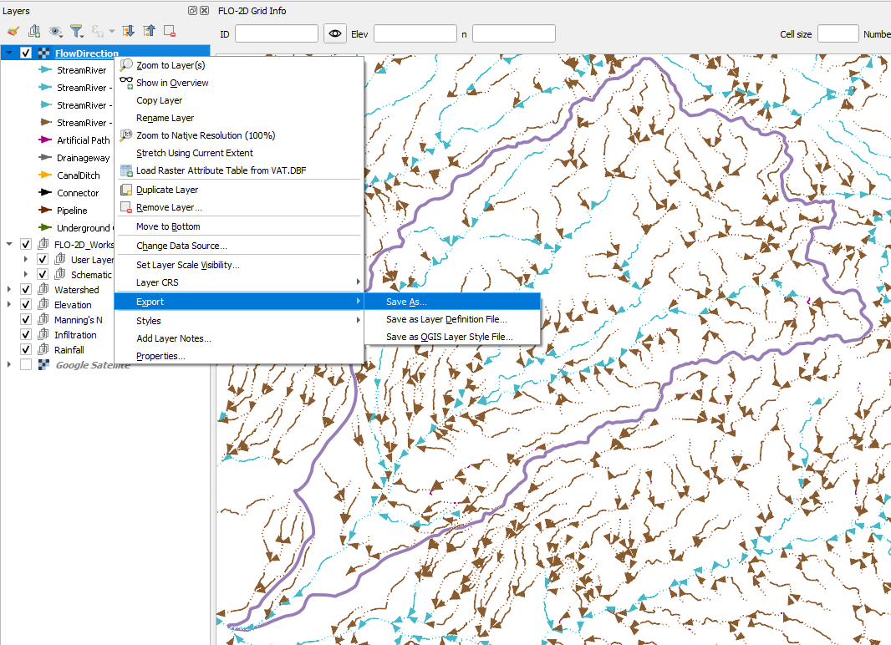
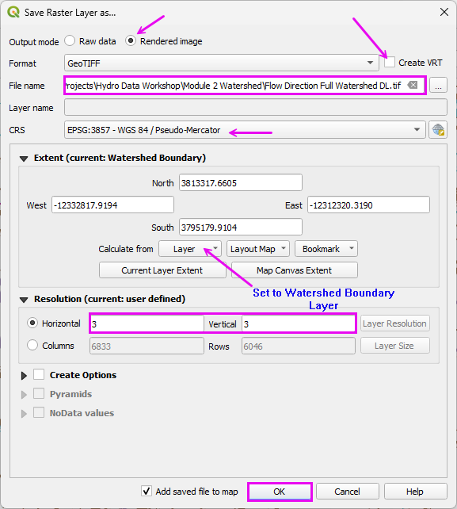
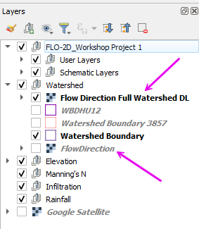
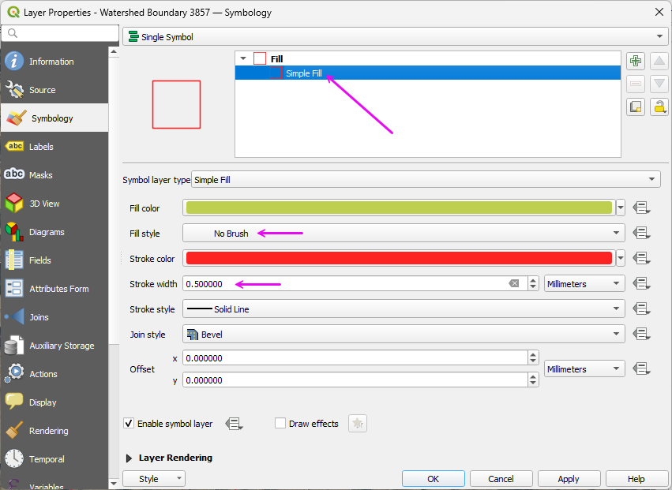

Module 2 - Identify the Contributing Watershed
====================================================

Step 1: Load data
---------------------------------------------------

- Open the Data Source Manager and find the ArcGIS REST tab.
- Connect the National Hydrography data server.
- Select the WBDHU12 Polygon layer.
- Click Add.

|hydrow016|

Step 2: Save one Watershed
---------------------------------------------------

- Zoom to the **Agua Caliente** Watershed.
- Wait for the watershed polygons to load.
- Use the Select tool to select a watershed polygon.

.. note:: This watershed is already part of the project.
   Download it again to learn the process and to get an editable copy.

|hydrow017|

Step 3: Polygon export
---------------------------------------------------

It is easy to export a single watershed polygon or a group of watershed polygons as a Project Domain.
These can be used for FLO-2D or any other 2D model.

- Right click the **WBDHU12** layer and click **Export Data >> Save Features As**.

|hydrow018|

- Fill the form and export the **Watershed Polygon**.

.. note:: This file needs to use EPSG:3857 because that is also the native elevation CRS.

|hydrow019|

- Adjust the polygon style to remove the fill and make the outline heavier.

|hydrow019h|

Step 4: Load the Flow Lines
---------------------------------------------------

- Open the **Data Manager** tool and load the **ArcGIS REST** tab.
- Select the Hydrography layer and click Connect.
- Select the FlowDirection Raster and click ADD.

|hydrow019a|

This project uses Soldier Canyon which is the streamline on the north-east side of the map.

.. important:: If the Flow Direction arrows are not visible, zoom in to a smaller area and 
   allow them to render. Once they display at a closer scale, they typically load more 
   efficiently when zooming back out to a larger extent.

|hydrow019b|

- Once the Flow Directions load, export them to a raster file.

|hydrow019e|

- Fill the form as shown and click OK.

|hydro019f|

- Uncheck the source layer and move both layers to the Watershed Group.

Step 5: Trim the Watershed Polygon
---------------------------------------------------

The watershed polygon is too large so it can be trimmed manually or by running some watershed processin tools.

- Select the Layer **Watershed Boundary 3857**.
- Click the **Edit Pencil**.
- Select the **Vertex Tool**.
- Delete the vertex points that are outside the flow line extent of the Project Area.

.. hint::
   Press Ctrl+Z to undo unintended deletions.
   If the changes are beyond recovery with Undo, toggle off editing mode and decline the save to revert to the last committed state.

- Once finished, untoggle the editor and click Save.

|hydrow019c|

This is the rough project extent.

|hydrow019d|

.. |hydrow016| image:: ../img/hydrowkshp/hydrow016.jpg

.. |hydrow017| image:: ../img/hydrowkshp/hydrow017.jpg

.. |hydrow018| image:: ../img/hydrowkshp/hydrow018.jpg

