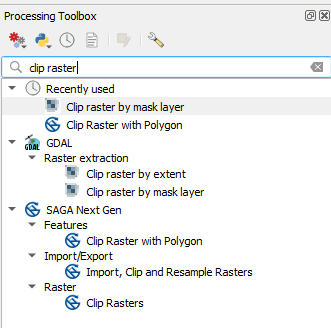
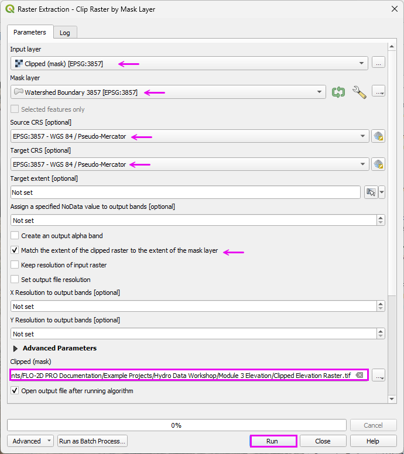
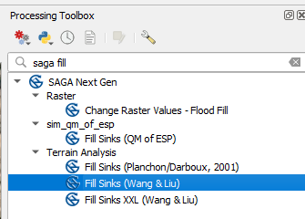
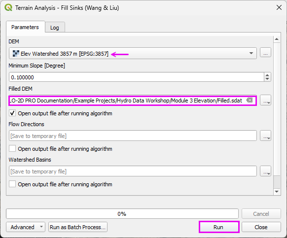
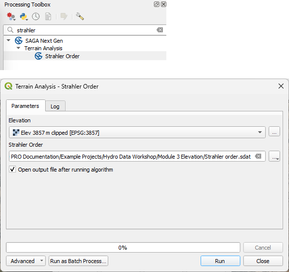

Module 3 - Process Elevation Data
========================================

Step 1: Load elevation data
---------------------------------------------------

- Zoom to the trimmed Watershed Boundary.

|hydrow020|

- Open the Data Source Manager and find the WCS tab.
- Connect the elevation data.
- Select the first layer.
- Set the coordinate system to 3857. (USGS data uses Metric units.) Add the layer.
- Close the Data Source Manager.

|hydrow021|

- Uncheck the 3DEP layer to prevent loading issues caused by its active data connection. 
- Then right-click the layer and choose Repair Data Source to reestablish the link.

|hydrow022|

- Expand the WCS group
- Expand the 3DEP group Select the first layer and click OK.

.. note:: Not certain why this reload step is necessary but it seems to work for all WCS connections.

|hydrow023|

Step 2: Download elevation
---------------------------------------------------

.. important::

   If the download is taking longer than expected, cancel it from the Progress Bar and verify that the selected extent is not excessively large.

   If the download fails or performs poorly, use the following alternative site:

   .. raw:: html

      <a href="https://apps.nationalmap.gov/downloader/" target="_blank">USGS Data Downloader</a>
      

   
.. hint:: 
   Local Agency data may be of better quality than 3DEP data.

- Right click the DEP3Elevation layer and Export a elevation data to cover the Project Area. 

|hydrow024|

- Set the file path.
- Make sure the CRS is 3857.
- Limit the Extent to Watershed Boundary Layer or Map Canvas if zoomed into the project area.

|hydrow025|

- The finished raster should look like this.  
- If it has a bad range, it may need to be patched. 
- Patching a raster consists of downloading the small missing pieces and then merging all of the rasters together.

|hydrow025a|

Step 3 - Clip the raster 
--------------------------

- Open the Processing toolbox and search Clip Raster

|hydrow025b|

- Fill the form as shown below and click Run

|hydrow025c|

- Search the Processing toolbox for saga fill.

.. note:: If Saga isn't in the Toolbox, install it with the Plugin Manager.

|hydrow025d|

- Fill the form as shown and click Run.

|hydrow025e|

- Search the Toolbox for Saga Strahler.
- Fill the form and click Run.

|hydrow025f|

- Run raster cacluator on the Stream Order raster to reduce the low level streams.

|hydrow025g|

.. |hydrow020| image:: ../img/hydrowkshp/hydrow020.png

.. |hydrow021| image:: ../img/hydrowkshp/hydrow021.jpg

.. |hydrow022| image:: ../img/hydrowkshp/hydrow022.jpg

.. |hydrow023| image:: ../img/hydrowkshp/hydrow023.jpg

.. |hydrow024| image:: ../img/hydrowkshp/hydrow024.jpg

.. |hydrow025| image:: ../img/hydrowkshp/hydrow025.png

.. |hydrow025a| image:: ../img/hydrowkshp/hydrow025a.png

.. |hydrow025g| image:: ../img/hydrowkshp/hydrow025g.png