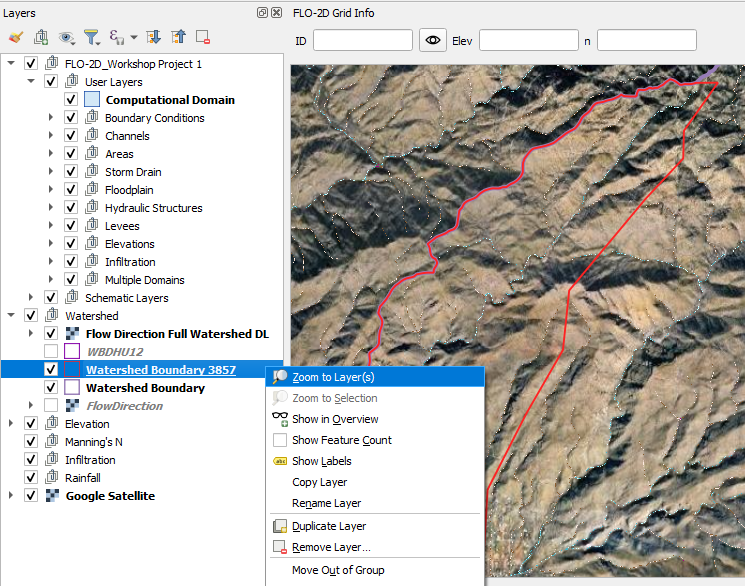
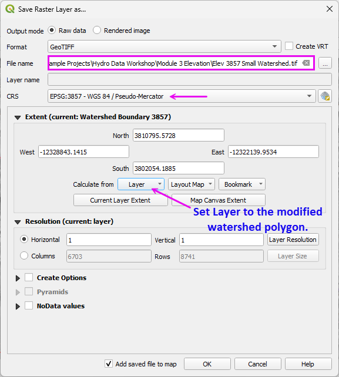
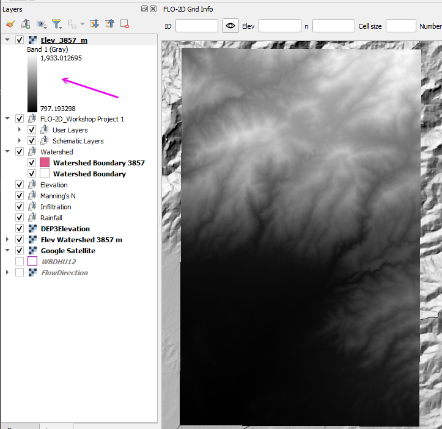
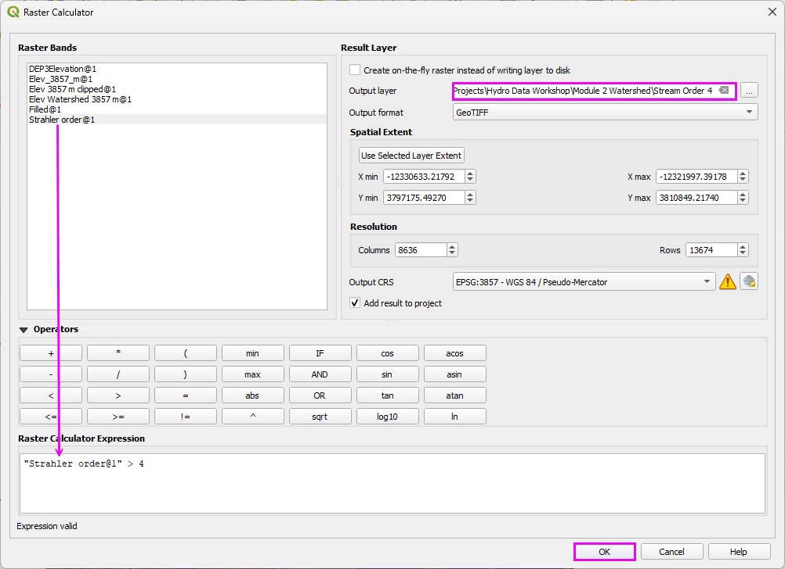
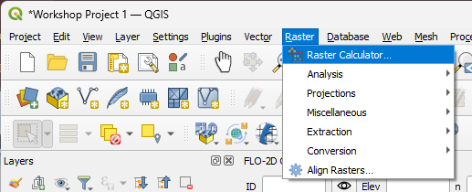
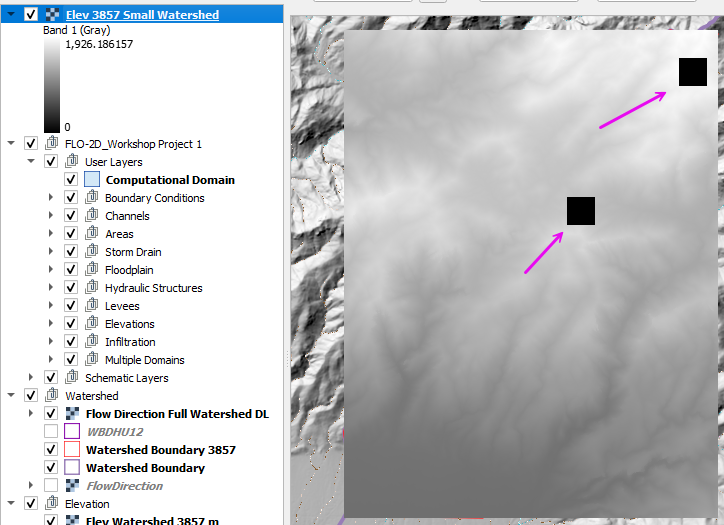
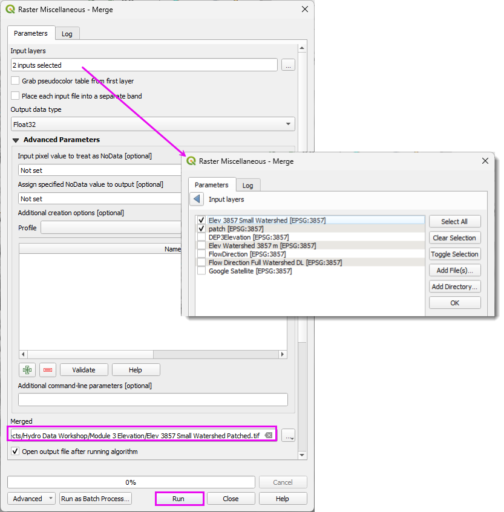
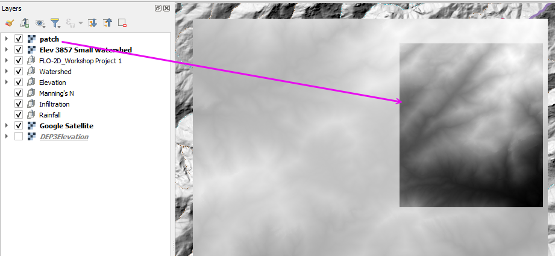

Module 3 - Process Elevation Data
========================================

.. note:: The complete watershed elevation file is already included in the project. 
   This exercise is intended to provide practice with the download workflow and to 
   identify any potential issues that may arise during the process.

Step 1: Load elevation data
---------------------------------------------------

- Zoom to the trimmed Watershed Boundary.

|hydrow020|

- Open the Data Source Manager and find the WCS tab.
- Connect the elevation data.
- Select the first layer.
- Set the coordinate system to 3857. (USGS data uses Metric units.) Add the layer.
- Close the Data Source Manager.

|hydrow021|

- Uncheck the 3DEP layer to prevent loading issues caused by its active data connection. 
- Then right-click the layer and choose Repair Data Source to reestablish the link.

|hydrow022|

- Expand the WCS group
- Expand the 3DEP group Select the first layer and click OK.

.. note:: The reason this reload step is required is not entirely clear; 
   however, it consistently resolves display and connection issues for WCS-based 3DEP elevation layers in QGIS.

|hydrow023|

Step 2: Download elevation
---------------------------------------------------

.. important::

   If the download is taking longer than expected, cancel it from the Progress Bar and verify that the selected extent is not excessively large.

   If the download fails or performs poorly, use the following alternative site:

   .. raw:: html

      <a href="https://apps.nationalmap.gov/downloader/" target="_blank">USGS Data Downloader</a>
      

   
.. hint:: 
   Local Agency data may be of better quality than 3DEP data.

- Right click the DEP3Elevation layer and Export a elevation data to cover the Project Area. 

|hydrow024|

- Set the file path.
- Make sure the CRS is 3857.
- Limit the Extent to Watershed Boundary Layer or Map Canvas if zoomed into the project area.

|hydrow025|

- The finished raster should look like this.  

|hydrow025a|

.. dropdown:: Elevation Patching

   If download issues occur, incomplete raster may result. The following guidance clarifies when patching is necessary and how to complete the process properly:

   - If the downloaded raster contains blank areas, unexpected NoData regions, or 0-elevation pixels that are not physically realistic for the terrain, the dataset is incomplete.
   - These gaps commonly occur with WCS services, interrupted downloads, or when the request extent slightly exceeds the server’s tile boundaries.

   **Patching Procedure**

   1. Identifying the missing or corrupted areas (typically visible as NoData or anomalous 0 values).

   |hydrow025i|

   2. Redownloading only the small missing sections using a tighter extent that fully covers the gap.
   
   |hydrow025k|

   3. Verifying that all rasters share:

      - The same coordinate reference system (CRS)
      - The same cell size
      - The same NoData definition

   4. Merging (mosaicking) the rasters into a single continuous dataset using tools such as:

      - GDAL Merge
      - Build Virtual Raster (VRT)
      - Merge in QGIS Processing

   |hydrow025j|
   
   After merging, confirm:

   - No unintended NoData seams remain.
   - Elevation statistics are reasonable (minimum, maximum, and mean).
   - The raster extent fully covers the intended modeling domain.
   - This approach avoids redownloading large datasets while preserving continuity in the final elevation surface.

.. |hydrow021| image:: ../img/hydrowkshp/hydrow021.jpg

.. |hydrow022| image:: ../img/hydrowkshp/hydrow022.jpg

.. |hydrow023| image:: ../img/hydrowkshp/hydrow023.jpg

.. |hydrow024| image:: ../img/hydrowkshp/hydrow024.jpg

