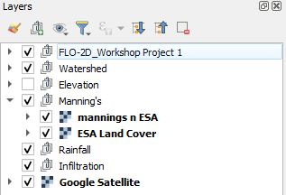
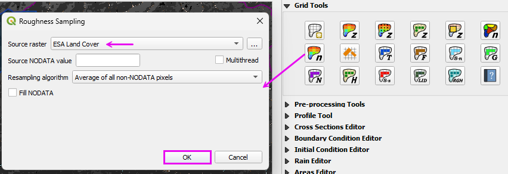

World Land Cover Data - European Satellite Agency (ESA World)
==============================================================

Step 1. Curve Number Generator ESA
--------------------------------------

- Load the Curve Number Generator from the Processing toolbox.

|hydrow029a|

- Set the Extent to Grid.
- Set the name and path.
- Uncheck the other items.
- Click Run

|hydrow030a|

Step 2: Run ESA Land Cover Roughness processor
---------------------------------------------------

This processor works on World Data.
For Example, use it on the **US Mexico boundary.**

- Open the **Processing Toolbox**.

|hydrow034|

- Open the Existing Processor Model.

|hydrow039|

- Double click the Reclassify module.

|hydrow036|

- This table can be modified to reflect **Local Manning’s n value standards**.

|hydrow040|

- Run the processor model to reclassify the Land Cover data as roughness data.

|hydrow041|

Step 3: Interpolate Manning's n to the Grid 
---------------------------------------------------

- Run the Roughness Raster processor.

|hydrow038c|

- Move the Land Cover and Roughness layers to the Manning's n group.

|hydrow038d|

.. |hydrow029a| image:: ../img/hydrowkshp/hydrow029a.png

.. |hydrow030a| image:: ../img/hydrowkshp/hydrow030a.png

.. |hydrow034| image:: ../img/hydrowkshp/hydrow034.jpg

.. |hydrow036| image:: ../img/hydrowkshp/hydrow036.jpg

.. |hydrow039| image:: ../img/hydrowkshp/hydrow039.png

.. |hydrow040| image:: ../img/hydrowkshp/hydrow040.png

.. |hydrow041| image:: ../img/hydrowkshp/hydrow041.jpg

