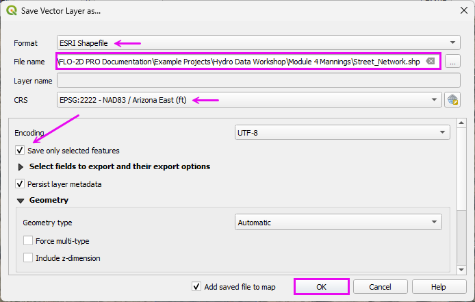
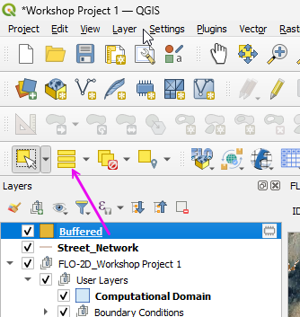
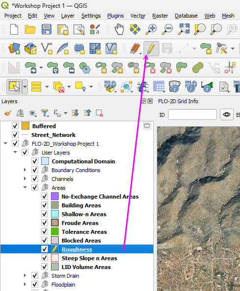
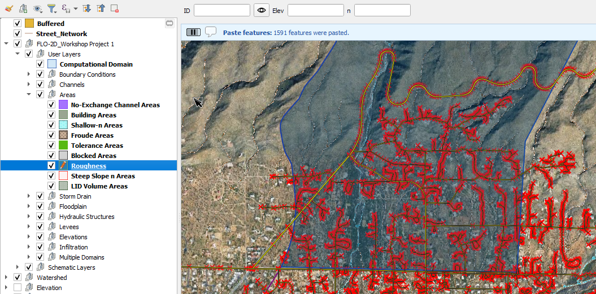
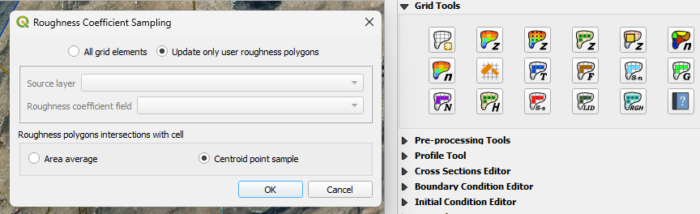
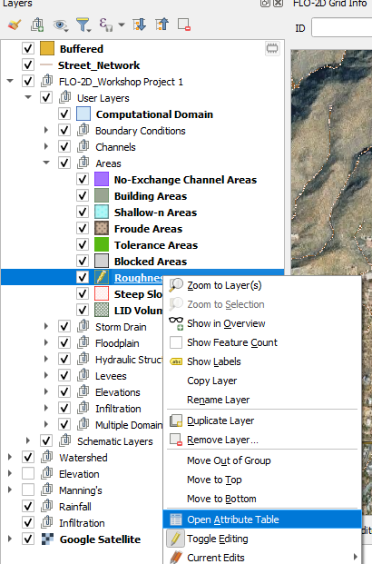
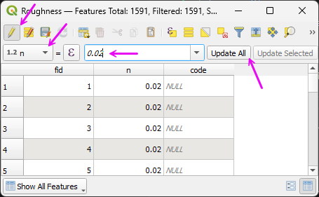
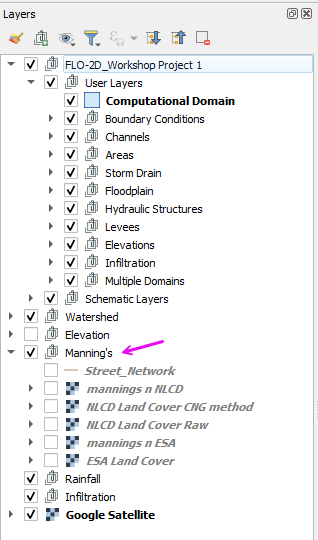

Open Street Data OSM
==========================

Step 1: Download Street Centerlines
--------------------------------------------------------------

- Move all Manning's n Roughness related rasters into the Manning's Group.

|hydrow040a|

- Open **Plugins → Manage and Install Plugins** and install **QuickOSM** (or **OSM Downloader**) if it is not already enabled.

|hydrow042a|

- Open the tool:
- **Vector → QuickOSM → QuickOSM**

|hydrow042b|

- Use the **Map Preset** tab and select Urban for Streets and Buildings.
- Use the current map canvas extent so the download matches the project domain.
- Click Run Preset.

.. note:: if a timeout error occurs, run the preset again.

|hydrow042c|

- Select the streets that are inside the **Watershed Boundary**.
- Run the Select by location tool.
- Fill the fields as shown and click Run.

|hydrow042d|

- Invert the selection.

|hydrow042e|

- Toggle the editor.
- Delete the Selected Streets.
- Save the edits.
- Toggle the editor off.

|hydrow042f|

Step 2: Reproject and Export Street Layer
---------------------------------------------------

The street layer must be in the project coordinate system before buffering.  
If it remains in WGS84 (EPSG:4326), the buffer distance will be interpreted in degrees and will not produce correct results.

- Right-click the **Roads** layer.
- Select **Export → Save Features As**.

|hydrow043a|

- Set **Format** to: ``ESRI Shapefile``
- Set the **Coordinate Reference System (CRS)** to: ``EPSG:2222``
- Choose an appropriate file name and save location.
- Check Selected Features. 
- Click **OK**.

|hydrow043d|

The street layer is now in projected units (feet), and buffer distances will be applied correctly in the next step.

Step 3: Create street layer buffer
---------------------------------------------------

- Run the **Buffer** tool from the **Processing Toolbox**.

|hydrow042|

- Load the **Street Network** in the editor and set the buffer distance to Edit Expression.

|hydrow043|

- Copy code into the **Expression Editor** to determine the buffer width by street type.

.. code-block:: text

   CASE
       WHEN "highway" = 'primary' THEN 40
       WHEN "highway" = 'secondary' THEN 30
       WHEN "highway" = 'tertiary' THEN 25
       WHEN "highway" = 'residential' THEN 20
       WHEN "highway" = 'service' THEN 15
       ELSE 15
   END / 2

|hydrow043c|

This results in a polygon layer that covers the streets.
If some streets are missing, it is easy to digitize them directly into the street network.

Step 4. Add Buffered features into the Roughness layer
----------------------------------------------------------------

- Click the Buffered Layer to activate the layer.
- Select all features in the layer.
- CTRL-c copies the features.

|hydrow043e|

- Select the Roughness layer and toggle the **Edit Pencil** on.

|hydrow043f|

- Ctrl-v pastes the features into the roughness layer.
- Save the edits and toggle the **Edit Pencil** layer off.

|hydrow043g|

- Open the attribute table of the Roughness layer.

|hydrow043i|

- Toggle the **Edit Pencil** on.
- Change the field selector to **n**
- Type **0.02** in the combo box.
- Click **Update All**.
- Click the **Save Button**.
- Toggle the **Edit Pencil** off.
- Close the table.

|hydrow043j|

Step 4. Sample roughness layer to the grid.
----------------------------------------------------------------

- Sample the roughness polygons values to the Grid.

|hydrow043h|

- Remove the Buffered layer.
- Organize all roughness layers to the Manning's n group.

|hydrow043k|

.. |hydrow040a| image:: ../img/hydrowkshp/hydrow040a.png

.. |hydrow042| image:: ../img/hydrowkshp/hydrow042.jpg

.. |hydrow042a| image:: ../img/hydrowkshp/hydrow042a.png

.. |hydrow042b| image:: ../img/hydrowkshp/hydrow042b.png

.. |hydrow042c| image:: ../img/hydrowkshp/hydrow042c.png

.. |hydrow042d| image:: ../img/hydrowkshp/hydrow042d.png

.. |hydrow042e| image:: ../img/hydrowkshp/hydrow042e.png

.. |hydrow042f| image:: ../img/hydrowkshp/hydrow042f.gif

.. |hydrow043| image:: ../img/hydrowkshp/hydrow043.jpg

.. |hydrow043a| image:: ../img/hydrowkshp/hydrow043a.png

.. |hydrow043c| image:: ../img/hydrowkshp/hydrow043c.png

