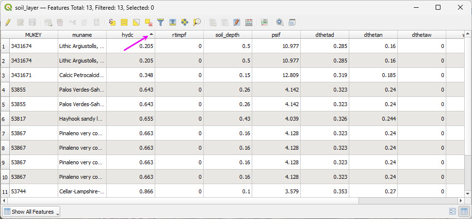
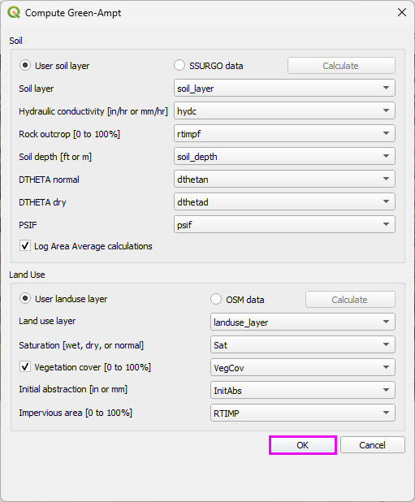

Module 6 - Process Infiltration Data
==============================================

Choose one method: :ref:`Green-Ampt <green>` or :ref:`SCS <scs>`.

.. _green:

Green-Ampt Method
---------------------------------------------------

These agencies use Green-Ampt infiltration data with FLO-2D.

   FCDMC, AZDOT, NVDOT, PCRFCD

Step 1: Run the Green Ampt Processor
---------------------------------------------------

- Open the Infiltration Global button and check Green-Ampt and SCS CN.
- Click OK

|hydrow068|

- Click Calculate Green Ampt button and set the radio buttons to SSURGO and OSM and use the Calculate buttons to get data.
- Cancel the final process. 
- The data QC is performed in the next step.

|hydrow069|

Step 2: Review the LandUse data
---------------------------------------------------

- Open the attribute table of the LandUse layer.
- Some polygons are categorized as Medium Density Residential with a 30 RTIMP.
- Change these areas to Desert Landscape with 0 RTIMP.
- Select the polygons with the polygon selector.

|hydrow070|

- Open the attribute table of the Soil layer.
- Sort all of the pertinent columns by high low to verify that the values are within a reasonable range.
- Spot checking polygons is also recommended to determine if the data is valid.

|hydrow070a|

- Save the two layers to Module 6 folder and add them to the Infiltration Group.

|hydrow070b|

.. _scs:

SCS Curve Number Method
---------------------------------------------------

Many agencies and clients use the SCS Curve Number (CN) method for rainfall-runoff modeling.  
In the Southwestern United States, Pima County Regional Flood Control District has developed a 
well-documented and regionally calibrated CN methodology that reflects desert hydrology and local soil conditions.

For reference, see the Pima County guidance:

.. raw:: html

   <a href="https://content.civicplus.com/api/assets/db8e8971-fa2d-4e02-a207-968561c5ebae"
      target="_blank"
      rel="noopener noreferrer">
      PCHydro User Guide
   </a>

.. warning:: This workshop demonstrates use of the **Curve Number Generator** tool 
   in QGIS in combination with the **Desert Curve Number lookup table from TR-55** 
   to represent arid watershed conditions.

   This workflow is provided for instructional purposes and does not reflect 
   the recommended methodology for Pima County.

   A more comprehensive QGIS-based procedure, incorporating updates to the 
   FLO-2D Plugin, will be provided in a future tutorial.

Step 1: Run the Curve Number Generator
---------------------------------------------------

- Load the **Curve Number Generator** from the **Processing Toolbox**.
- Download the data only.
- The final process will be completed after modifying the lookup table.

|hydrow071|

Step 2: Review the CN lookup table
---------------------------------------------------

- Modify the lookup table to apply the **TR-55 Desert CN values**.
- The table may also be adjusted to reflect local agency standards where required.
- The processing model can be adapted to connect to local servers if needed.
- The plugin developer is responsive to enhancement requests.

|hydrow072|

.. |hydrow068| image:: ../img/hydrowkshp/hydrow068.jpg

.. |hydrow069| image:: ../img/hydrowkshp/hydrow069.png

.. |hydrow070| image:: ../img/hydrowkshp/hydrow070.jpg

.. |hydrow071| image:: ../img/hydrowkshp/hydrow071.jpg

.. |hydrow072| image:: ../img/hydrowkshp/hydrow072.jpg

