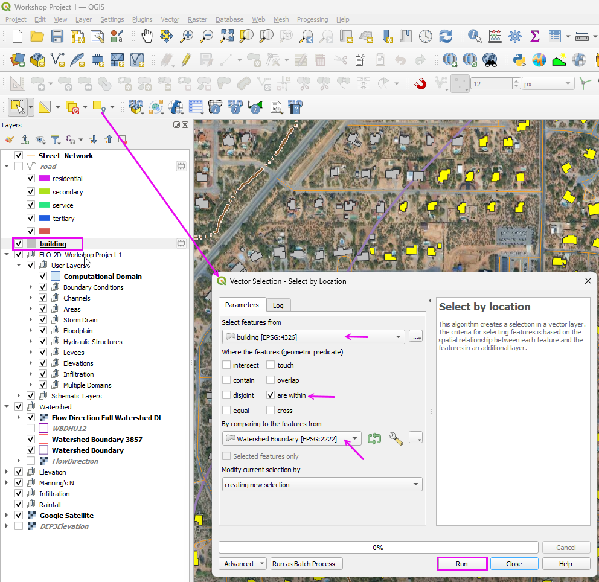
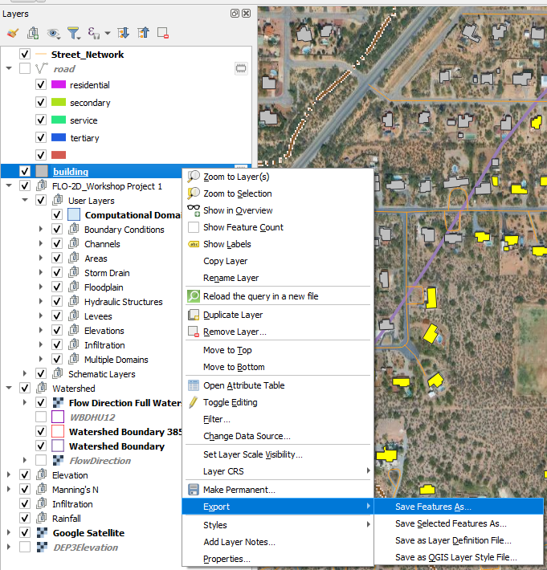
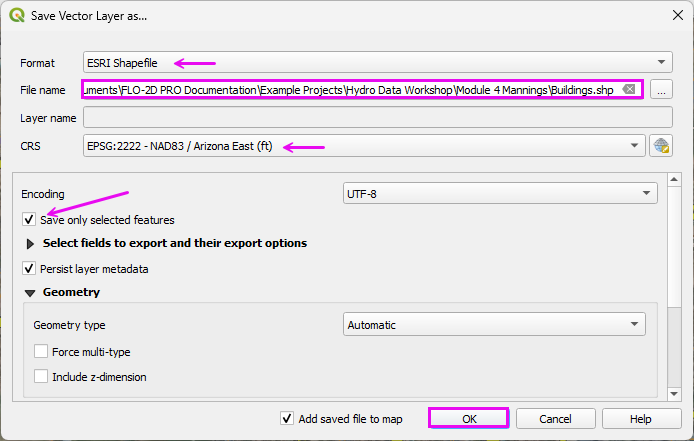
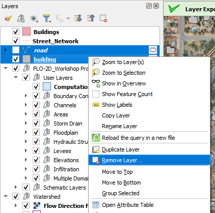
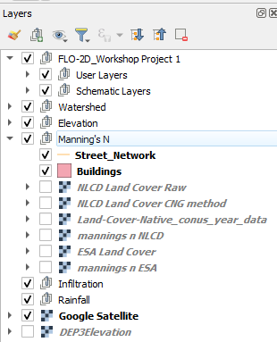

Module 7 - Process Buildings
=================================

Step 1. Save Buildings Layer from OSM
-----------------------------------------

- Select the buildings by location.
- Select Buildings that are within the Watershed Polygon.

|hydrow073|

- Export the Buildings layer.

|hydrow073a|

- Save the buildings as an ESRI Shapefile.

|hydrow073b|

- Remove the OSM Layers.

|hydrow073c|

- Add the exported layers to the Manning's Group.

|hydrow073d|

