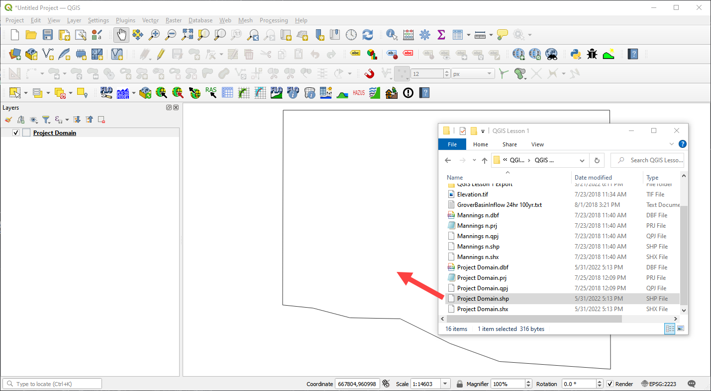
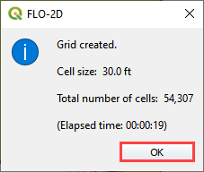
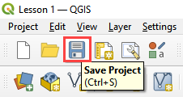
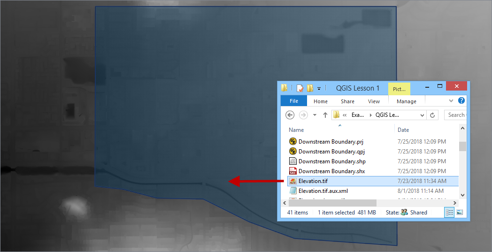
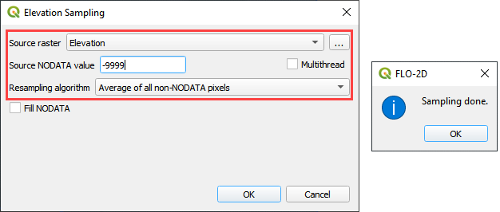
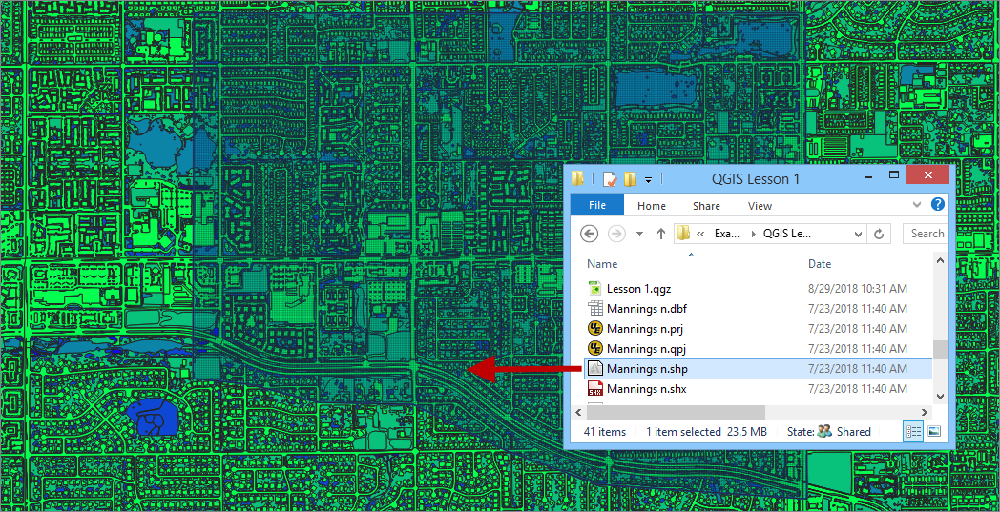
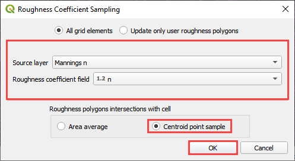
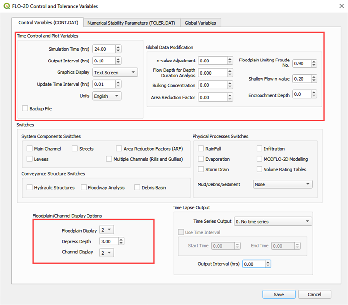
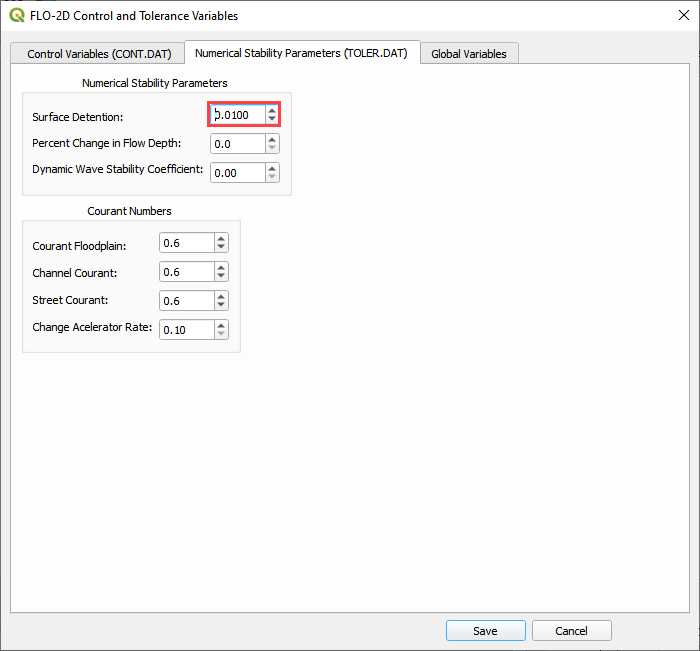

Lesson 1 Part 1 – Getting Started
====================================

Overview
________

This lesson will outline the process of setting up a FLO-2D project using the Plugin for QGIS.
Setting up the computational domain, creating a grid, interpolating elevation data and spatially variable roughness.

Step by step instructions are below and this video will add detail to the lesson.

.. raw:: html

    <iframe width="560" height="315" src="https://www.youtube.com/embed/TO331jqrcrc" frameborder="0" allowfullscreen></iframe>

Required Data
_____________

The lesson makes use of terrain elevation data, project domain, roughness data, and an inflow hydrograph in the Lesson 1 folders.

.. list-table::
   :widths: 33 33 33
   :header-rows: 0

   * - **File**
     - **Content**
     - **Location**

   * - Elevation.tif
     - Digital terrain raster
     - QGIS Lesson 1

   * - Project Domain.shp
     - Polygon for project domain
     -

   * - Mannings n.shp
     - Shapefile for spatially variable roughness
     -

   * - GroverBasinInflow24hr 100yr.txt
     - Inflow data file
     -

Project Location C:\\Users\\Public\\Documents\\FLO-2D PRO Documentation\\Example Projects\\QGIS Tutorials

Check these folders to ensure the data is available before starting the lesson.

Step 1: Open QGIS
_________________

.. image:: ../img/Workshop/Worksh002.png

1. Search the start menu and run the QGIS Desktop program.  Look for QGIS version 3.22 or higher.

2. Click the New Project icon to load a new map.

.. image:: ../img/Workshop/Worksh003.png

Step 2: Import the project domain
__________________________________

1. Open the project folder

2. Drag the file Project Domain.shp onto the map space.
   This will set the CRS to the correct EPSG code.

C:\\Users\\Public\\Documents\\FLO-2D PRO Documentation\\Example Projects\\QGIS Tutorials\\QGIS Lesson 1\\Project domain.shp

.. note::  If the image is not clear, use Firefox browser or open the image in a new tab.

Step 3: Set up the FLO-2D project
_________________________________

1. Click the Set-up icon fill out the dialog box as shown below.
   Set the Grid cell size to 30 ft.

2. Click Create.

.. image:: ../img/Workshop/Worksh006.png

3. Save the geopackage file to the project folder.

4. Name the file Lesson 1.gpkg.

C:\\Users\\Public\\Documents\\FLO-2D PRO Documentation\\Example Projects\\QGIS Tutorials\\QGIS Lesson 1\\Lesson 1.gpkg

5. Set the project CRS to Arizona Central (ft).
   Filter the list with an EPSG code: 2223.
   Select EPSG: 2223 and click OK.

.. image:: ../img/Workshop/Worksh007.png

6. Wait for the geopackage to write and check the accuracy of the project settings and click OK.

.. image:: ../img/Workshop/Worksh180.png

Step 4: Create the grid
_______________________

1. From the Grid Tools widget, select Create Grid.

.. image:: ../img/Workshop/Worksh008.png

2. Select the Project Domain layer, and the Cell Size field and click OK.

.. note:: If a shapefile is not available, digitize the project domain in the Computational Domain Layer.
          In order to align the grid to a raster, load the raster file into the dialog box.

          C:\\Users\\Public\\Documents\\FLO-2D PRO Documentation\\Example Projects\\QGIS Tutorials\\QGIS Lesson 1\\Elevation.tif

.. image:: ../img/Workshop/Worksh009.png

3. Click OK to close.
   The grid is complete.

.. image:: ../img/Workshop/Worksh010a.png

Step 5: Save the project
________________________

1. Click the main Save icon on the QGIS toolbar.

2. Navigate to the Lesson folder, name the project Lesson 1.qgz and click Save.

C:\\Users\\Public\\Documents\\FLO-2D PRO Documentation\\Example Projects\\QGIS Tutorials\\QGIS Lesson 1\\Lesson 1.qgz

Step 6: Assign grid elevation
_____________________________

1. Import the elevation file.
   Open the project folder and drag the Elevation.tif file onto the map space.

2. To interpolate the elevation to a grid layer from a raster layer, use the Sample Grid Elevation icon.

.. image:: ../img/Workshop/Worksh013.png

3. Click on the Sample Grid Elevation icon and enter the required data in the dialog fields and click OK.

4. Sampling Done dialog box will appear once the process is complete.
   Click OK to close it.

.. note:: Use the Fill NoData option if the elevation raster is missing data such as buildings.  This method uses the GDAL
          Warp processing tool.  To learn more about GDAL Warp, visit this page:

          https://gdal.org/programs/gdalwarp.html

Step 7: Assign Roughness data
_____________________________

1. Open the project folder and drag the Mannings n.shp file onto the map space.

2. Click the Sample Manning’s icon.

.. image:: ../img/Workshop/Worksh015.png

3. Fill the dialog box and click OK.
   Once the sample is complete, the following window will appear.
   Close the window.

.. image:: ../img/Workshop/Worksh156.png

4. The roughness values and elevations are assigned to the grid layer in the Schematized Layers group.  Right click the
   Grid layer and click Open Attribute Table to see the data.

.. note::  Don't open a table for a large project >1 million cells.  The data is too large to load
           without applying filters.

.. image:: ../img/Workshop/Worksh016.png

Step 8: Assign Control variables
________________________________

1. Click the Set Control Parameters Icon.

2. Fill the dialog box using the two figures below.
   Save the data to the GeoPackage with the Save icon.

.. note::  The variable descriptions and additional instructions are presented in the Data Input Manual.

C:\\Users\\Public\\Documents\\FLO-2D PRO Documentation\\flo_help\\Manuals\\Data Input Manual PRO.pdf

Step 9: Save the project
________________________

1. Click the main Save icon on the QGIS toolbar.

Step 10: Export the FLO-2D data files
_____________________________________

1. Click the FLO-2D Data Export icon.

.. image:: ../img/Workshop/Worksh021.png

2. Uncheck Rain and Click OK

.. image:: ../img/Workshop/Worksh170.png

3. Navigate to the project folder and click Select Folder.

C:\\Users\\Public\\Documents\\FLO-2D PRO Documentation\\Example Projects\\QGIS Tutorials\\QGIS Lesson 1\\QGIS Lesson 1 Export

4.  Once the project is exported click OK to close the export message.

.. image:: ../img/Workshop/Worksh171.png

Step 11: Run the simulation
___________________________

1. Click on the Run FLO-2D icon.

.. image:: ../img/Workshop/Worksh022.png

2. Set the FLO-2D Pro folder.
   C:\\Program Files (x86)\\FLO-2D Pro

3. Set the Project folder.
   C:\\Users\\Public\\Documents\\FLO-2D PRO Documentation\\Example Projects\\QGIS Tutorials\\QGIS Lesson 1\\Lesson 1 Export Folder

4. Click OK to Run the simulation.

.. image:: ../img/Workshop/Worksh023.png

.. warning:: If the simulation does not start, close the Run FLO-2D Model window and copy the contents of the
             Run for Project Folder into the Project Folder and double click flopro.exe to start the simulation.
             Open the following image in a new tab if it is not clear.

.. image:: ../img/Workshop/Worksh028a.gif
