Lesson 1 Part 3 – Hydrology
===========================

Overview
_________

This lesson will outline the process for setting up a rainfall runoff model using a 24-hour 100yr storm and rainfall data and spatially variable
infiltration data.

If Lesson 1 cannot be loaded, it can be recovered from the Lesson 1 Recovery Files.zip.

.. raw:: html

    <iframe width="560" height="315" src="https://www.youtube.com/embed/DyBcK-Bf8wA" frameborder="0" allowfullscreen></iframe>

Required Data
_____________

The lesson makes use of rainfall distribution, rain arf, landuse and soil data.

.. list-table::
   :widths: 33 33 33
   :header-rows: 0

   * - **File**
     - **Content**
     - **Location**

   * - SCS 24-Hr Type II
     - Rainfall Distribution Curve
     - QGIS Lesson 1\\Hydrology

   * - NOAA Atlas 14
     - Rainfall depth reduction
     -

   * - Land use.shp
     - Shapefile for land use
     -

   * - Soil.shp
     - Shapefile for soil type
     -

Project location C:\\Users\\Public\\Documents\\FLO-2D PRO Documentation\\Example Projects\\QGIS Tutorials

Check these folders to ensure the data is available before starting the lesson.

Step 1: Open QGIS
___________________

1. Search the start menu or open the QGIS file folder and run the QGIS Desktop program.
   The version should be QGIS 3.22 or later.

.. image:: ../img/Workshop/Worksh002.png

Step 2: Load Lesson 1
_____________________

1. Open the project folder.

2. Drag the file Lesson 1.qgz onto the map space.
   If the file is missing extract it from the zipped recovery file.

C:\\Users\\Public\\Documents\\FLO-2D PRO Documentation\\Example Projects\\QGIS Tutorials\\QGIS Lesson 1\\Lesson 1.qgz

.. image:: ../img/Workshop/Worksh157.png

.. note:: If the following image is fuzzy.  Switch to Firefox or load the image in a new tab.

.. image:: ../img/Workshop/Worksh158.png

3. Click Yes to load the model.

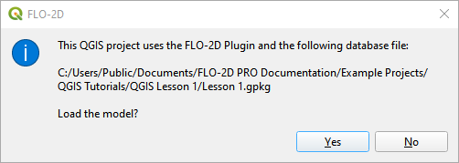

Step 3: Import aerial images
____________________________

1. Load an aerial image to help locate features.

2. Use Quick Map Services Plugin with the Contributed Pack to load aerial images into the layer.

.. image:: ../img/Workshop/Worksh032.png

.. note:: If an internet connection is not available, aerial images are saved to QGIS Lesson 1/Aerials folder.

.. note:: If QuickMapServices does not have Google maps, go to QuickMapServices/Settings/More Services/Get Contributed
          Pack.

Step 4: Add an inflow node
___________________________

1. Zoom in on the top right corner of the project grid.
   Find the Basin Inlet feature.

.. image:: ../img/Workshop/Worksh033.png

2. Click the Add point BC icon.

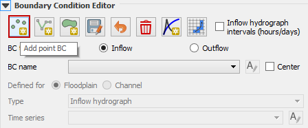

3. Click the cell indicated on the map in the following image and click OK to close the window.

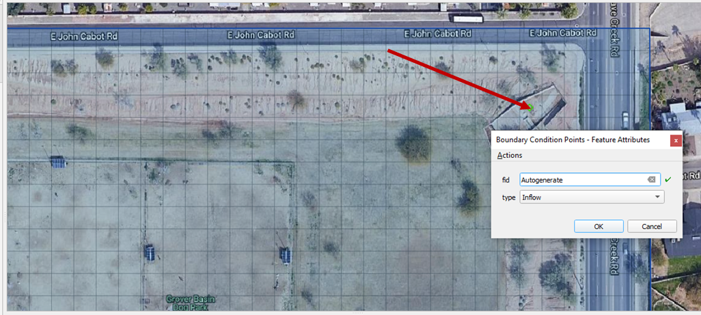

4. Click Save to load the data into the editor.  Click OK to close the message.

.. image:: ../img/Workshop/Worksh183.png

5. Updated the BC name and the Time series name.

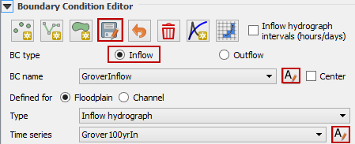

6. The inflow hydrograph is stored in a text file in the project folder.
   Open this file in Notepad.

C:\\Users\\Public\\Documents\\FLO-2D PRO Documentation\\Example Projects\\QGIS Tutorials\\QGIS Lesson 1\\Hydrology\\GroverBasinInflow 24hr 100yr.txt

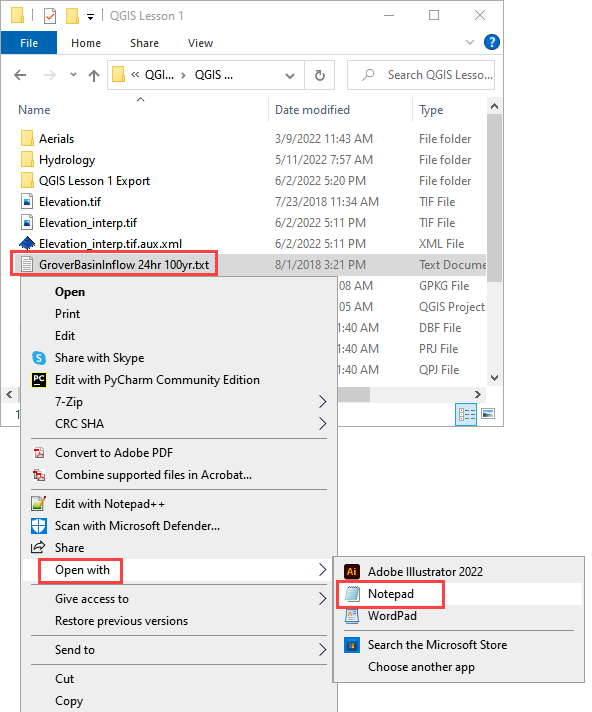

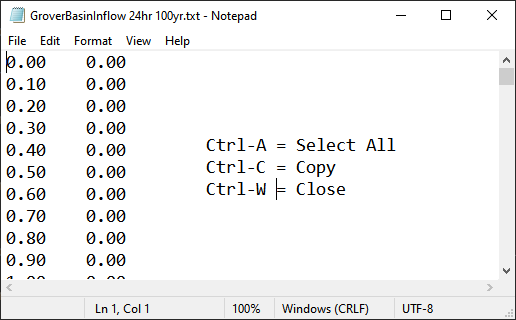

7. Select the first cell of the FLO-2D Table Editor Table and click Paste.

.. image:: ../img/Workshop/Worksh039.gif

8. Schematize the inflow data into the schema layers.

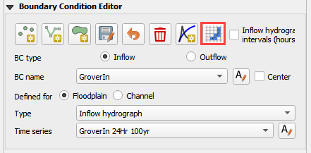

9. Click OK.

.. image:: ../img/Workshop/Worksh041.png

Step 5: Assign uniform rainfall
_______________________________

1. Collapse all FLO-2D Widgets and Expand the Rain Editor.

.. image:: ../img/Workshop/Worksh181.png

2. Check Simulate rainfall and add 3.74 inches to the total inflow box.  Check the Building Rain box.

3. Click the Import icon and load the data file from QGIS Lesson 1 or from the Rainfall Distribution Folder.

C:\\Users\\Public\\Documents\\FLO-2D PRO Documentation\\Example Projects\\QGIS Tutorials\\QGIS Lesson 1\\Hydrology\\SCS 24-Hr Type II.DAT

C:\\Users\\Public\\Documents\\FLO-2D PRO Documentation\\Rainfall Distributions\\SCS 24-Hr Type II.DAT

.. image:: ../img/Workshop/Worksh043.png

.. image:: ../img/Workshop/Worksh160.png

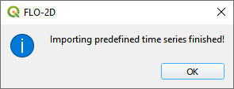

4. The rainfall data is imported into the FLO-2D Table Editor.

.. image:: ../img/Workshop/Worksh161.png

.. note:: This assigns uniform rainfall to every grid element.  The rainfall is added to the grid as a depth over time.
          The depth is interpolated linearly for every timestep that falls between data points in the Rainfall time
          series table.

Step 6: Apply depth area reduction
___________________________________

.. note::  This rainfall method is only valid for small watersheds.  If a larger watershed is modeled, a spatially
           variable rainfall method may be applied to different sub-watersheds because each watershed will have a
           different total rainfall value and FLO-2D needs the overall total for the whole watershed.  See local
           hydrology guidelines for more information.

1. Select the Project Data Group in the Layers List.

.. image:: ../img/Workshop/Worksh184.png

2. Import the NOAA Atlas rainfall map.
   Open the project folder and drag the NOAA Atlas 14 24hr 100yr.tif file onto the map space.

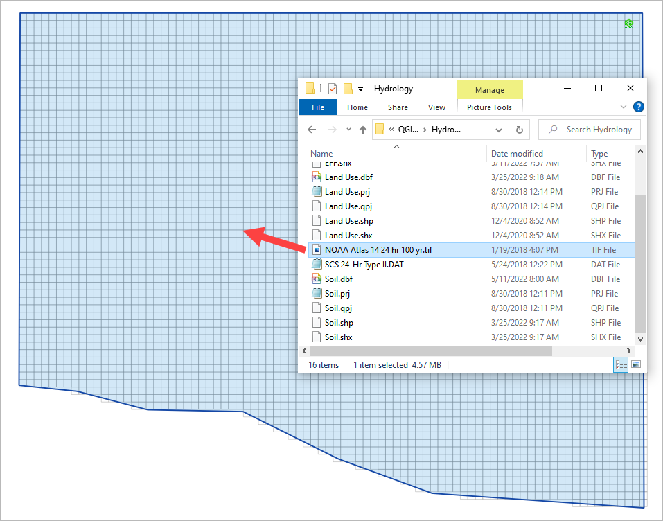

3. To perform the depth area reduction calculation, use the Area Reduction calculator.

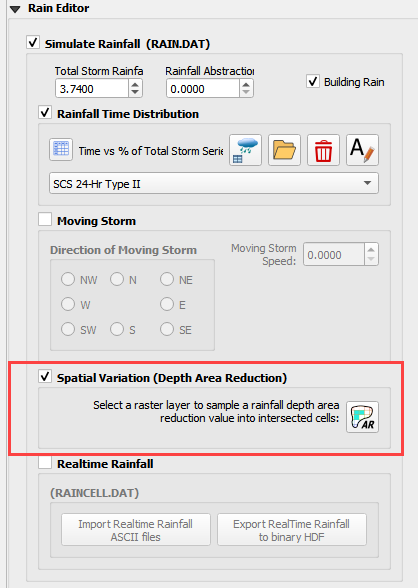

4. Click the Area Reduction icon.

.. image:: ../img/Workshop/Worksh162.png

5. The raster pixels are typically 1000 by 1000 ft or larger.
   It is not necessary to average the data.
   Fill the dialog box as shown below and click OK to calculate and OK to confirm the data was written to file.

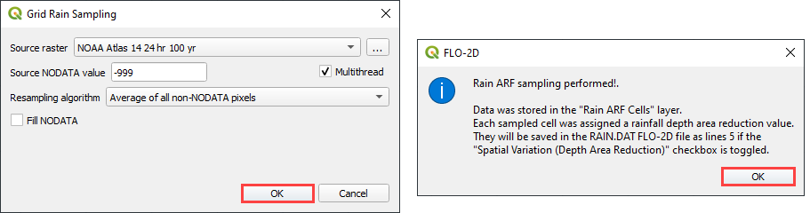

Step 7: Assign infiltration
___________________________

1. Drag the file Land Use.shp and Soil.shp onto the map space.

C:\\Users\\Public\\Documents\\FLO-2D PRO Documentation\\Example Projects\\QGIS Tutorials\\QGIS Lesson 1\\Hydrology\\Land Use.shp

C:\\Users\\Public\\Documents\\FLO-2D PRO Documentation\\Example Projects\\QGIS Tutorials\\QGIS Lesson 1\\Hydrology\\Soil.shp

.. note:: The map will look different every time a layer is loaded.  The colors QGIS uses are random.

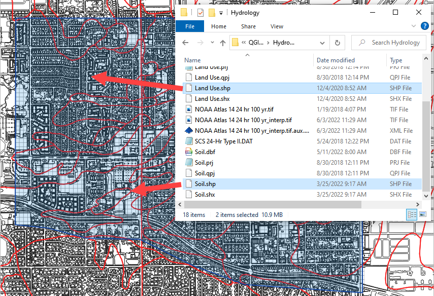

2. From the Infiltration Editor click the Global Infiltration icon.

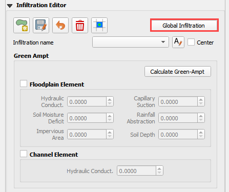

3. Check the Global Green Ampt switch and fill the global variables.
   The Global variables will be used for any cell that is not defined by the F lines in the spatially variable data assigned to INFIL.DAT.

4. Click OK to close.

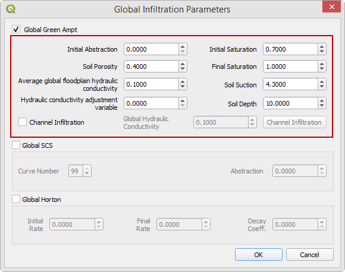

5. On the Infiltration Editor click Calculate Green-Ampt.

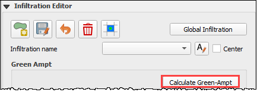

6. Specify the attributes as shown in the following image and click OK.
   The calculation process will take 1 to 5 min for this project.

.. image:: ../img/Workshop/Worksh051.png

Step 8: Check control variables
_______________________________

1. Click the Control Parameters Icon.
   Make sure the Rain and Infiltration switches are turned on.
   Click Save to Close.

.. image:: ../img/Workshop/Worksh017.png

.. image:: ../img/Workshop/Worksh053.png

Step 9: Save the project
________________________

1. Click the main Save icon on the QGIS toolbar.

.. image:: ../img/Workshop/Worksh011.png

Step 10: Export the FLO-2D data files
______________________________________

1. Click the FLO-2D Data Export icon.

.. image:: ../img/Workshop/Worksh021.png

2. Review the image and Click OK

.. image:: ../img/Workshop/Worksh172.png

3. Navigate to the project folder and click Select Folder.

C:\\Users\\Public\\Documents\\FLO-2D PRO Documentation\\Example Projects\\QGIS Tutorials\\QGIS Lesson 1\\QGIS Lesson 1 Export

4.  Once the project is exported click OK to close the export message.

.. image:: ../img/Workshop/Worksh173.png

Step 11: Run the simulation
___________________________

1. Click on the Run FLO-2D icon.

.. image:: ../img/Workshop/Worksh0052.png

2. Set the FLO-2D Pro folder.
   C:\program files (x86)\flo-2d pro

3. Set the Project folder.

C:\\Users\\Public\\Documents\\FLO-2D PRO Documentation\\Example Projects\\QGIS Tutorials\\QGIS Lesson 1\\Lesson 1 Export

.. image:: ../img/Workshop/Worksh023.png

This is the final step of this Lesson 1.  Make a Recovery Point/Backup and continue to Lesson 2.