Lesson 2 – Channels
=====================

**Overview**

Complete QGIS Lesson 1 before starting this lesson.

Use this training module to build an urban drainage channel by digitizing the channel components.  Finish it up by
adding culverts to the channel, boundary conditions.  The final part of the tutorial is to review the channel results.

**Required Data**

The lesson makes use of the original data from Lesson 1, left bank, right bank, and cross section data, and culvert
rating tables.

Start from the end of Lesson 1.
All data is provided in the Lesson folders.

.. list-table::
   :widths: 33 33 33
   :header-rows: 0

   * - **File**
     - **Content**
     - **Location**

   * - QGIS Lesson 1.gpkg
     - FLO-2D GeoPackage
     - \\QGIS Lesson 1

   * - QGIS Lesson 1.qgz
     - QGIS file
     - \\QGIS Lesson 1

   * - Grnway Inflow 24 hr100yr.txt
     - Inflow hydrograph
     - \\QGIS Lesson 2

   * - \*.txt
     - Culvert rating tables
     - \\QGIS Lesson 2\\Hydraulic Structures

   * - \*.shp
     - Channel shapefiles
     - \\QGIS Lesson 2\\Mixed Channel Layers

Project Location C:\\Users\\Public\\Documents\\FLO-2D PRO Documentation\\Example Projects\\QGIS Tutorials

This video will cover up to Step 9.  The second video is linked to Step 10.

.. raw:: html

    <iframe width="560" height="315" src="https://www.youtube.com/embed/lrYwqe_0Y0c" frameborder="0" allowfullscreen></iframe>

Step 1: Open Lesson 1 Part 3 in QGIS
__________________________________________

1. Search the start menu and run the “QGIS Desktop” program.

.. image:: ../img/Workshop/Worksh002.png

2. Open QGIS and drag Lesson 1.qgz onto the canvas the file in QGIS and Load the Project into the FLO-2D Plugin.

.. image:: ../img/Workshop/Worksh157.png

C:\\Users\\Public\\Documents\\FLO-2D PRO Documentation\\Example Projects\\QGIS Tutorials\\QGIS Lesson 1\\QGIS Lesson 1.qgz

3. Click Yes to load the model.

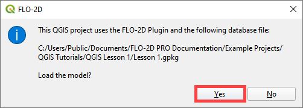

4. If necessary, use Quick Map Services to load an aerial image onto the map.
   See Lesson 1 - Part 2 - Step 3 for instructions.

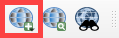

5. If necessary, import and check visible box of the Elevation Raster from Lesson 1.
   This layer should be right above the Google Hybrid layer.
   It may be necessary to move it from another location in the Layers List.

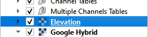

6. Double click the Elevation raster layer and click Symbology.

7. Set the Hillshade parameters as shown in the following image.

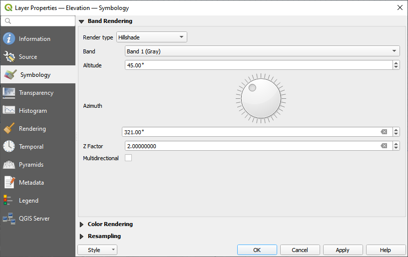

Step 2: Digitize the left banks
__________________________________________

.. note:: Digitize the lines from upstream to downstream.

1. Zoom in on the upstream channel segment in the southeast corner of the map.

.. image:: ../img/Advanced-Workshop/channel/Lesson008.png

2. In the User Layers Group, click the Left Banks Lines to activate the layer.

.. image:: ../img/Advanced-Workshop/channel/Lesson009.png

3. Click the Editor pencil to turn on edits for this layer and click the Add Line Feature to add a left bank line.

.. image:: ../img/Advanced-Workshop/channel/Lesson010.png

.. note::
         Cool digitizing features:

         - Use the scroll wheel to zoom in and out.
         - Click the scroll wheel to pan while in editing mode.
         - Use the delete key to delete the last point clicked.
         - Esc key will cancel polyline.
         - The point won’t drop until the mouse button is released.
         - Redo and undo have limited functionality and can be useful.

4. Start at the beginning of the channel on the left bank looking downstream.
   Click the left mouse button to create a line that runs along the left bank.
   Click the right mouse button to close the polyline and fill the attributes.

5. The channel runs from east to west so the left bank looking downstream is on the south side.

.. image:: ../img/Advanced-Workshop/channel/Mod10_002.gif

6. Repeat this process for the next two segments.
   The final left banks should look something like the following image.

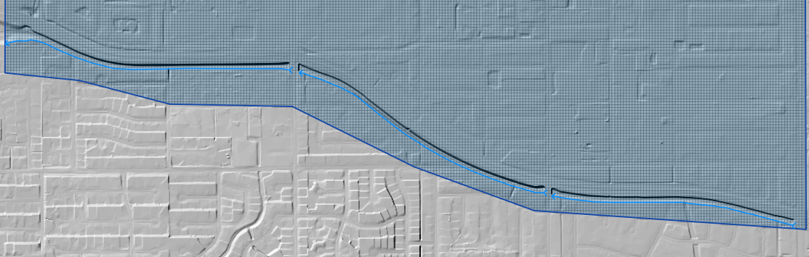

7. Click the Save Icon to save the features and turn the editing pencil off.

.. image:: ../img/Advanced-Workshop/channel/Lesson013.png

Step 3: Digitize the right banks
__________________________________________

1. Zoom in on the upstream channel segment in the southeast corner of the map.

.. image:: ../img/Advanced-Workshop/channel/Lesson014.png

2. In the User Layers Group, click the Right Bank Lines to activate the layer.

.. image:: ../img/Advanced-Workshop/channel/Lesson015.png

3. Click the Editor pencil to turn on edits for this layer and click the Add Line Feature to add a right bank line.

.. image:: ../img/Advanced-Workshop/channel/Lesson010.png

4. Start at the beginning of the channel on the right bank looking downstream.
   Click the left mouse button to create a line that runs along the right bank.
   Click the right mouse button to close the polyline and fill the attributes.

5. The channel runs from east to west so the right bank looking downstream is on the north side.

.. image:: ../img/Advanced-Workshop/channel/Mod10_003.gif

6. Repeat this process for the next two segments.
   The final left banks should look something like the following image.

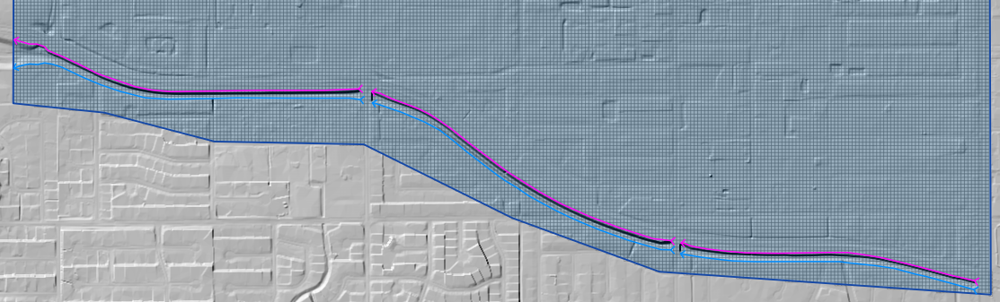

7. Click the Save Icon to save the features and turn the editing pencil off.

.. image:: ../img/Advanced-Workshop/channel/Lesson013.png

Step 4: Digitize the cross sections
__________________________________________

.. note:: Try to digitize the cross sections in order from upstream to downstream.

1. Zoom in on the upstream channel segment in the southeast corner of the map.

.. image:: ../img/Advanced-Workshop/channel/Lesson018.png

2. In the User Layers Group, click Cross Sections to activate the layer.

.. image:: ../img/Advanced-Workshop/channel/Lesson019.png

3. Click the Editor pencil to turn on edits for this layer and click the Add Line Feature to add a right bank line.

.. image:: ../img/Advanced-Workshop/channel/Lesson010.png

.. note:: The first cross section of a channel segment has important restrictions.

          - The line must cross the left and right bank line.
          - The line must start in the same cell as the left and right bank line.

4. Digitize the first cross section.

   - Click the left side first and then the right side.
   - Right click to close the line.
   - Use the enter key to close the dialog box.  It isn't necessary to fill the data at this time.

.. note:: Want to restart the gif? Right click and open it in a new tab.

.. image:: ../img/Advanced-Workshop/channel/Mod10_004.gif

5. The remaining cross sections are not restricted.  The should cross both lines and be somewhat perpendicular to
   flow.  Since this is a uniform system, it is not necessary to use more than a cross section every 20 or 30 cells.
   Use more cross sections in transitional areas and leading up to box culvert transitions.

.. image:: ../img/Advanced-Workshop/channel/Mod10_002.png

6. The final cross sections should look like something like this:

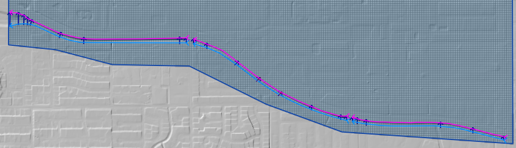

Step 5: Complete cross section attributes
__________________________________________

1. Right click the **Cross Sections** layer in the User Layers Group and click Open Attribute Table.

2. Click the Edit pencil.

3. Set the field to fcn and click Update All.

4. Set the n value to 0.035.

.. image:: ../img/Advanced-Workshop/channel/Mod10_011.gif

5. Click Update All.

6. Name the cross sections.

7. Click Save button and turn off editor.

8. Close the table.

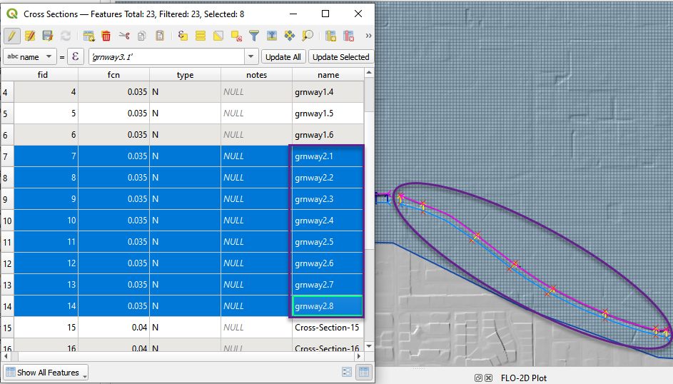

9. It is OK to group the User Layers into a more organized system.  Don't remove any layers.

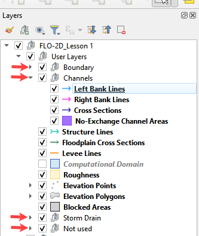

Step 6: Sample station elevation
_________________________________

1. Select the first Natural cross section and click the Sample current natural cross section elevation button.

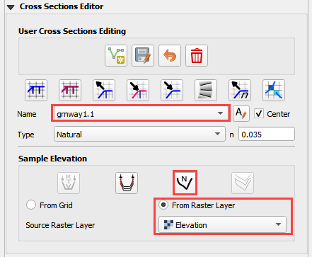

2. Repeat this step for each Natural Type cross section.

.. image:: ../img/Advanced-Workshop/channel/Mod10_012.gif

3. If a cross section is not sampled correctly, the plot will indicate a bad bank alignment.  The sample limits are
   confined by the intersection of the bank line and the cross section line.

.. image:: ../img/Advanced-Workshop/channel/Mod10_003.png

4. Modify the bank line or cross section line using the node tool to reposition the sample line.  Then resample the
   elevation data.

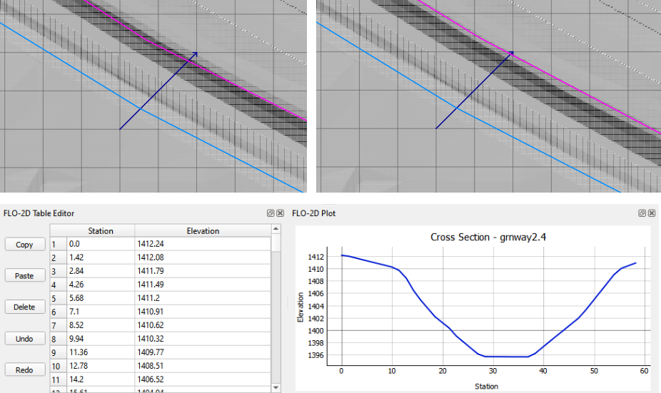

5. After the final cross section is sampled correctly, save the Left Bank Line, Right Bank Lines, and Cross Sections
   user layers.

.. image:: ../img/Advanced-Workshop/channel/Mod10_005.png

Step 7: Schematize channel
__________________________________________

.. warning::  The schematize button is a great reset button.  If any channel modification is required, click the
              schematize channel button before making changes.

1. Click Schematize channels.

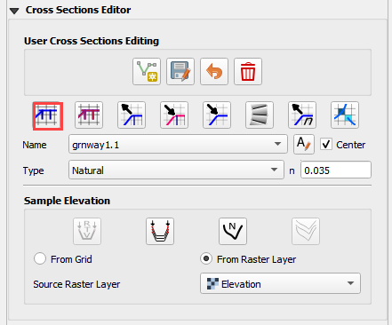

2. If the channel schematizing process was successful, the following message will appear.
   Click Close.

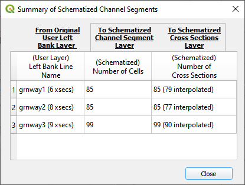

Step 8: Revise bank alignment
__________________________________________

1. Channel alignment in urban projects can be important because channels are usually squeezed between features like
   buildings, walls, and streets.  In this image, the left bank is on the wrong side of an urban wall.

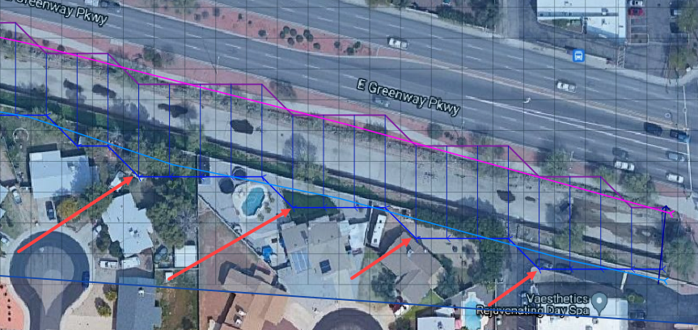

2. Urban channels also vary widely in their design.
   This channel is not a rectangular channel or a trapezoidal channel.
   It has a stepped gabion lining along the banks.

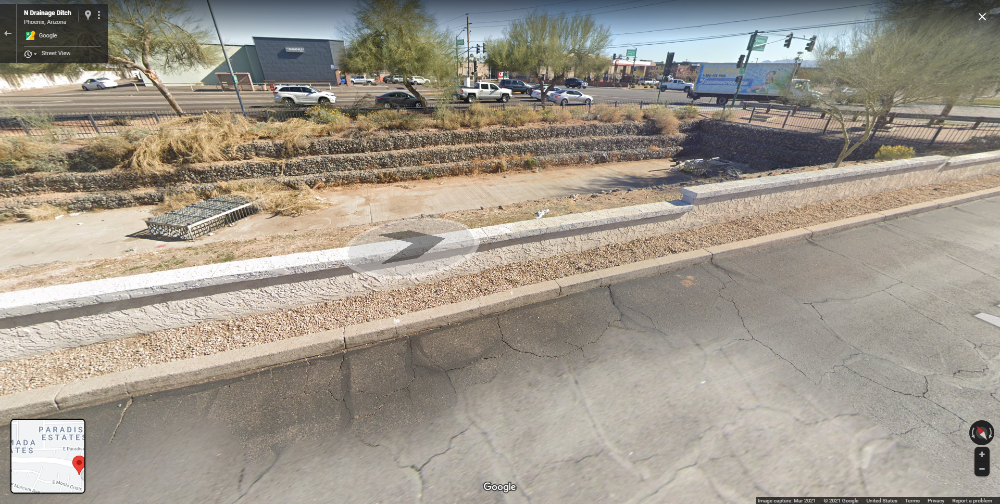

3. It is simple to make minor corrections to the left bank lines and right bank lines to realign the channels.

4. In the User Layers group, turn on the Editor Pencil for Left Bank Lines, Right Bank Lines, and Cross Sections.

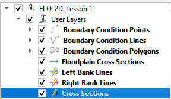

5. Set the Vertex Tool to All Layers.

.. image:: ../img/Advanced-Workshop/channel/Lesson033.png

6. Reposition the Left Bank Line so that it is in between the retaining wall and the channel.

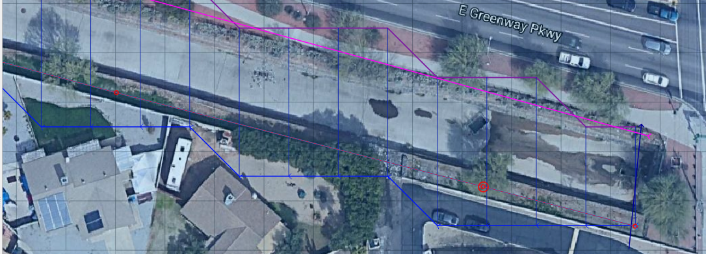

7. Click the Schematize button to reposition the Schematized Channel and click Yes and Close to close the windows.  In
   This case, hitting the enter button twice will be faster.

.. image:: ../img/Advanced-Workshop/channel/Lesson035.png

.. image:: ../img/Advanced-Workshop/channel/Lesson036.png

.. image:: ../img/Advanced-Workshop/channel/Lesson037.png

8. If necessary, uncheck the Center button.
   This will keep the channel in place, so the corrections are easy to track.

.. image:: ../img/Advanced-Workshop/channel/Lesson038.png

9. Squeezing the left bank like this means some of the bank elements might be inside the channel.

10. Slight corrections can be made to Left Bank Line to ensure good bank placement.

.. image:: ../img/Advanced-Workshop/channel/Mod10_008.gif

11. The same procedure can be used on the right bank.

.. image:: ../img/Advanced-Workshop/channel/Mod10_009.gif

12.  Always finish by clicking the schematize button to ensure the final edits were updated.

13. Once the final edits are complete, save and close the editors for the User Layers.

Step 9: Interpolate cross section data
________________________________________

N type channels are interpolated using the INTERPOLATE.EXE program.
This method will outline how to call the interpolator and reload the data.

.. warning:: If this process needs to be repeated, click the Schematize button before repeating
             anything beyond this step.

1. Click the Create CHAN.DAT, XSEC.DAT, AND CHANBANK.DAT button.

.. image:: ../img/Advanced-Workshop/channel/Lesson044.png

2. Select the folder where the \*.DAT files will be saved.

C:\\Users\\Public\\Documents\\FLO-2D PRO Documentation\\Example Projects\\QGIS Tutorials\\QGIS Lesson 2\\Lesson 2 Export

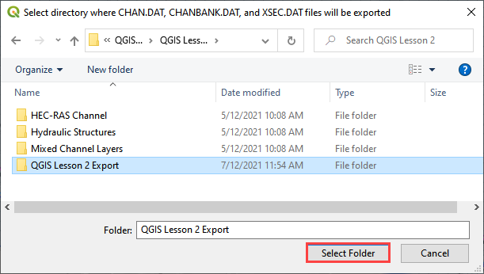

3. The first action saves the channel data.
   Click OK to close the message.

.. image:: ../img/Advanced-Workshop/channel/Lesson046.png

4. The second action calls the Interpolate.exe program from the FLO-2D Pro folder.

.. note:: If this process results in an INTERPOLATE.EXE error, it is possible to move that file to another location and
          make sure it is named correctly.

          If Interpolate.exe is missing from the FLO-2D Pro folder, get it here:

          https://flo-2d.sharefile.com/d-sc217afc44dee42e882a590bc13813db2

5. Click Interpolate.

.. image:: ../img/Advanced-Workshop/channel/Lesson047.png

6. If the interpolation is performed correctly the following message will appear.
   Click Import CHAN.DAT and XSEC.DAT to update the channel data in QGIS.

.. image:: ../img/Advanced-Workshop/channel/Lesson048.png

7. Click the OK icon when the process is finished.

.. image:: ../img/Advanced-Workshop/channel/Lesson049.png

Step 10: Channel boundary condition
__________________________________________

Instructional Video

.. raw:: html

    <iframe width="560" height="315" src="https://www.youtube.com/embed/l1Ph2BjPGpo" frameborder="0" allowfullscreen></iframe>

Inlet
^^^^^^

1. Zoom to the first channel element on the southeast corner of the map.

.. image:: ../img/Advanced-Workshop/channel/Lesson050.png

2. Uncheck the visibility of the User Layers Left Bank Lines, Right Bank Lines, Cross Sections.

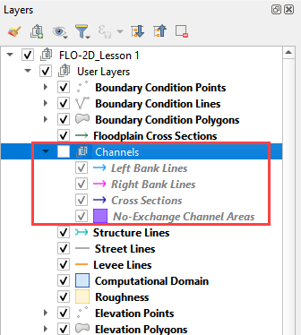

3. Collapse the Cross Section Editor

4. Expand the Boundary Condition Editor.

5. Click the Add point BC button.

.. image:: ../img/Advanced-Workshop/channel/Lesson052.png

6. Digitize a point to the first left bank channel cell and click OK.

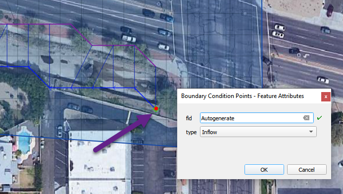

7. Click Save on the Widget

.. image:: ../img/Advanced-Workshop/channel/Lesson054.png

8.  Change the BC name of the inflow to GrnwayIN

9.  Set Defined for to Channel

10. Click Add new Time Series

11. Name the new Time Series to Grnway 24hr 100yr.

12. The widget should look like this.

.. image:: ../img/Advanced-Workshop/channel/Mod10_010.gif

13. Open the hydrograph file in Notepad and copy the data.

.. image:: ../img/Advanced-Workshop/channel/Lesson056.png

C:\\Users\\Public\\Documents\\FLO-2D PRO Documentation\\Example Projects\\QGIS Tutorials\\QGIS Lesson 2\\Greenway Inflow 100yr 24hr.txt

14. Place the cursor in the first cell of the Table and click Paste.

.. image:: ../img/Workshop/Worksh040.gif

Outlet
^^^^^^^

1. Zoom to the end of the channel.

2. Add a BC Point to the last element of the channel.

.. image:: ../img/Advanced-Workshop/channel/Lesson058.png

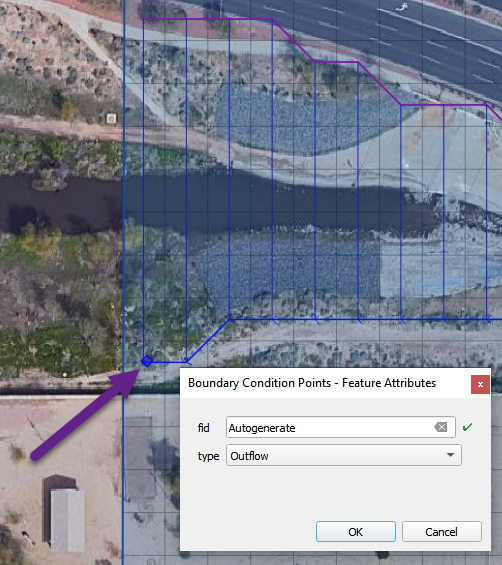

3. Save the form and set the BC type to Outflow

.. image:: ../img/Advanced-Workshop/channel/Lesson054.png

4. Name the BC to GrnwayOut

5. Set the Outflow type to 3.

.. image:: ../img/Advanced-Workshop/channel/Lesson060.png

6. Click the Schematize button the outflow conditions and click OK to close the message.

.. image:: ../img/Advanced-Workshop/channel/Lesson061.png

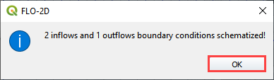

Step 11: Culverts
_____________________

This structure will calculate discharge through a box culvert.
This example has a box culvert that is longer than the grid element.
The channel segments are split up to allow for the width of the roadway.

.. note::  This image shows how the culverts should look once they have been digitized.

.. image:: ../img/Workshop/Worksh074.png

1. Zoom to the first culvert.

.. image:: ../img/Workshop/Worksh175.png

2. Open the Structures Editor.
   Click the Add Structure icon.

.. image:: ../img/Workshop/Worksh075.png

3. Digitize the first culvert by clicking on the upstream left bank element and downstream left bank element of the
   channel.  Right click to complete the line and click OK to close the Structure Line attribute box.

.. image:: ../img/Workshop/Worksh176.png

4. Repeat the process on the second culvert downstream.

.. image:: ../img/Workshop/Worksh177.png

5. Click the Save Button on the Structure Editor.

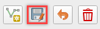

6. Fill out the data for each structure.

   - Name the culverts Grnway1, Grnway2

   - Type \= Channel

   - Rating \= Rating table

   - Tailwater condition is none.

.. image:: ../img/Workshop/Worksh076.png

7.  Click the Import Rating Tables button

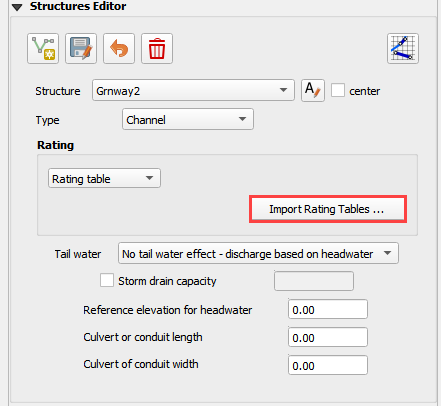

8.  Navigate to the Rating Tables files, select both tables and click Open.

C:\\Users\\Public\\Documents\\FLO-2D PRO Documentation\\Example Projects\\QGIS Tutorials\\QGIS Lesson 2\\Hydraulic Structures

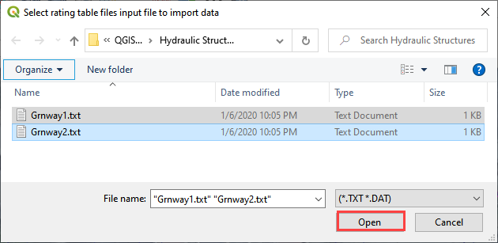

9. Note that the data was loaded into the FLO-2D Table Editor for the active structure.

.. image:: ../img/Workshop/Worksh179.png

10. Click Schematize to write the data to the schematic layers.

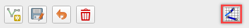

11. The hydraulic structures are now ready.

12. If the table and plot did not update, refresh the tables by selecting the structure again in the widget.

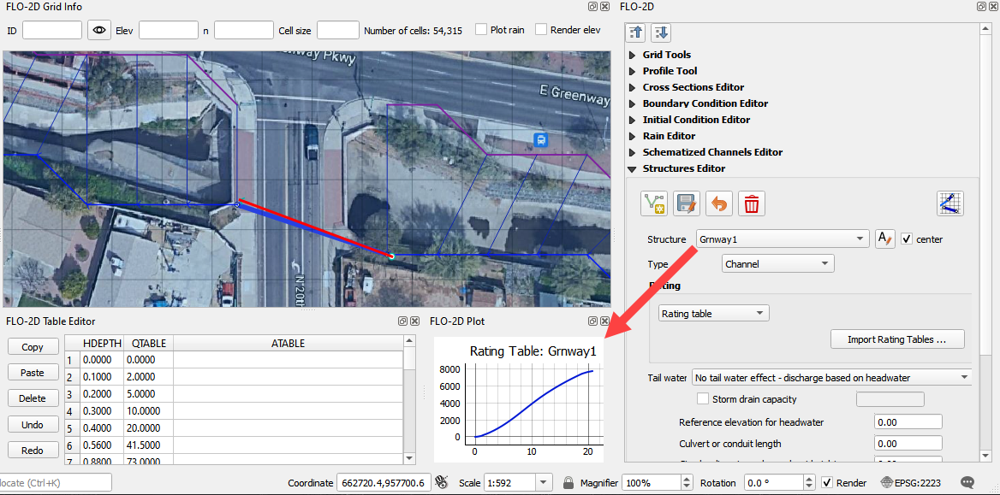

Step 12: Export the project
__________________________________________

1. Click the Setup Control Parameters icon.

.. image:: ../img/Workshop/Worksh017.png

2. Check the boxes for Main Channel and Hydraulic structures if needed.

3. Click Save.

.. image:: ../img/Workshop/Worksh082.png

4. Click the Export button for the FLO-2D Data files.
   Click OK.

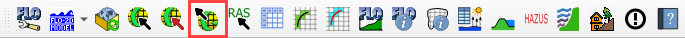

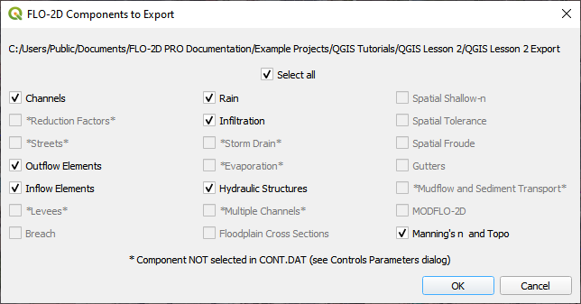

5. Select the QGIS Lesson 2 Export folder.

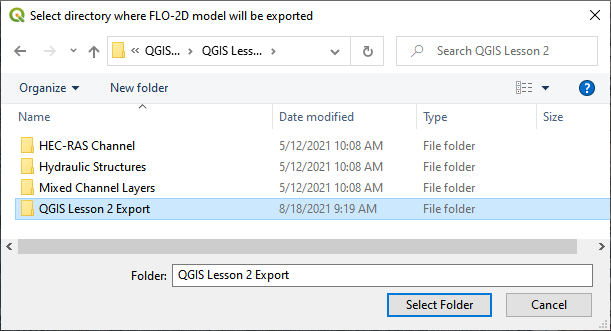

6. The data is ready to run.

.. image:: ../img/Advanced-Workshop/channel/Lesson065.png

Step 13: Run the simulation
__________________________________________

1. Click the Run FLO-2D Icon.

.. image:: ../img/Advanced-Workshop/channel/Lesson066.png

2. Set the FLO-2D Folder.
   C:\\program files (x86)\\flo-2d pro

3. Set the Project Folder.

C:\\users\\public\\public documents\\flo-2d pro documentation\\Example Projects\\QGIS Tutorials\\QGIS Lesson 2\\Lesson 2 Export

4. Click OK.

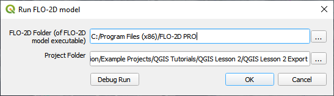

5. This is a good point to save project.

.. image:: ../img/Workshop/Worksh011.png

Here's a link to the `channel checklist <https://flo-2d.sharefile.com/d-s0a23a86268f8401a85db1d582e997619>`_

Sorry for the Name and Email request on that link.  Trying to eliminate bot downloads.

This final video explains how to review the channel to check if it is running correctly.

.. raw:: html

    <iframe width="560" height="315" src="https://www.youtube.com/embed/shtqYasu_Qo" frameborder="0" allowfullscreen></iframe>

