Lesson 3 – Create a Storm Drain System Using Shapefiles
=======================================================

**Overview**

This lesson will outline the process to create a storm drain network for FLO-2D.  This is the quick version.  It is
better for learning QGIS and FLO-2D Plugin operations.  For advanced storm drain modeling, see the Advanced Lessons.

.. raw:: html

    <iframe width="560" height="315" src="https://www.youtube.com/embed/SArfBrC0U9A" frameborder="0" allowfullscreen></iframe>

Required Data
_____________

Start this lesson from the end of Lesson 2.
It requires the channels and culverts.
All data is provided in the Lesson folders.

.. list-table::
   :widths: 33 33 33
   :header-rows: 0

   * - **File**
     - **Content**
     - **Location**

   * - Shapefiles
     - Inlets-Junctions, Outfalls, and Conduits
     - QGIS Lesson 3\\Basic Storm Drain Shapefiles\

   * - I4-37-32-26-1.txt
     - Rating Table
     - QGIS Lesson 3\\Basic Storm Drain Shapefiles

Project Location C:\\Users\\Public\\Documents\\FLO-2D Pro Documentation\\Example Projects\\QGIS Tutorials

Check these folders to ensure the data is available before starting the lesson.

Step 1: Open QGIS and load the project
______________________________________

.. image:: ../img/Workshop/Worksh002.png

1. Open QGIS and drag Lesson 1.qgz onto the map space the file in QGIS and Load the Project into the FLO-2D Plugin.

.. image:: ../img/Workshop/Worksh157.png

2. Click Yes to load the plugin.

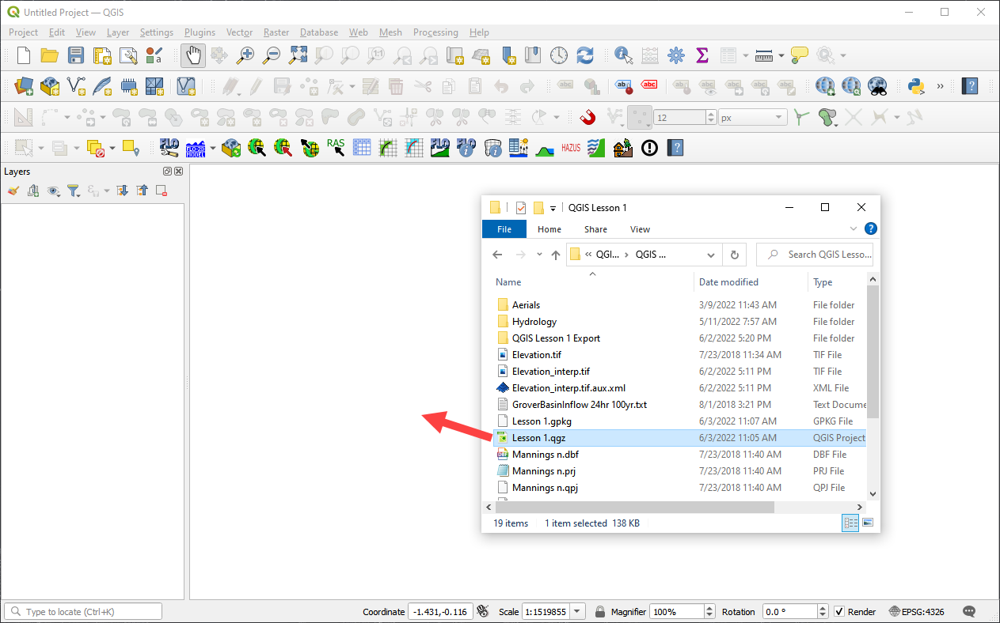

C:\\Users\\Public\\Documents\\FLO-2D PRO Documentation\\Example Projects\\QGIS Tutorials\\QGIS
Lesson 1\\QGIS Lesson 1.qgz

3. If necessary add an aerial image to the map.  See Lesson 1 - Part 2 - Step 3 for instructions.

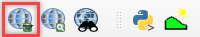

4. Organize the map layers to facilitate the next steps.  It is OK to group user layers.  Notice
   the Not Used group for layers that are not required by this project.

.. warning:: Do not remove layers that are part of the geopackage.  It may break the geopackage layout and corrupt the
             data files.

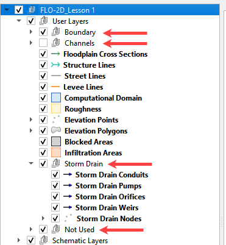

Step 2: Import the storm drain shapefiles
__________________________________________

1. Click User Layers Group.

2. Drag the \*.shp files from QGIS Lesson 3 folder and drop the files in the map space.
   The shapefiles should be located in the User Layers group.

C:\\Users\\Public\\Documents\\FLO-2D PRO Documentation\\Example Projects\\QGIS Tutorials\\QGIS Lesson 3\\
Basic Storm Drain Shapefiles

.. image:: ../img/Workshop/Worksh093.png

.. important:: For a detailed description of the shapefile features and attributes, go to |attributes|

.. |attributes| raw:: html

   <a href="https://documentation.flo-2d.com/Advanced-Lessons/Module%208.html#step-3-review-the-storm-drain-attributes"
   target="_blank">Storm Drain - Shapefile Overview</a>

Step 3: Select component fields from the shapefiles
_____________________________________________________

1. Expand the Storm Drain Editor widget and click the Select components from shapefile layer button.

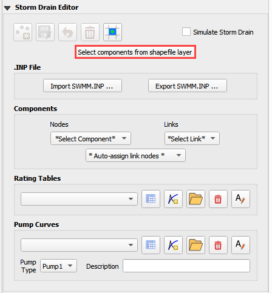

2. Use the Editor to assign the Inlets/Junctions parameters from the shapefile to the attribute table.

.. note:: Skip Pumps, Weirs, and Orifice fields for now.

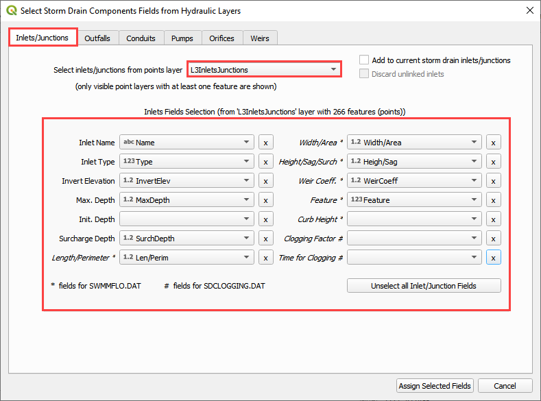

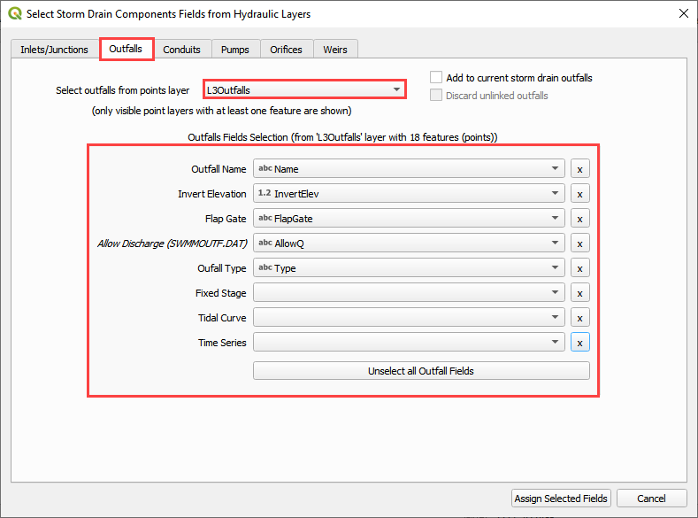

.. image:: ../img/Workshop/Worksh098.png

3. Once all features are selected in the drop-down menus, click **Assign Selected Inlets/Junctions, Outfalls and
   Conduits** to create the data structures of the Storm Drain Components.

4. The following message will be displayed.
   Click *OK*.

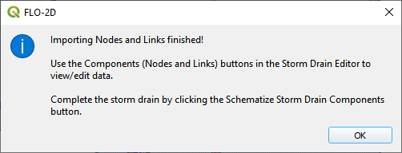

Step 4: Assign the link node connections
_________________________________________

1. Click the Simulate storm drain checkbox.

2. Click the Auto-assign link nodes button and select Conduits.

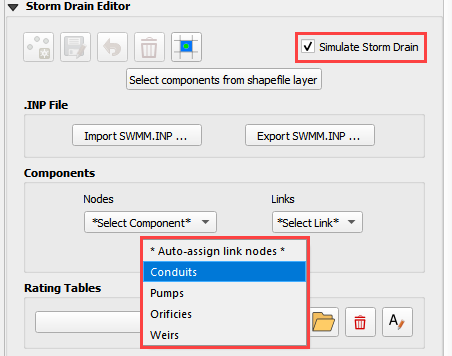

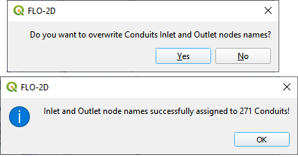

Step 5: Import rating tables
____________________________

1. Click the Import Rating Table Button

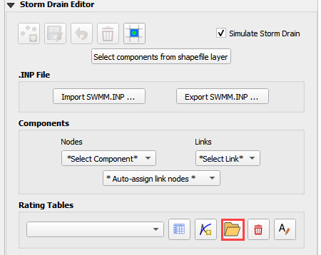

2. Navigate to the I4 table with this path.
   Select the file and click Open.

C:\\Users\\Public\\Documents\\FLO-2D PRO Documentation\\Example Projects\\QGIS Tutorials\\QGIS Lesson 3\\
Storm Drain Shapefiles\\I4-37-32-26-1.txt

3. The table was imported and assigned to the correct inlet node.

.. image:: ../img/Workshop/Worksh103.png

4. If an error was detected because one Type 4 inlet didn't match a selected text file, it
   would be reported to this file:

.. image:: ../img/Workshop/Worksh103a.png

.. warning:: If a Python error pops up because the Rating Table Warnings file can't be written, simply perform this
             step again.

Step 6: Schematize the storm drain components
_______________________________________________________

1. Click on Schematize Storm Drain Components in the Storm Drain Editor widget.

.. image:: ../img/Workshop/Worksh104.png

2. Once the storm drain components are schematized, the following dialog will appear.
   Click *OK* to close.

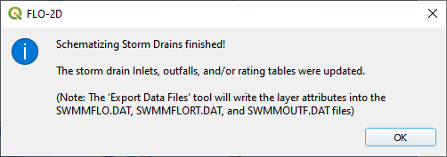

3. The storm drain schematized data layers have been completed.  The storm drain components are now part of the
   schematized layers in the project.

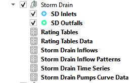

Step 7: Export the project
__________________________

1. Click the Set Control Variable icon.

.. image:: ../img/Workshop/Worksh017.png

2. Verify the data and Click Save.

.. image:: ../img/Workshop/Worksh111.png

3. This is a good point to save project.

.. image:: ../img/Workshop/Worksh083.png

4. Export the data files to the Project Folder in QGIS Lesson 3

.. image:: ../img/Workshop/Worksh021.png

C:\\Users\\Public\\Documents\\FLO-2D PRO Documentation\\Example Projects\\QGIS Tutorials\\QGIS Lesson 3\\Lesson 3 Export

5. Click OK to export the main project data files.

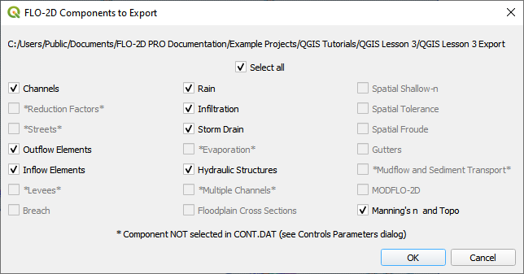

6. Save the swmm.inp file with the next dialog.  Make sure the path is still Lesson 3 Export.

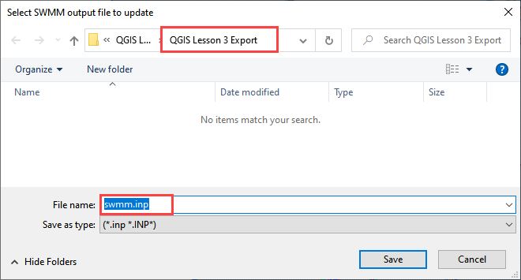

7. Check the .INP control variables and click OK.

.. image:: ../img/Workshop/Worksh021d.png

8. These are the storm drain components that were written to the swmm.inp file.

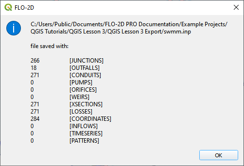

9. The final dialog will be displayed.  The associated storm drain data files are created when the storm drain switch
   has been turned ON.

.. image:: ../img/Workshop/Worksh021f.png

Step 8: Run the simulation
____________________________

1. Click the Run FLO-2D Icon.

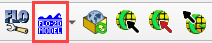

2. Set the Project path and the FLO-2D Engine Path and click OK to start the simulation.

3. Set the *FLO-2D Folder*.

C:\\program files (x86)\\flo-2d pro

4. Set the *Project Folder*.

C:\\Users\\Public\\Documents\\FLO-2D PRO Documentation\\Example Projects\\QGIS Tutorials\\QGIS Lesson 3\\
QGIS Lesson 3 Export

.. image:: ../img/Workshop/Worksh113.png

5. After the storm drain model is complete, review FLO-2D Storm Drain Manual Chapter 6 for more details about reviewing
   results.

Step 9. Storm drain project recovery point
_____________________________________________

1. Save all layers that may be in editing mode, save the project, close QGIS.

2. Find Lesson 1 qgz and gpkg in a File Browser.  Select zip them.  This will create a recovery point with the simple
   storm drain.

3. Reload the project in QGIS.

.. important:: If you can't remember how to do this step, go to
               `Lesson 1 Part 2 <https://documentation.flo-2d.com/Workshops/Lesson%201%20Part%202.html#step-2-create
               -a-recovery-file>`_.

Summary
_______

This is the completion of a full storm drain model using the FLO-2D model along with digital terrain elevation data and
an inflow hydrograph, rain, and boundary conditions from Lesson 1 and 2.  This lesson has demonstrated how to create the
storm drain system by using shapefiles for conduits, inlets/junctions, and outfalls.